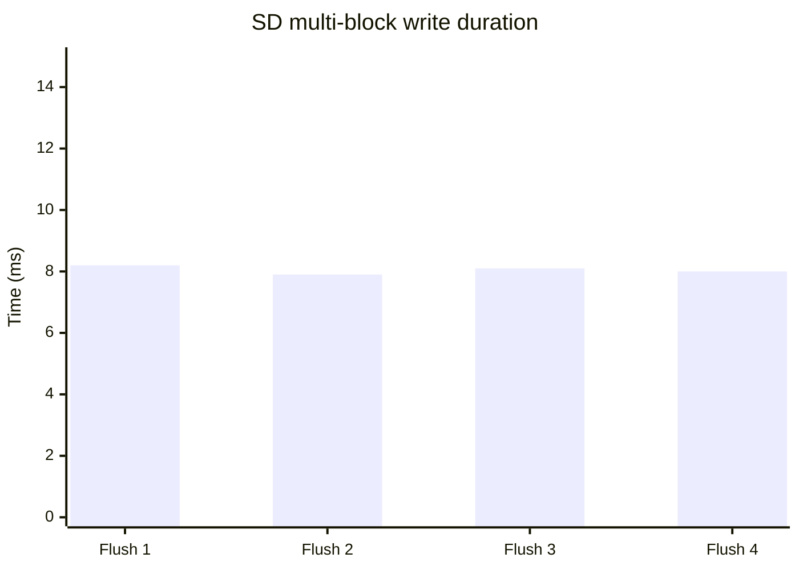

<div align="center">
  
  <h1>STM32H7 CAN sniffer</h1>
  <p><em>Dual-channel CAN logger with HTTP config UI and SD persistence</em></p>
</div>

<!-- [](https://github.com/Clomann/stm32h745-spi-to-microSD/actions/workflows/build.yml) -->


This project implements the software for a device that logs CAN traffic on two CAN channels and stores the data on an SD card. The device can be configured and the logged data can be accessed via a simple built-in web GUI.

**Project recap**

- Role: solo firmware engineer (FreeRTOS + STM32H745)
- Built: dual-channel CAN logger with 3-stage buffering, on-board HTTP config UI, SD persistence
- Result: sustained 2×1 Mbit/s capture for 6 h with zero frame loss; SD wear limited via rotating logs
- Tooling: gcc/FreeRTOS, custom comm drivers, lightweight web stack

**Table of contents**

<!-- TOC -->

- [Features](#features)
    - [Measurements](#measurements)
        - [CAN ISR latency](#can-isr-latency)
        - [SD multi-block write timing](#sd-multi-block-write-timing)
        - [Block flush window Saleae](#block-flush-window-saleae)
        - [Lossless logging validation](#lossless-logging-validation)
- [Quick start](#quick-start)
    - [Run unit tests](#run-unit-tests)
    - [Verify logging](#verify-logging)
    - [System overview](#system-overview)
    - [Prerequisites](#prerequisites)
    - [Build the code](#build-the-code)
    - [Download the code](#download-the-code)
    - [Access the web GUI](#access-the-web-gui)
- [Architecture](#architecture)
    - [Software](#software)
    - [Hardware](#hardware)
    - [Tooling](#tooling)
        - [Documentation tooling](#documentation-tooling)
        - [Formatting tooling](#formatting-tooling)
- [Future work](#future-work)

<!-- /TOC -->

# Features

The CAN sniffer can log CAN frames on two channels with following specs:

- continuous logging at 2x 1 Mbit/s @ 100% busload using three-stage buffering
- supports classic and extended CAN IDs and message filtering
- rotating log file on an SD card in a way that keeps memory wear low
- JSON based config persisting
- HTTP API that supports connecting through built-in web GUI to:
    - control and config the CAN logger 
    - download of logged data
    - client-side log data parser

**Web GUI**

The *CAN setup* page allows you to configure the CAN sniffer and start/stop logging:


Through the *CAN trace* page you can download logged data as a binary file and decode it through using the funciton in the *Parse and Display Log* function:


## Measurements

### CAN ISR latency

```mermaid
%% placeholder chart – replace with actual capture image/data %%
xychart-beta
    title "CAN ISR latency (µs)"
    x-axis [1, 2, 3, 4, 5]
    y-axis "Latency (µs)" 0 --> 6
    line [4.8, 5.0, 4.9, 4.7, 5.1]
```

### SD multi-block write timing



### Block flush window (Saleae)

```mermaid
xychart-beta
    title "Block flush window"
    x-axis ["Block 1", "Block 2", "Block 3", "Block 4"]
    y-axis "Duration (ms)" 0 --> 20
    line [12.5, 12.3, 12.6, 12.4]
```

### Lossless logging validation

Frame counters and embedded sequence IDs are captured on both CANoe and the firmware. The logger records its own 64-bit start/stop timestamps (logger starts first, then CANoe; stopping happens in the reverse order) and writes only the summary (first/last sequence ID, drop count, timestamps). After the run a host script streams the SD log files, computes a CRC over the actual data, and compares the sequence range + runtime against the CANoe report to confirm no drops.


# Quick start

The project consists of the source code written to run on a NUCLEO-144 STM32H745ZI discovery board. It uses GPIO to interface to:
- SD card
- CAN transceiver
- the on-board ETH interface

It is built using cmake and make based on the gcc toolchain.

This section briefly explains how to build and download the software for and to the device using the tool configuration included in this project.

## Run unit tests

_Placeholder: describe how to run `cmake -S tests -B build && cmake --build build && ctest`. Add pass/fail screenshot later._

## Verify logging

_Placeholder: describe end-to-end logging verification (e.g., feed CAN traffic, show resulting SD file)._

## System overview

The system uses following components:
- NUCLEO-H745ZI-Q STM32 board
- two TJA1050 based CAN transceiver breakout boards
- a 3 V micro SD card adapter breakout board


*Figure: The image shows a simplified overview of the system components.*

More details of the systems technical context and a picture of the prototypical built can be found [here](doc/arc42-template-EN.md#technical-context)

> **NOTE**: Use a high quality SD card because cheap ones can have reliability issues when used with SPI (e.g., an SD card initializes correctly and some writes/reads work but then it hangs until power cycled for no apparent reason). The system was tested with a Kingston industrial-grade card.

## Prerequisites

Following tool versions are used to develop, debug and run the program on the target:

| Component | Version | Scope |
|-|-|-|
| cmake | 3.28.1 | build |
| make | 3.81 | build |
| GNU Tools for STM32 | 13.3.1 | build/ debug |
| OpenOCD | 0.12.0 | download/ debug |
| Cppcheck | 2.17.1 | develop |
| clang-format | 20.1.8 | develop |

## Build the code

To create the software, you can use following command from the repo's root directory:

```sh
cmake --preset "Debug" -B ./build/
``` 

Running this command might take a while because following dependencies are pulled while generating the configuration:

- FreeRTOS (see [FreeRTOS on github](https://github.com/FreeRTOS/FreeRTOS-LTS.git))
- lwrb (see [lwrb on github](https://github.com/MaJerle/lwrb.git))

To build the actual code, run the following from the root directory:

```sh
make -C build -j4
``` 

Alternatively, use the CMake workflow and just run 

```sh
cmake --workflow --preset release-cm4 &&
cmake --workflow --preset release-cm7
```

to generate the configuration and start the build in one go.

## Download the code

You can run the commands

> STM32_Programmer_CLI -c port=SWD -d _bin/Debug/SPI_FullDuplex_ComDMA_CM7.elf 0x08000000 -rst

and

> STM32_Programmer_CLI -c port=SWD -d _bin/Debug/SPI_FullDuplex_ComDMA_CM4.elf 0x08100000 -rst

from the root directory.


## Access the web GUI

The CAN sniffer uses Multicast DNS (mDNS) and Internet Group Management Protocol (IGMP) so that its hostname can be discoverd. If your network supports mDNS you can access the CAN sniffer via following hostname:

> http://can-sniffer.local

Otherwise, the IP address is assigned to the CAN sniffer by the DHCP server of your network.
You have to identify the IP address manually via the MAC address:

> 00:80:E1:00:00:00

# Architecture

This is a brief overview of the architecture. You can read the full architecture documentation [HERE](doc/arc42-template-EN.md).

## Software 

The driver design is inspired by Linux's opaque‑ops and linker‑list registration patterns (SPI, CAN, Ethernet) and they run bare-metal
on FreeRTOS. Task orchestration is realized by prioritized preemptive task scheduling. 

At a high level the firmware separates drivers, a multistage buffering pipeline, storage, and configuration into distinct layers; the full breakdown (logging pipeline, config workflow, hooks) lives in the [arc42 building-block view](doc/arc42-template-EN.md#building-block-view). Storage modules rely on overridable hooks for error handling—see the [architecture decisions](doc/arc42-template-EN.md#error-handling-hooks-for-storage-subsystems) before integrating.

The full arc42 template based document (doc/arc42-template-EN.md) covers the following in more detail:

- building blocks (modules, interfaces)
- runtime view (ISRs, queues)
- quality scenarios (SD write latency, CAN Rx latency)

Read it [here](doc/arc42-template-EN.md).

## Hardware

To get the system running, you need to connect the necessary adapters to the NUCLEO-144 board. 

Following diagram shows which pins are connected to which external components:


| Peripheral | Pins |
| - | - |
| CAN 1 | Rx: PB12, Tx: PB6 |
| CAN 2 | Rx: PA11, Tx: PA12 |
| SPI 1 | SS: PA4, CLK: PA5, MISO: PA6, MOSI: PD11 |
| ETH | MDC: PC1, REF_CLK: PA1, MDIO: PA2, CRS_DV: PA7, RXD0: PC4, RXD1: PC5, TXD1: PB13, TX_EN: PG11, TXD0: PG13 |
| SDMMC1 (for future extension) | D6: PC6, D7: PC7, D0: PC8, D1: PC9, D2: PC10, D3: PC11, CK: PC12, CMD: PD2, CLKIN: PB8, CDIR: PB9 |
|  |  |

```mermaid
flowchart TD
    subgraph STM32H7 [STM32H7]
        subgraph ETH [ETH MAC]
            MAC_MDC["MDC<br>(PC1)"]
            MAC_REF_CLK["REF_CLK<br>(PA1)"]
            MAC_MDIO["MDIO<br>(PA2)"]
            MAC_CRS_DV["CRS_DV<br>(PA7)"]
            MAC_RXD0["RXD0<br>(PC4)"]
            MAC_RXD1["RXD1<br>(PC5)"]
            MAC_TXD1["TXD1<br>(PB13)"]
            MAC_TX_EN["TX_EN<br>(PG11)"]
            MAC_TXD0["TXD0<br>(PG13)"]
        end
        
        subgraph SPI1 [SPI1 - Master]
                SPI1_SS["SS (PA4)<br>CN7.D13"]
                SPI1_CLK["CLK (PA5)<br>CN7.D13"]
                SPI1_MISO["MISO (PA6)<br>CN7.D12"]
                SPI1_MOSI["MOSI (PB5)<br>CN7.D11"]
        end

        subgraph CAN1 [CAN 1]
            CAN1_Tx["Tx<br>(B9)"]
            CAN1_Rx["Rx<br>(B8)"]
        end

        subgraph CAN2 [CAN 2]
            CAN2_Tx["Tx<br>(B6)"]
            CAN2_Rx["Rx<br>(B12)"]
        end
    end

    subgraph PHY["ETH - PHY (on board)"]
        PHY_MDC
        PHY_REF_CLK
        PHY_MDIO
        PHY_CRS_DV
        PHY_RXD0
        PHY_RXD1
        PHY_TXD1
        PHY_TX_EN
        PHY_TXD0
    end

    subgraph SDCARD [SD card]
        SPI4_SS["SS (PE11)"]
        SPI4_CLK["CLK (PE12)<br>CN10.D39"]
        SPI4_MISO["MISO (PE13)<br>CN10.D3"]
        SPI4_MOSI["MOSI (PE14)<br>CN10.D4"]
    end

    subgraph CAN1TRCV [CAN 1 Tranceiver]
        CAN1TRANC_Tx["CAN Tx"]
        CAN1TRANC_Rx["CAN Rx"]
    end

    subgraph CAN2TRCV [CAN 2 Tranceiver]
        CAN2TRANC_Tx["CAN Tx"]
        CAN2TRANC_Rx["CAN Rx"]
    end

    %% Connections with directions
    MAC_MDC     --- PHY_MDC
    MAC_REF_CLK --- PHY_REF_CLK
    MAC_MDIO    --- PHY_MDIO
    MAC_CRS_DV  --- PHY_CRS_DV
    MAC_RXD0    --- PHY_RXD0
    MAC_RXD1    --- PHY_RXD1
    MAC_TXD1    --- PHY_TXD1
    MAC_TX_EN   --- PHY_TX_EN
    MAC_TXD0    --- PHY_TXD0

    SPI1_SS --- |SS| SPI4_SS
    SPI1_CLK --- |CLK| SPI4_CLK
    SPI1_MOSI --- |MOSI| SPI4_MOSI

    CAN1_Tx --- |Tx| CAN1TRANC_Tx
    CAN1_Rx --- |Rx| CAN1TRANC_Rx

    CAN2_Tx --- |Tx| CAN2TRANC_Tx
    CAN2_Rx --- |Rx| CAN2TRANC_Rx

    SPI1_MISO --- |MISO| SPI4_MISO

```


> _Performance chart placeholder – add logic-analyzer capture showing CAN ISR latency and SD write timing (e.g., 1 Mbit/s @ 100 % bus load, block flush duration). See [arc42 measurement instrumentation](doc/arc42-template-EN.md#measurement-instrumentation) for the exact probe points._

## Tooling

### Documentation tooling

Mermaid diagrams live under doc/images/*.md.

To regenerate the .svg outputs:

1. Create/activate a virtual environment in dev/scripts:
    > python -m venv .venv && source .venv/bin/activate
2. Install the converter’s dependencies (inside dev/scripts): 
    > pip install -r requirements.txt
3. Run 
    > python convert_mermaid.py --root ../doc/images
    
    The script scans for .md sources and emits .md.svg files with the same name.

The docker-compose helper only provides a local Kroki + Mermaid renderer; the actual export still requires running `convert_mermaid.py` from inside `doc/scripts`.

> NOTE: Usage of the Memaid CLI can be found here: 
> https://doctoolchain.org/docToolchain/v2.0.x/020_tutorial/170_kroki-configuration.html

### Formatting tooling

```sh
clang-format -i --files=tools/clang/clang_files.txt
```

# Future work

Planned features are:
- support for CAN FD frames
- SDIO interface to allow for lower-quality SD cards
- Wi-Fi extension
- external Realtime-Clock (RTC)
- support to convert to various CAN log formats via GUI (e.g. Vector ASCII)
- for better performance and higher availability the serving of requests via ethernet shall be executed on another core to not interfere with the CAN trace logging when large files are loaded for user downloads.
- in-app-programming to update the firmware via web GUI
