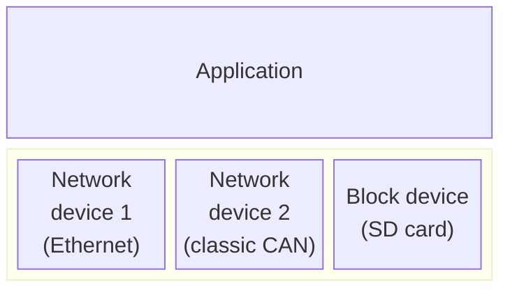
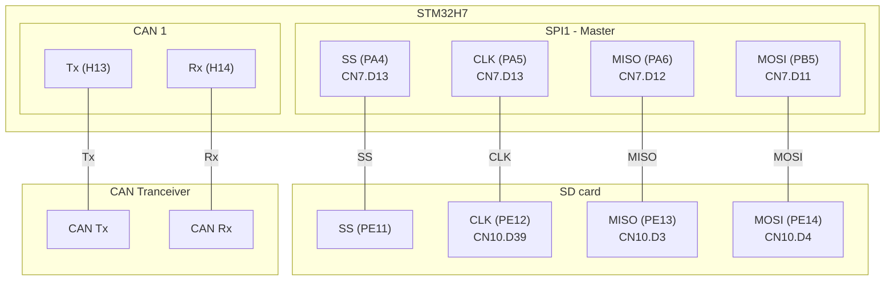

- [STM32H7 CAN sniffer](#stm32h7-can-sniffer)
  * [Software architecture](#software-architecture)
    + [System overview](#system-overview)
    + [Building block view](#building-block-view)
    + [FatFS and SD card driver](#fatfs-and-sd-card-driver)
  * [Hardware setup](#hardware-setup)
  * [Pin usage](#pin-usage)
  * [Funtional reuquirements](#funtional-reuquirements)
    + [General](#general)
    + [CAN](#can)
    + [Data Logging Requirements](#data-logging-requirements)
    + [Server Requirements](#server-requirements)
    + [Storage and File Management Requirements](#storage-and-file-management-requirements)
  * [Hardware Constraints](#hardware-constraints)
  * [Wishlist](#wishlist)
  * [Design decisions](#design-decisions)
  * [Clocks](#clocks)
  * [HTTP](#http)

STM32H7 CAN sniffer
====================

This is a multi-protocol learning project. It implements a device that logs CAN traffic and stores the data onto a SD card. The device can be configured and the logged data can be accessed via a web interface.

## How To Use

The project consists of the source code written to run on a NUCLE 144 STM32H745ZI discovery board. It uses GPIO to interface to:
- SD card
- CAN tranceiver
- the on board ETH interface

It is build using cmake and make based on the gcc toolcain. You can run 

```sh
cmake --preset "Debug" -B ./build/
```
to build the make project using cmake and then 

```sh
make -C build -j4
```

to build the application.

[!NOTE]: Use a high quality SD card because many cheap once have issues with SPI. Thus, the quality of the SD card influences the reliablity accesing it through SPI. The system was tested with a Kingston Industrial graded card.

## Software architecture
### Introduction and goals
The main of this project is to offer practical challanges to gain experience in:
- applying software architecture concepts in an embedded environment
- developing hardware drivers and there abstractions
- using and integrating thrid party libraries
- practicing tool chain management (cmake, vs code, gcc) 
- leaning about industry relevant protocols (SPI, I2C, Ethernet, etc.)

The application itself shall provide a basic software piece offering:
- functions for data management and persisting
- connectivity
- user interaction
- extendable and modularized HW interface to easily add protocols in the future

Therefore, a central goal is to make the core application reusable and portable in a way, to also use it with other uCs of the family.

### Quality goals

| Goal | Motivation and description |
|-|-|
| Transferability | The app shall be modularized and open to extension so that the code can be resued in other projects. A clean interface between main app and HW abstraction is neede. |
| Reliability | Data aquisition shall be reliable also at high throughput |
| Maintainability | It shall be easy to add funcitons in the main app, but also to change driver implementations without affecting other parts of the code base. | 

### System overview



### Building block view

 The following figure shows the layers of the CAn sniffer software.

 ```mermaid 
 %%{init: 
    { 'theme':'default', 
      'sequence': {
        'useMaxWidth':true
        } 
    } 
}%%

block-beta 
    columns 4

    Application:4

    block:middleware:4
        DUMMY1[" "]:1
        DUMMY2[" "]:1
        %% ISOTP["ISO-TP"]:1
        %% J1939[" "]:1


        block:middlewarefs:1
            columns 1
            FatFS
        StorageDeviceControls["Storage Device Controls"]
    end

    lwIP["HTTP/TCP/IP Stack (lwIP)"]
    end
    
    CANDRIVERABS["CAN driver abstraction"]:2
    SDCARDDRIVER["SD card driver"]
    NETIF["Network interface abstarction"]
    
    CANDRIVER["CAN driver"]:2
    SPIDRIVER["SPI driver"]
    ETHDRIVER["ETH driver"]
```

For better performance and higher availability the serving of requests via ethernet shall be executed on another core to not interfere with the CAN trace logging when large files are loaded for user downloads.

### FatFS and SD card driver
 http://elm-chan.org/fsw/ff/

 ## Hardware setup

This section gives a brief overview of the hardware setup. The hardware setup is based on a NUCLEO-H745ZI-Q development board.

## Pin usage
Following diagram showes which pins are connected to the external components:




## Funtional reuquirements

This section states the most important funcitonal requirements for the CAN sniffer.

### General
The CAN sniffer shall implement following functions:
- Support for classic CAN
- Store all received CAN frames to a SD card
- impement a small server which allows to:
  - download and delete log files with CAN traces
  - configure the CAN sniffer remotely via the network (e. g. CAN ID filters, baudrate, etc.)

The CAN sniffer shall be able to capture all CAN frames at 100 % bus load reliably and store them persistently without losing any frames.

### CAN
The CAN sniffer shall have following CAN specific functions:
- The system shall support standard (11-bit) and extended (29-bit) CAN identifiers.
- The system shall support baudrates of up to 1 Mbit/s
- The system shall be able to filter messages based on CAN ID ranges.
- The system shall detect and log error frames.
- The system shall log bus load statistics.
- The system shall support ISO-TP (ISO 15765-2) reassembly for multi-frame messages.

### Data Logging Requirements
- The system shall log messages to an SD card formatted with FAT32.
- The system shall store CAN messages in a timestamped log format.
- The system shall allow log retrieval via a network or direct SD card access.
- The system shall support automatic log file rotation to prevent SD card overflow.
- The system shall include metadata (e. g. timestamp, frame type) for each message.

### Server Requirements
- The system shall host a web interface accessible over Wi-Fi or LAN.
- The web interface shall allow live message monitoring.
- The web interface shall provide options to configure the message filters based on CAN IDs.
- The system shall support starting and stopping logging sessions via the web interface.
- The system shall support remote log file download.
- optional: The system shall support firmware updates via the web interface.

### Storage and File Management Requirements
- The system shall implement buffered writes to the SD card to minimize wear.
- The system shall create a new log file at the start of each session.
- The system shall allow oldest logs to be deleted automatically if storage is full.

## Hardware Constraints
- The system shall operate with an STM32H7 microcontroller.
- The system shall support an SPI-connected SD card.
- The system shall support a low-power mode when logging is not active.
- The system shall indicate operational status via LED indicators.

## Wishlist
- the web interface shall support cliennt side CAN log parsing to offload the 
formatting from the server

## Design decisions


## Clocks
HSE is used as the input clock due to it's better accuracy (https://community.st.com/t5/stm32-mcus-products/hse-versus-hsi-on-nucleo-boards/td-p/473783)

## HTTP
To reduce development time the LwIP library. ST provides functional examples usign LwIP which help to get up to speed.

To reduce implementation overhead and debugging complexity no multi-threading is used.

To reduce space the logger and the http server shall access the same file.
For that, the file system must support concurrent read/write operations.