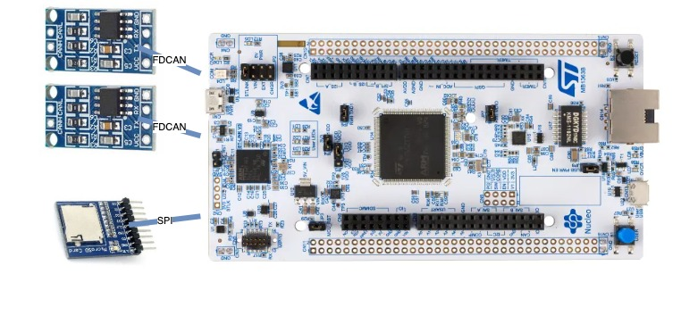

<div align="center">
  
  <h1>STM32H7 CAN sniffer</h1>
  <p><em>Dual-channel CAN logger with HTTP config UI and SD persistence</em></p>
</div>

[](https://github.com/Clomann/stm32h7-CAN-sniffer/actions/workflows/unity-tests.yml)

This project implements the software for a device that logs CAN traffic on two CAN channels and stores the data on an SD card. The device can be configured and the logged data can be accessed via a simple built-in web GUI.

**Project recap**

- Role: solo firmware engineer (FreeRTOS + STM32H745)
- Built: dual-channel CAN logger with 3-stage buffering, on-board HTTP config UI, SD persistence
- Result: sustained 2×1 Mbit/s capture for 6 h with zero frame loss; SD wear limited via rotating logs
- Tooling: gcc/FreeRTOS, custom comm drivers, lightweight web stack

**Table of contents**


# Features

The CAN sniffer can log CAN frames on two channels with the following specs:

- continuous logging at 2x 1 Mbit/s @ 100% bus load (e.g., ~19920 frames/s) using three-stage buffering
- supports classic and extended CAN IDs and message filtering
- rotating log file on an SD card in a way that keeps memory wear low
- JSON-based configuration persistence
- HTTP API that powers the built-in web GUI to:
    - control and configure the CAN logger
    - download of logged data
    - manage SD card logging (format on next restart, log file size/count, cluster size)
    - client-side log data parser

**Web GUI**

The *CAN setup* page allows you to configure the CAN sniffer and start/stop logging. It also includes SD card management to queue a format on the next restart and adjust log ring settings.


Through the *CAN trace* page you can download logged data as a binary file and decode it using the *Parse and Display Log* function:


## Measurements

Detailed measurement setup, plots, and validation results (CAN ISR latency, SD write timings, lossless logging validation, stress test) live in the architecture doc: [Measurements](doc/arc42-template-EN.md#measurements).

# Quick start

The project targets a NUCLEO-144 STM32H745ZI discovery board. It uses GPIOs to interface with:
- SD card
- CAN transceiver
- the on-board ETH interface

It is built using CMake and Make with the GCC toolchain.

This section briefly explains how to build and download the firmware using the tool configuration included in this project.

## Run unit tests

From the `tests` directory, generate and build the test binaries:

```sh
cmake --preset Release_CM7 --fresh -B build/application \
  -DPYTHON_EXE="$PWD/.env/bin/python" \
  -DMCUBOOT_PYTHON="$PWD/.env/bin/python"
cmake --build build/application -j

cmake --preset "Release_CM4" -B ./build/application \
  -DPYTHON_EXE="$PWD/.env/bin/python" \
  -DMCUBOOT_PYTHON="$PWD/.env/bin/python"
cmake --build build/application -j
```

and for the bootloader:

```sh
cmake --preset "Release_CM7_Boot" -B ./build/bootloader
cmake --build build/bootloader -j
```

Run the tests:

```sh
ctest --test-dir build
```

## Verify logging

See [Lossless logging validation](doc/arc42-template-EN.md#lossless-logging-validation) for the end-to-end verification workflow.

## System overview

The system uses the following components:
- NUCLEO-H745ZI-Q STM32 board
- two TJA1050 based CAN transceiver breakout boards
- a 3 V micro SD card adapter breakout board


*Figure: The image shows a simplified overview of the system components.*

More details of the system's technical context and a picture of the prototype build can be found [here](doc/arc42-template-EN.md#technical-context)

> **NOTE**: Use a high quality SD card because cheap ones can have reliability issues when used with SPI (e.g., an SD card initializes correctly and some writes/reads work but then it hangs until power cycled for no apparent reason). The system was tested with a Kingston industrial-grade card.

## Prerequisites

The following tool versions are used to develop, debug and run the program on the target:

| Component | Version | Scope |
|-|-|-|
| cmake | 3.28.1 | build |
| make | 3.81 | build |
| GNU Tools for STM32 | 13.3.1 | build/ debug |
| OpenOCD | 0.12.0 | download/ debug |
| Cppcheck | 2.17.1 | develop |
| clang-format | 18.1.8 | develop |

## Build the code

To create the software, you can use the following command from the repo's root directory:

```sh
cmake --preset "Release_CM4" -B ./build/application && make -C ./build/application -B
```

and

```sh
cmake --preset "Release_CM7" -B ./build/application && make -C ./build/application -B
```

```sh
cmake --preset "Release_CM7_Boot" -B ./build/bootloader && make -C ./build/bootloader -B   
```

Running this command might take a while because the following dependencies are pulled while generating the configuration:

- FreeRTOS (see [FreeRTOS on github](https://github.com/FreeRTOS/FreeRTOS-LTS.git))
- lwrb (see [lwrb on github](https://github.com/MaJerle/lwrb.git))

To build the actual code, run the following from the root directory:

```sh
make -C build -j4
``` 

Alternatively, use the CMake workflow and run

```sh
cmake --workflow --preset release-cm4 &&
cmake --workflow --preset release-cm7
```

to generate the configuration and start the build in one go.

## Download the code

You can run the commands

> STM32_Programmer_CLI -c port=SWD -d _bin/Debug/SPI_FullDuplex_ComDMA_CM7.elf 0x08000000 -rst

and

> STM32_Programmer_CLI -c port=SWD -d _bin/Debug/SPI_FullDuplex_ComDMA_CM4.elf 0x08100000 -rst

from the root directory.


## Access the web GUI

The CAN sniffer uses Multicast DNS (mDNS) and Internet Group Management Protocol (IGMP) so that its hostname can be discovered. If your network supports mDNS you can access the CAN sniffer via the following hostname:

> http://can-sniffer.local

Otherwise, the IP address is assigned to the CAN sniffer by the DHCP server of your network.
You have to identify the IP address manually via the MAC address:

> 00:80:E1:00:00:00

# Architecture

This is a brief overview of the architecture. You can read the full architecture documentation [HERE](doc/arc42-template-EN.md).

## Software 

The driver design is inspired by Linux's opaque‑ops and linker‑list registration patterns (SPI, CAN, Ethernet), and the firmware runs bare-metal
on FreeRTOS. Task orchestration is realized by prioritized preemptive task scheduling. 

At a high level the firmware separates drivers, a multistage buffering pipeline, storage, and configuration into distinct layers; the full breakdown (logging pipeline, config workflow, hooks) lives in the [arc42 building-block view](doc/arc42-template-EN.md#building-block-view). Storage modules rely on overridable hooks for error handling—see the [architecture decisions](doc/arc42-template-EN.md#error-handling-hooks-for-storage-subsystems) before integrating.

The full arc42-template-based document (doc/arc42-template-EN.md) covers the following in more detail:

- building blocks (modules, interfaces)
- runtime view (ISRs, queues)
- quality scenarios (SD write latency, CAN Rx latency)

Read it [here](doc/arc42-template-EN.md).

## Hardware

To get the system running, you need to connect the necessary adapters to the NUCLEO-144 board. 

Following diagram shows which pins are connected to which external components:


| Peripheral | Pins |
| - | - |
| CAN 1 | Rx: PB12, Tx: PB6 |
| CAN 2 | Rx: PA11, Tx: PA12 |
| SPI 1 | SS: PA4, CLK: PA5, MISO: PA6, MOSI: PD11 |
| ETH | MDC: PC1, REF_CLK: PA1, MDIO: PA2, CRS_DV: PA7, RXD0: PC4, RXD1: PC5, TXD1: PB13, TX_EN: PG11, TXD0: PG13 |
| SDMMC1 (for future extension) | D6: PC6, D7: PC7, D0: PC8, D1: PC9, D2: PC10, D3: PC11, CK: PC12, CMD: PD2, CLKIN: PB8, CDIR: PB9 |
|  |  |

```mermaid
flowchart TD
    subgraph STM32H7 [STM32H7]
        subgraph ETH [ETH MAC]
            MAC_MDC["MDC<br>(PC1)"]
            MAC_REF_CLK["REF_CLK<br>(PA1)"]
            MAC_MDIO["MDIO<br>(PA2)"]
            MAC_CRS_DV["CRS_DV<br>(PA7)"]
            MAC_RXD0["RXD0<br>(PC4)"]
            MAC_RXD1["RXD1<br>(PC5)"]
            MAC_TXD1["TXD1<br>(PB13)"]
            MAC_TX_EN["TX_EN<br>(PG11)"]
            MAC_TXD0["TXD0<br>(PG13)"]
        end
        
        subgraph SPI1 [SPI1 - Master]
                SPI1_SS["SS (PA4)<br>CN7.D13"]
                SPI1_CLK["CLK (PA5)<br>CN7.D13"]
                SPI1_MISO["MISO (PA6)<br>CN7.D12"]
                SPI1_MOSI["MOSI (PB5)<br>CN7.D11"]
        end

        subgraph CAN1 [CAN 1]
            CAN1_Tx["Tx<br>(B9)"]
            CAN1_Rx["Rx<br>(B8)"]
        end

        subgraph CAN2 [CAN 2]
            CAN2_Tx["Tx<br>(B6)"]
            CAN2_Rx["Rx<br>(B12)"]
        end
    end

    subgraph PHY["ETH - PHY (on board)"]
        PHY_MDC
        PHY_REF_CLK
        PHY_MDIO
        PHY_CRS_DV
        PHY_RXD0
        PHY_RXD1
        PHY_TXD1
        PHY_TX_EN
        PHY_TXD0
    end

    subgraph SDCARD [SD card]
        SPI4_SS["SS (PE11)"]
        SPI4_CLK["CLK (PE12)<br>CN10.D39"]
        SPI4_MISO["MISO (PE13)<br>CN10.D3"]
        SPI4_MOSI["MOSI (PE14)<br>CN10.D4"]
    end

    subgraph CAN1TRCV [CAN 1 Tranceiver]
        CAN1TRANC_Tx["CAN Tx"]
        CAN1TRANC_Rx["CAN Rx"]
    end

    subgraph CAN2TRCV [CAN 2 Tranceiver]
        CAN2TRANC_Tx["CAN Tx"]
        CAN2TRANC_Rx["CAN Rx"]
    end

    %% Connections with directions
    MAC_MDC     --- PHY_MDC
    MAC_REF_CLK --- PHY_REF_CLK
    MAC_MDIO    --- PHY_MDIO
    MAC_CRS_DV  --- PHY_CRS_DV
    MAC_RXD0    --- PHY_RXD0
    MAC_RXD1    --- PHY_RXD1
    MAC_TXD1    --- PHY_TXD1
    MAC_TX_EN   --- PHY_TX_EN
    MAC_TXD0    --- PHY_TXD0

    SPI1_SS --- |SS| SPI4_SS
    SPI1_CLK --- |CLK| SPI4_CLK
    SPI1_MOSI --- |MOSI| SPI4_MOSI

    CAN1_Tx --- |Tx| CAN1TRANC_Tx
    CAN1_Rx --- |Rx| CAN1TRANC_Rx

    CAN2_Tx --- |Tx| CAN2TRANC_Tx
    CAN2_Rx --- |Rx| CAN2TRANC_Rx

    SPI1_MISO --- |MISO| SPI4_MISO

```


> _Performance chart placeholder – add logic-analyzer capture showing CAN ISR latency and SD write timing (e.g., 1 Mbit/s @ 100 % bus load, block flush duration). See [arc42 measurement instrumentation](doc/arc42-template-EN.md#measurement-instrumentation) for the exact probe points._

# Contributing

Contributor workflows and tooling live in `CONTRIBUTING.md`.

# Future work

Planned features are:
- in-app-programming to update the firmware via web GUI
- Wi-Fi extension
- SDIO interface to allow for lower-quality SD cards
- external Realtime-Clock (RTC)
- support to convert to various CAN log formats via GUI (e.g. Vector ASCII)
- for better performance and higher availability the serving of requests via ethernet shall be executed on another core to not interfere with the CAN trace logging when large files are loaded for user downloads.
