STM32H7 CAN sniffer
====================

[](https://github.com/Clomann/stm32h745-spi-to-microSD/actions/workflows/build.yml)

<!-- TOC -->

- [STM32H7 CAN sniffer](#stm32h7-can-sniffer)
- [Quick start](#quick-start)
    - [Build the code](#build-the-code)
<!-- TOC -->

- [STM32H7 CAN sniffer](#stm32h7-can-sniffer)
- [Quick start](#quick-start)
    - [Build the code](#build-the-code)
    - [Download the code](#download-the-code)
    - [Access the web GUI](#access-the-web-gui)
- [Architecture](#architecture)
    - [Software](#software)
    - [Hardware](#hardware)

<!-- /TOC -->
To creake the  the software, you can use following command from the repos root directoy:

```sh
cmake --preset "Debug" -B ./build/
``` 

Running this command might take a while because following dependencies are pulled while generating the configuration:

- FreeRTOS (see [FreeRTOS on github](https://github.com/FreeRTOS/FreeRTOS-LTS.git))
- lwrb (see [lwrb on github](https://github.com/MaJerle/lwrb.git))

To build the actual code, run the following from the root directory:

```sh
make -C build -j4
``` 

Alternatively, use the cmake workflow and just run 

```sh
cmake --workflow --preset debug-all
```

to generate the configuration and start the build in one go.

## Download the code


## Access the web GUI

The IP address is assigned to the board by the DHCP server.
You have to identify the IP address manually via the MAC-Address:

> 00:80:E1:00:00:00

# Architecture

This is a brief overview of the architecture. You can read the full architecture documentation [HERE](doc/arc42-template-EN.md).

## Software 

The driver design is inspired by Linux's opaque‑ops and linker‑list registration patterns (SPI, CAN, Ethernet) and they run bare-metal
on FreeRTOS. Task orchestration is realized by prioritized preemptive task scheduling. 

The overall structure of the software is in layers and uses dependecy inversion from driver to application to make the application more portable (see [building block view](doc/arc42-template-EN.md#Building%20Block%20View)).


The full arc42 template based document (doc/arc42-template-EN.md) covers bin more detail:

- building blocks (modules, interfaces)
- runtime view (ISRs, queues)
- quality scenarios (SD write latency, CAN Rx latency)

Read it [here](doc/arc42-template-EN.md).

## Hardware

To get the system running, you need to connect the necessary adapters to the NUCLEO-144 board. 

Following diagram shows which pins are connected to which external components:


| Peripheral | Pins |
| - | - |
| CAN 1 | Rx: PB12, Tx: PB6 |
| CAN 2 | Rx: PA11, Tx: PA12 |
| SPI 1 | SS: PA4, CLK: PA5, MISO: PA6, MOSI: PD11 |
| ETH | MDC: PC1, REF_CLK: PA1, MDIO: PA2, CRS_DV: PA7, RXD0: PC4, RXD1: PC5, TXD1: PB13, TX_EN: PG11, TXD0: PG13 |
| SDMMC1 | D6: PC6, D7: PC7, D0: PC8, D1: PC9, D2: PC10, D3: PC11, CK: PC12, CMD: PD2, CLKIN: PB8, CDIR: PB9 |
|  |  |

```mermaid
flowchart TD
    subgraph STM32H7 [STM32H7]
        subgraph ETH [ETH MAC]
            MAC_MDC["MDC<br>(PC1)"]
            MAC_REF_CLK["REF_CLK<br>(PA1)"]
            MAC_MDIO["MDIO<br>(PA2)"]
            MAC_CRS_DV["CRS_DV<br>(PA7)"]
            MAC_RXD0["RXD0<br>(PC4)"]
            MAC_RXD1["RXD1<br>(PC5)"]
            MAC_TXD1["TXD1<br>(PB13)"]
            MAC_TX_EN["TX_EN<br>(PG11)"]
            MAC_TXD0["TXD0<br>(PG13)"]
        end
        
        subgraph SPI1 [SPI1 - Master]
            SPI1_SS["SS (PA4)<br>CN7.D13"]
            SPI1_CLK["CLK (PA5)<br>CN7.D13"]
            SPI1_MISO["MISO (PA6)<br>CN7.D12"]
            SPI1_MOSI["MOSI (PB5)<br>CN7.D11"]
            SPI1_SS["SS (PA4)<br>CN7.D13"]
            SPI1_CLK["CLK (PA5)<br>CN7.D13"]
            SPI1_MISO["MISO (PA6)<br>CN7.D12"]
            SPI1_MOSI["MOSI (PB5)<br>CN7.D11"]
        end

        subgraph SDMMC1 [SDMMC1 - Master]
            SDMMC1_CLKIN["CLKIN<br>(PB8)"]
            SDMMC1_D0["D0<br>(PC8)"]
            SDMMC1_D1["D1<br>(PC9)"]
            SDMMC1_D2["D2<br>(PC10)"]
            SDMMC1_D3["D3<br>(PC11)"]
            SDMMC1_CK["CK<br>(PC12)"]
            SDMMC1_CMD["CMD<br>(PD2)"]
        end

        subgraph SDMMC1 [SDMMC1 - Master]
            SDMMC1_CLKIN["CLKIN<br>(PB8)"]
            SDMMC1_D0["D0<br>(PC8)"]
            SDMMC1_D1["D1<br>(PC9)"]
            SDMMC1_D2["D2<br>(PC10)"]
            SDMMC1_D3["D3<br>(PC11)"]
            SDMMC1_CK["CK<br>(PC12)"]
            SDMMC1_CMD["CMD<br>(PD2)"]
        end

        subgraph CAN1 [CAN 1]
                CAN1_Tx["Tx<br>(B6)"]
                CAN1_Rx["Rx<br>(B12)"]
        end

        subgraph CAN2 [CAN 2]
                CAN2_Tx["Tx<br>(A12)"]
                CAN2_Rx["Rx<br>(A11)"]
        end
    end

    subgraph PHY["ETH - PHY (on board)"]
        PHY_MDC
        PHY_REF_CLK
        PHY_MDIO
        PHY_CRS_DV
        PHY_RXD0
        PHY_RXD1
        PHY_TXD1
        PHY_TX_EN
        PHY_TXD0
    end

    subgraph SDCARD [SD card]
        SPI4_SS["SS (PE11)"]
        SPI4_CLK["CLK (PE12)<br>CN10.D39"]
        SPI4_MISO["MISO (PE13)<br>CN10.D3"]
        SPI4_MOSI["MOSI (PE14)<br>CN10.D4"]
    end

    subgraph SDIO1 [SDIO device]
        SDIO1_CLKIN["CLKIN<br>PB8"]
        SDIO1_D0["D0"]
        SDIO1_D1["D1"]
        SDIO1_D2["D2"]
        SDIO1_D3["D3"]
        SDIO1_CK["CK"]
        SDIO1_CMD["CMD"]
    end

    subgraph SDIO1 [SDIO device]
        SDIO1_CLKIN["CLKIN<br>PB8"]
        SDIO1_D0["D0"]
        SDIO1_D1["D1"]
        SDIO1_D2["D2"]
        SDIO1_D3["D3"]
        SDIO1_CK["CK"]
        SDIO1_CMD["CMD"]
    end

    subgraph CAN1TRCV [CAN 1 Tranceiver]
        CAN1TRANC_Tx["CAN Tx"]
        CAN1TRANC_Rx["CAN Rx"]
    end

    subgraph CAN2TRCV [CAN 2 Tranceiver]
        CAN2TRANC_Tx["CAN Tx"]
        CAN2TRANC_Rx["CAN Rx"]
    end

    %% Connections with directions
    MAC_MDC     --- PHY_MDC
    MAC_REF_CLK --- PHY_REF_CLK
    MAC_MDIO    --- PHY_MDIO
    MAC_CRS_DV  --- PHY_CRS_DV
    MAC_RXD0    --- PHY_RXD0
    MAC_RXD1    --- PHY_RXD1
    MAC_TXD1    --- PHY_TXD1
    MAC_TX_EN   --- PHY_TX_EN
    MAC_TXD0    --- PHY_TXD0

    SPI1_SS --- |SS| SPI4_SS
    SPI1_CLK --- |CLK| SPI4_CLK
    SPI1_MOSI --- |MOSI| SPI4_MOSI

    SDMMC1_CLKIN --- SDIO1_CLKIN
    SDMMC1_D0    --- SDIO1_D0
    SDMMC1_D1    --- SDIO1_D1
    SDMMC1_D2    --- SDIO1_D2
    SDMMC1_D3    --- SDIO1_D3
    SDMMC1_CK    --- SDIO1_CK
    SDMMC1_CMD   --- SDIO1_CMD

    SDMMC1_CLKIN --- SDIO1_CLKIN
    SDMMC1_D0    --- SDIO1_D0
    SDMMC1_D1    --- SDIO1_D1
    SDMMC1_D2    --- SDIO1_D2
    SDMMC1_D3    --- SDIO1_D3
    SDMMC1_CK    --- SDIO1_CK
    SDMMC1_CMD   --- SDIO1_CMD

    CAN1_Tx --- |Tx| CAN1TRANC_Tx
    CAN1_Rx --- |Rx| CAN1TRANC_Rx

    CAN2_Tx --- |Tx| CAN2TRANC_Tx
    CAN2_Rx --- |Rx| CAN2TRANC_Rx

    SPI1_MISO --- |MISO| SPI4_MISO

```



