# STM32H7 CAN sniffer software architecture documentation


**About STM32H7 CAN sniffer**

This document describes the software architecture of the 
STM32H7 CAN sniffer. The STM32H7 CAN sniffer is a small CAN data logger device.

<!-- TOC -->

- [STM32H7 CAN sniffer software architecture documentation](#stm32h7-can-sniffer-software-architecture-documentation)
- [Introduction and Goals](#introduction-and-goals)
    - [Requirements Overview](#requirements-overview)
    - [Quality Goals](#quality-goals)
    - [Stakeholders](#stakeholders)
- [Architecture Constraints](#architecture-constraints)
- [Context and Scope](#context-and-scope)
    - [Business Context](#business-context)
    - [Technical Context](#technical-context)
- [Solution Strategy](#solution-strategy)
    - [Hardware](#hardware)
    - [Software](#software)
- [Building Block View](#building-block-view)
    - [System overview](#system-overview)
        - [Application Layer](#application-layer)
        - [Middleware Components](#middleware-components)
            - [Configuration Management overview](#configuration-management-overview)
            - [CAN Logging Subsystem overview](#can-logging-subsystem-overview)
            - [HTTP/TCP Stack overview](#httptcp-stack-overview)
        - [Abstraction Layers](#abstraction-layers)
            - [Comm Drivers documented](#comm-drivers-documented)
            - [File System Management](#file-system-management)
        - [HAL Layer](#hal-layer)
    - [Configuration Management Building Block view](#configuration-management-building-block-view)
        - [Level 1: Subsystem Architecture](#level-1-subsystem-architecture)
        - [Level 2: ConfigManager Component](#level-2-configmanager-component)
        - [Level 3: SettingsHandler Component](#level-3-settingshandler-component)
    - [CAN Logging Subsystem Building Block view](#can-logging-subsystem-building-block-view)
        - [Level 1: Subsystem Architecture](#level-1-subsystem-architecture)
        - [Level 2: CanLogBuffer Component](#level-2-canlogbuffer-component)
            - [Log file structure packet format](#log-file-structure-packet-format)
        - [Level 3: CanLogManager Component](#level-3-canlogmanager-component)
    - [File System Management Building Block view](#file-system-management-building-block-view)
        - [Level 1: FileHandler as FatFS Facade](#level-1-filehandler-as-fatfs-facade)
        - [Level 2: FileHandler API Layers](#level-2-filehandler-api-layers)
    - [Comm drivers Building Block view](#comm-drivers-building-block-view)
        - [Level 1: Comm drivers components](#level-1-comm-drivers-components)
        - [Level 2: CommFactory diagram plugin mechanism](#level-2-commfactory-diagram-plugin-mechanism)
        - [Level 3: Runtime Structure internal composition](#level-3-runtime-structure-internal-composition)
    - [HTTP/TCP/IP Stack Deep Dive](#httptcpip-stack-deep-dive)
        - [Level 1: HTTP Subsystem Architecture](#level-1-http-subsystem-architecture)
        - [Level 2: HTTP Application Layer](#level-2-http-application-layer)
        - [Level 3: LwIP Integration](#level-3-lwip-integration)
    - [Firmware Update (IAP) Building Block view](#firmware-update-iap-building-block-view)
- [Runtime View](#runtime-view)
    - [Configuration Management Scenarios](#configuration-management-scenarios)
    - [Firmware update scenarios](#firmware-update-scenarios)
    - [Ethernet requests processing](#ethernet-requests-processing)
    - [Log file](#log-file)
    - [CAN frame logging](#can-frame-logging)
        - [Measurement instrumentation](#measurement-instrumentation)
        - [Measurements](#measurements)
            - [CAN ISR latency](#can-isr-latency)
            - [SPI/SD timings](#spisd-timings)
                - [SD multi-block write timing](#sd-multi-block-write-timing)
                - [Block flush window logic analyzer](#block-flush-window-logic-analyzer)
            - [Lossless logging validation](#lossless-logging-validation)
                - [Test results](#test-results)
            - [Stress test](#stress-test)
                - [Test results](#test-results)
    - [Comm drivers Runtime view](#comm-drivers-runtime-view)
    - [Comm driver factory](#comm-driver-factory)
        - [SPI driver](#spi-driver)
        - [FDCAN driver](#fdcan-driver)
    - [System Scenarios](#system-scenarios)
        - [Scenario 1: End-to-end CAN message logging](#scenario-1-end-to-end-can-message-logging)
        - [Scenario 2: Configuration load/apply flow](#scenario-2-configuration-loadapply-flow)
        - [Scenario 3: Firmware update upload/apply flow](#scenario-3-firmware-update-uploadapply-flow)
    - [CAN Logging Subsystem System scenarios](#can-logging-subsystem-system-scenarios)
        - [Scenario 1: CAN frame capture to buffer](#scenario-1-can-frame-capture-to-buffer)
        - [Scenario 2: Block-based flush to file](#scenario-2-block-based-flush-to-file)
        - [Scenario 3: Log file rotation](#scenario-3-log-file-rotation)
    - [Configuration Management System scenarios](#configuration-management-system-scenarios)
        - [Scenario 1: Load settings on boot](#scenario-1-load-settings-on-boot)
        - [Scenario 2: HTTP POST updates settings](#scenario-2-http-post-updates-settings)
        - [Scenario 3: Persist changes to file](#scenario-3-persist-changes-to-file)
    - [Comm Drivers System scenarios](#comm-drivers-system-scenarios)
        - [Scenario 1: SPI transfer lifecycle](#scenario-1-spi-transfer-lifecycle)
- [Deployment View](#deployment-view)
- [Cross-cutting concerns](#cross-cutting-concerns)
    - [Architecture and design concepts](#architecture-and-design-concepts)
        - [CAN frame logging](#can-frame-logging)
        - [SPI](#spi)
        - [Firmware update path (IAP)](#firmware-update-path-iap)
        - [Concurrency & Interrupt Priorities](#concurrency--interrupt-priorities)
            - [Interrupts](#interrupts)
            - [Tasks](#tasks)
    - [Memory Overview](#memory-overview)
- [Architecture Decisions](#architecture-decisions)
    - [Using STM HAL](#using-stm-hal)
    - [Frame logging](#frame-logging)
    - [FreeRTOS tasks](#freertos-tasks)
    - [Active Object design pattern](#active-object-design-pattern)
    - [Prioritize logging determinism over UI responsiveness](#prioritize-logging-determinism-over-ui-responsiveness)
    - [Comm module driver factory pattern](#comm-module-driver-factory-pattern)
    - [Error-handling hooks for storage subsystems](#error-handling-hooks-for-storage-subsystems)
    - [Clock source selection](#clock-source-selection)
    - [SPI ring-buffer data management](#spi-ring-buffer-data-management)
    - [Chunked log files](#chunked-log-files)
    - [HTTP stack selection](#http-stack-selection)
    - [Firmware update artifact contract](#firmware-update-artifact-contract)
    - [Firmware activation strategy](#firmware-activation-strategy)
    - [CAN timestamp reconstruction strategy](#can-timestamp-reconstruction-strategy)
- [Risks and Technical Debts](#risks-and-technical-debts)
    - [Risks](#risks)
    - [Technical debts](#technical-debts)
- [Glossary](#glossary)

<!-- /TOC -->

# Introduction and Goals

This document summarizes the STM32H7 CAN sniffer’s purpose, structure, and architectural trade-offs. The project doubles as a learning vehicle, so design choices balance “most pragmatic” solutions and areas the author wanted to explore. The following sections capture the essential features, functional requirements, quality goals, and stakeholder expectations for future reuse or extensions.

## Requirements Overview

The CAN sniffer shall implement following functions:
- logging classic CAN frames from two channels
- Store all received CAN frames to a SD card for persistent storage
- implement a small server which allows to:
  - download and delete log files with CAN traces
  - configure the CAN sniffer remotely via the network (e. g. CAN ID filters, baudrate, etc.)
  - upload a firmware image through the web UI and trigger a controlled restart to apply updates

The CAN sniffer shall be able to capture all CAN frames at 100 % bus load reliably and store them persistently without losing any frames.

The detailed functional requirements are located [here](./requirements.md).

## Quality Goals

The following table shows the quality goals pursued in this project. They determine how the focus is set during the development.

| Goal | Motivation and description |
|-|-|
| Modifiability | The app shall be modularized and open to extension so that the code can be reused in other projects or changes and extensions will be localized. A clean interface between main app and HW abstraction is needed.|
| Reliability / Determinism | Data acquisition shall be reliable also at high throughput. Users must trust that samples are neither lost nor corrupted even under peak load.|
| Portability | The software shall be portable across the STM32H7 family that provide the appropriate peripherals, it shall support operation on one and two core devices |


The project serves as a learning vehicle focused on:

1. RTOS-level determinism: practice concurrency, priority tuning and inter-process communication
2. Architectural decoupling: enforce low coupling/high cohesion for reuse  
3. Firmware development: driver design and development

## Stakeholders

The following table illustrates the stakeholders of STM32H7 CAN sniffer and their respective intentions.

| Role/Name   | Contact        | Expectations       |
|-------------|----------------|--------------------|
| Developer | author | well structured code, documented design decisions, clear specifications |
| Maintainer | author | quick overview over software structure, quick and localized changes for fixing bugs |
| User | author | ease of use, reliable operation and data acquisition |
| Open-source visitor | other GitHub users | understand quickly what the project provides and whether it solves their problem |

# Architecture Constraints

The following table states some constraints towards the system:

| Constraint | Explanation |
| - | - |
| The system shall use LwIP  | save time on making a HTTP server available |
| The system shall use [ff15a]( http://elm-chan.org/fsw/ff/) FatFS | save time on making a file system available |
| Use STM32H7 | A NUCLEO-144 STM32H745 board is already available for the author and matches the required peripherals |
| Implementation in C | many third party code and examples are in C and it is the authors preference |
| Bootloader integration | Firmware updates must stay compatible with the MCUboot image model and slot-based boot flow |
| Update artifact policy | Web-based firmware update accepts only bootloader-compatible signed update images (release workflow may additionally use encrypted artifacts). |

# Context and Scope

This section describes the environment of the STM32H7 CAN sniffer, its users and other systems it interacts with.

## Business Context

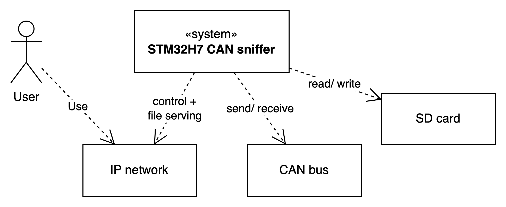

| Neighbor | Description |
| - | - |
| User | accesses the system through a web GUI, connects the system physically to the CAN bus that is supposed to be monitored |
| local network/ DHCP server (external system)| to make the web GUI available, the system needs to be assigned an IP address by a DHCP server |
| CAN bus (external system) | The CAN bus is the physical communication channel between devices, it can be configured with different baudrates (e.g. 250 kbit/s, 500 kbit/s 1 Mbit/s) |

## Technical Context

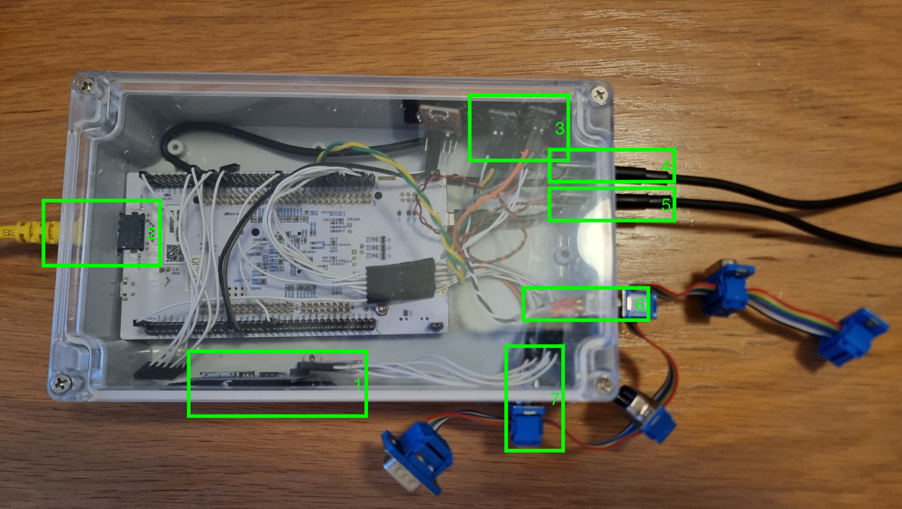
*Figure: STM32H7 CAN sniffer complete device* 

| # | Description |
| - | - |
| 1 | SPI SD card adapter (3.3 V) |
| 2 | RJ45 ethernet jack (on-board) |
| 3 | 2x CAN transceiver breakout |
| 4 | USB plug - STLink/debug |
| 5 | USB plug - 5 V supply for CAN transceivers |
| 6 | DSUB-9 connector CAN 1 |
| 7 | DSUB-9 connector CAN 2 |

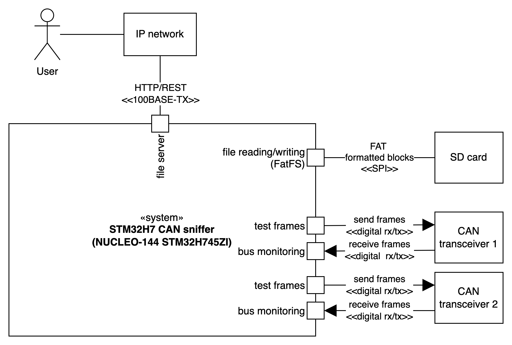


# Solution Strategy

## Hardware

The STM32H7 CAN sniffer system uses the on board ethernet adapter of the NUCLEO-144 board. Other adapters are bought as-is and connected via jump-wires to the respective pins on the board (two CAN transceivers and SD card to SPI adapter).

## Software

The STM32H7 CAN sniffer runs a custom software based on an embedded real-time operating system. Prioritized and preemptive task scheduling is used to perform the functions of the system.


The following table shows which measures are taken to reach the quality goals.

| Goal/Requirement | Architectural Approach | Details |
|-|-|-|
| Modifiability | separation of concerns (low coupling and high cohesion), opaque driver design, dependency inversion by letting drivers access data of the app layer through callback functions | |
| Reliability / Determinism | Use of NVIC for latency-critical drivers (e.g. CAN), prioritized task scheduling for critical code paths, error detection and correction for SD card access | |
| Safe firmware update | Prepare inactive slot, stream upload through an ingest pipeline, verify before apply, and reboot only after a controlled handover request to bootloader | |
| Portability | Use of STM32 HAL where applicable, conditional compilation for dual/single-core configs | | 

> **Note**: Portability in this context means portability across the STM32H7 family that support the needed peripherals and not portability accross toolchains. Thus, the code is allowed to use GCC specific commands (see function requirements)


# Building Block View

This section describes the decomposition of the STM32H7 CAN sniffer into modules.

## System overview

The software follows a layer architecture. Following the dependency inversion principle (DIP), drivers expose callback declarations so the application layer can inject RTOS services (e.g., task-notification hooks) or shared data (e.g., timestamps).

The diagram below shows the level-1 (white-box) view:

 ```mermaid 
 %%{init: 
    { 'theme':'default', 
      'sequence': {
        'useMaxWidth':true
        } 
    } 
}%%
block-beta 
    columns 6
    
    Application["Application / RTOS"]:6
    
    space:1
    
    block:LOGGING["CAN Logging"]:2
        columns 1
        CanLogManager["CAN Log Manager"]
        CanLogBuffer["CAN Log Buffer (lwrb)"]
    end
    
    block:CONFIG["Configuration"]:1
        columns 1
        SettingsHandler["Settings Handler"]
        ConfigManager["Config Manager"]
    end
    
    HTTP["HTTP/TCP/IP Stack"]:2

    space:1
    
    block:FILEABS["File System"]:3
        columns 1
        FileHandler["File Handler"]
        FatFS["FatFS"]
        StorageControls["Storage Controls"]
    end
    
    space:2
    CANABS["CAN abstraction"]
    SDCARD["SD Card Driver"]:4
    space:1
    
    COMMABS["Comm Driver Core"]:5
    NETIF["Network Interface"]:1
    
    CANDRIVER["CAN Driver"]:1
    SPIDRIVER["SPI Driver"]:4
    ETHDRIVER["ETH Driver"]:1
    
    STMHAL["STM HAL"]:6
    
    style Application fill:#e8f4f8,stroke:#333,stroke-width:2px
    style LOGGING fill:#fff4e6,stroke:#333,stroke-width:2px
    style CONFIG fill:#fff4e6,stroke:#333,stroke-width:2px
    style HTTP fill:#fff4e6,stroke:#333,stroke-width:2px
    style FILEABS fill:#f0f0f0,stroke:#333,stroke-width:2px
    style COMMABS fill:#f0f0f0,stroke:#333,stroke-width:2px
    style STMHAL fill:#ffe6e6,stroke:#333,stroke-width:2px

```

The RTOS lives in the application layer to let the application integrator have the freedom to assign tasks to functions. For example a driver task can be created by combining its callback functions with a task living in the app layer. If no hooks are provided, the default callback functions are used and they then depend on the driver implementation.

The drivers itself call the functions from the STM32 HAL directly.

### Application Layer

The application layer hosts the FreeRTOS tasks and services that turn the middleware blocks into full features. Each task focuses on a single responsibility and interacts with lower layers only through the abstractions documented elsewhere.

| Task / Service | Responsibility | Interfaces |
| - | - | - |
| **Core0Task0** (main loop) | Boots the system, mounts SD, initializes HTTP + settings, then periodically calls *http_poll* and configuration hooks to keep the UI responsive and configs synced. Applies CAN settings when requested. | *http_init/http_poll*, *SettingsHandler*, *ConfigManager*, *CanCtrl* |
| **Core0Task1** (log manager loop) | Polls *CanLogManager*: drains *fdcan_msg_port*, builds log entries, updates counters, and notifies *SdBridgeTask* when a block is ready. | *CanLogManager*, *fdcan_msg_port*, *CanLogBuffer*, *SdBridgeTask* |
| **CanBridgeTask** | Pulls frames from *CanAbs* and enqueues them into *fdcan_msg_port* for downstream logging. | *CanAbs*, *fdcan_msg_port*, logging telemetry hooks |
| **SdBridgeTask** | Flushes *CanLogBuffer* blocks to SD via the log manager hook; dedicated to log writes. | *CanLogManager*, *FileHandler* |
| **CanSendTask** | Handles optional CAN transmission (test frames / tracer) and propagates run/stop state from the UI/config. | *CanCtrl*, *Core0Task0* control flags |
| **SpiTask** | Multiplexes SPI clients, coordinates completion via RTOS semaphores/notifications, and drives SPI transfers for SD/logging and other peripherals. | *SpiAbs*, device-specific completion hooks |

Scheduling: CAN path tasks (*CanBridgeTask*, *Core0Task1*, *SdBridgeTask*, *CanSendTask*) and *SpiTask* run at higher priority than the *Core0Task0* loop to guarantee logging determinism (see [Concurrency & Interrupt Priorities](#concurrency--interrupt-priorities)). HTTP/config work executes inside *Core0Task0*’s periodic loop via *http_poll*, so callbacks must stay short to avoid extending the cycle. All application tasks avoid touching HAL drivers directly and instead rely on the comm/file abstractions, keeping the layer testable.

### Middleware Components

This section gives an overview of the software components that sit between application layer and the abstraction layer.

#### Configuration Management overview

The configuration stack combines *ConfigManager*, *SettingsHandler*, and the HTTP control surface to load/persist JSON settings via FatFS. See [Configuration Management (Building Block view)](#configuration-management-building-block-view) for component details and [Configuration Management Scenarios](#configuration-management-scenarios) for runtime flows.

#### CAN Logging Subsystem overview

CAN logging spans *CanAbs*, *CanBridgeTask*, *CanLogBuffer*, and *CanLogManager*, forming a three-stage buffering pipeline that writes rotating files on SD. Refer to [CAN Logging Subsystem (Building Block view)](#can-logging-subsystem-building-block-view) and [CAN Logging Subsystem (System scenarios)](#can-logging-subsystem-system-scenarios) for structure and behavior.

#### HTTP/TCP Stack overview

Networking relies on LwIP running on CM7 (zero-copy Ethernet DMA) with the built-in *httpd* server and CGI/SSI callbacks. See [HTTP/TCP/IP Stack (Deep Dive)](#httptcpip-stack-deep-dive) for the subsystem diagram and handler breakdown.

### Abstraction Layers

These layers add functionality and decouple hardware-specific details, providing clean interfaces for the application.

#### Comm Drivers (documented)

Driver abstractions (*SpiAbs*, *CanAbs*, *CommHandle*) hide HAL specifics, while the comm-factory linker section auto-registers implementations. For a detailed breakdown see [Comm drivers (Building Block view)](#comm-drivers-building-block-view) and the runtime/scenario sections later in this document.

#### File System Management

*FileHandler* centralizes FatFS access (mount, buffered writes, iterators) so configuration and logging modules don’t touch FatFS directly. See [File System Management (Building Block view)](#file-system-management-building-block-view) for responsibilities and diagrams.

### HAL Layer

CM7/CM4 share startup files, HAL MSP init, and system clock setup reused from ST example projects rather than regenerated in Cube. HAL drivers (FDCAN, SPI, ETH, SDMMC, GPIO, TIM) originate from those reference examples and are adapted in the abstraction layers. The exact PLL/clock configuration is documented in [*doc/clock_setup.md*](clock_setup.md) for cross-checking against *SystemClock_Config*.

## Configuration Management (Building Block view)

### Level 1: Subsystem Architecture

| Component | Purpose | Notes |
| - | - | - |
| ConfigManager | Persistence facade around FatFS; exposes load/save plus weak hooks. | Tracks diagnostics (*lastError*, *needsSync*, *fileOpen*). |
| SettingsHandler | JSON adapter for *AppConfigType*; owns dirty flag. | Uses *coreJSON* + small helpers in *FileHandler*. |
| HTTP control surface | CGI/SSI glue that forwards form data to *SettingsHandler* and triggers apply + persistence. | Runs inside the CM7 LwIP/httpd task. |

Data model excerpt (*app/services/config/SettingsHandler.h*):

```c
typedef struct {
    uint32_t baudrate;
    uint8_t mode;
} AppFcdanConfigType;

typedef struct {
    uint8_t updated;
    AppFcdanConfigType can1;
    AppFcdanConfigType can2;
    uint8_t ip[4];
} AppConfigType;
```

The persistent JSON mirrors these fields 1:1, keeping schema translation out of the storage layer.

### Level 2: ConfigManager Component

- Uses *FatFS_SD_OpenFileForRead/OverWrite*, *ReadFile*, *WriteFile*, *CloseFile*.
- Stores a single 512-byte buffer and exposes *ConfigManager_LoadConfig/SaveConfig*.
- Weak hooks (*SerializeHook*/*DeserializeHook*) isolate schema knowledge; *SettingsHandler* implements them.
- Diagnostics (*ConfigManager_GetFileInfo*) expose filename, size, open state, *needsSync*, and last error for the web UI.

### Level 3: SettingsHandler Component

- Converts between JSON configuration and *AppConfigType*.
- Tracks the *updated* bit so background tasks can decide when to persist changes.
- Provides helpers for CGI/SSI callbacks (*httpd_post_cb*, *http_app_set_setting*, *http_app_get_setting*) and implements IP parsing + CAN validation logic.
- Supplies the weak hooks consumed by *ConfigManager*.

## CAN Logging Subsystem (Building Block view)

### Level 1: Subsystem Architecture

| Component | Purpose | Notes |
| - | - | - |
| *CanAbs* + deferred IRQ | Copies frames out of the FDCAN FIFOs in IRQ context and schedules lower-priority processing. | ISR ring buffer keeps latency deterministic; deferred IRQ notifies FreeRTOS tasks safely. |
| *CanBridgeTask* + *fdcan_msg_port* | Moves frames from the driver domain into a lock-free queue owned by the application. | Provides back-pressure before the logging pipeline. |
| *CanLogBuffer* | LwRB-based staging buffer (3 × 64 KiB blocks) in D1 SRAM. Produces fixed-size blocks with headers for SD writes. | Exposed via *CanLogBuffer_AddEntry*/*ReadNextBlock*. |
| *CanLogManager* | Drains ready blocks, writes them to */logs/CAN.LOG<n>*, handles rotation + metadata, exposes statistics. | Uses *FileHandler*/FatFS and notifies *SdBridgeTask* for background flush. |
| *SdBridgeTask* + FileHandler | Performs log block writes/flushes for the logging pipeline. | Config writes run in *Core0Task0* and are not routed through *SdBridgeTask*. |



### Level 2: CanLogBuffer Component

- Implemented with *lwrb* and located in the D1 SRAM bulk-buffer region (see [Memory Overview](#memory-overview)) to guarantee bandwidth for DMA + CPU.
- Maintains an epoch counter and per-block sequence ID so offline tools can detect gaps.
- API surface:
  - *CanLogBuffer_AddEntry* copies entries (includes timestamp, channel, DLC, flags).
  - *CanLogBuffer_IsBlockReady* reports when at least 64 KiB are buffered.
  - *CanLogBuffer_ReadNextBlock* emits *{header, payload, padding}* and clears consumed bytes. Block header layout:

```c
typedef struct {
    uint8_t version;
    uint8_t header_size;
    uint8_t epoch;
    uint8_t cnt;
    uint32_t block_size;
    uint32_t block_fill;
    uint32_t ingress_frames;
    uint32_t frame_count;
} __attribute__((packed)) CanLogBlockHeaderType;
```

- Padding is filled with *0xFF* so tools can skip unused bytes quickly.

#### Log file structure (packet format)

Each block written to SD starts with *CanLogBlockHeaderType*, followed by a series of packed entries (*CanLogEntryType* frames and periodic *CanLogSyncType* sync entries), and padding. Packet-style diagrams:

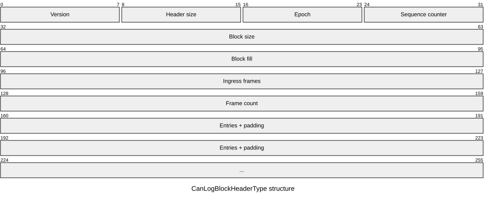

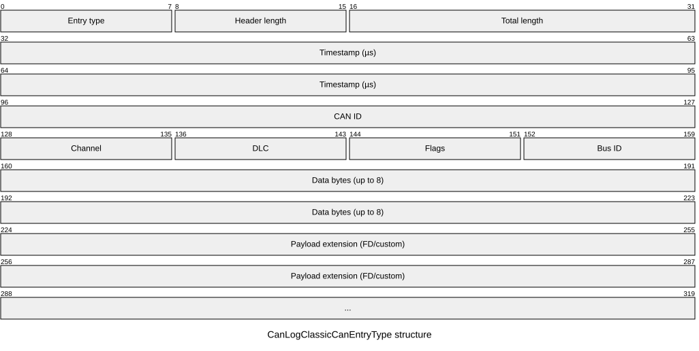

Frame entries embed: 32-bit timestamp (us, low bits), CAN ID, channel, DLC/flags, and payload length/data. Periodic *SYNC* entries carry *abs_time_high* so tools can reconstruct a 64-bit timeline from the 32-bit per-frame timestamp. *block_fill* tells post-processing tools where padding (*0xFF*) begins for each block as byte index.

### Level 3: CanLogManager Component

- Owns the active log filename, head/tail indices (circular buffer sized by configured *log_file_count*), and rotation policy driven by configured *log_file_size* (defaults to *MAX_LOG_FILE_SIZE*/*MAX_LOG_FILE_COUNT*).
- Polls *CanLogBuffer_IsBlockReady* inside *appCanLogHandlerPoll*. When ready it:
  1. Reads the block.
  2. Writes it via *FatFS_SD_WriteFile*.
  3. Checks configured *log_file_size* and rotates to */logs/CAN.LOG<n>* if needed (with wrap-around based on *log_file_count* and optional pre-allocation).
- Exposes hooks for UI/CLI queries via *FsCustom_GetCanLogHeadIndex/TailIndex*, *FsCustom_IsTracerRunning*, etc.
- Provides *CanLogFileManager_ErrorHandler* so the application can react to SD errors (LED, telemetry).
- Initialization / shutdown entry points:
  - *CanLogHandler_Init* wires mount status + run flags.
  - *appCanLogHandlerInit*, *appCanLogHandlerPoll*, *appCanLogHandlerDeInit* integrate with CM7 tasks.

## File System Management (Building Block view)

### Level 1: FileHandler as FatFS Facade

- Responsibilities:
  - Mount/unmount SD partitions.
  - Provide safe wrappers for read/write/truncate/iterator operations.
  - Buffer write indices so append operations stay O(1).
- Consumers:
  - *ConfigManager*, *CanLogManager*, HTTP virtual file system, diagnostics CLI.

.

### Level 2: FileHandler API Layers

- Layering:
  1. **Raw I/O** – *FatFS_SD_OpenFileForWrite/OverWrite/Read*, *FatFS_SD_WriteFile*, *FatFS_SD_ReadFile*.
  2. **Helpers** – iterators, block writes, mounting macros, buffered size queries.
  3. **Format utilities** – *FileHandler_GetValue*, *FileHandler_ConvertToInteger*, JSON helpers used by SettingsHandler.
- These layers let higher modules opt-in only to what they need (e.g., CanLogManager never pulls in JSON helpers).



## Comm drivers (Building Block view)

### Level 1: Comm drivers components



### Level 2: CommFactory diagram (plugin mechanism) 



### Level 3: Runtime Structure (internal composition)



## HTTP/TCP/IP Stack (Deep Dive)

### Level 1: HTTP Subsystem Architecture



### Level 2: HTTP Application Layer



### Level 3: LwIP Integration


## Firmware Update (IAP) Building Block view

The firmware update path is implemented as a small chain of components. It keeps application logic and bootloader logic separated.



- HTTP upload handlers stream data into *UpdateIngestPipeline*.
- *UpdateIngestPipeline* gets the active ingest implementation from *UpdateIngestRegistry*.
- *IapIngestAdapter* handles incoming chunking and checks continuous chunk sequence.
- *IapWriter* erases/writes/verifies the inactive slot through storage callbacks.
- The application requests reset only after successful finalize; the bootloader decides image activation during reboot.

# Runtime View

This section describes the behavioral aspects of the software components.

## Configuration Management Scenarios

**Boot-time load.** *Core0Task0* mounts the SD card, initializes *ConfigManager*, and issues *ConfigManager_LoadConfig*. The component opens *CONF.TXT*, reads it into the staging buffer, and calls the deserialize hook implemented by *SettingsHandler*. On success the shared *AppConfig* struct is populated and handed to the rest of the system. *Core0Task0* also loads `log_config.json` (cluster_size, log_file_size, log_file_count) and applies it to *CanLogManager*; if a reformat was requested or the card comes up without a usable filesystem, the boot path recreates the filesystem and rewrites `log_config.json`.

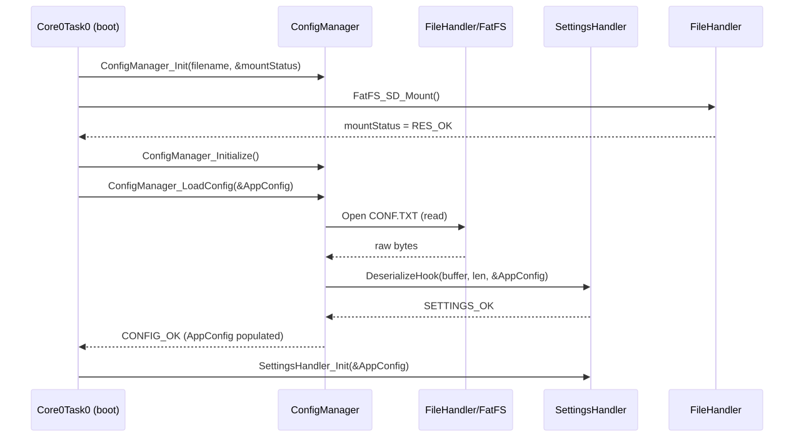

**Remote update via web UI.** HTTP POST handlers call *consume_param_values*, which updates *AppConfig* in RAM and sets the *updated* flag. The application task polls via *SettingsHandler_Poll*; when dirty it calls *ConfigManager_SaveConfig*, triggering serialization through the hook and an overwrite of *CONF.TXT*. The write-path stays out of the HTTP task, keeping SD latency away from the TCP/IP stack. SD card management requests persist the desired log sizing and reformat state for application on the next boot.

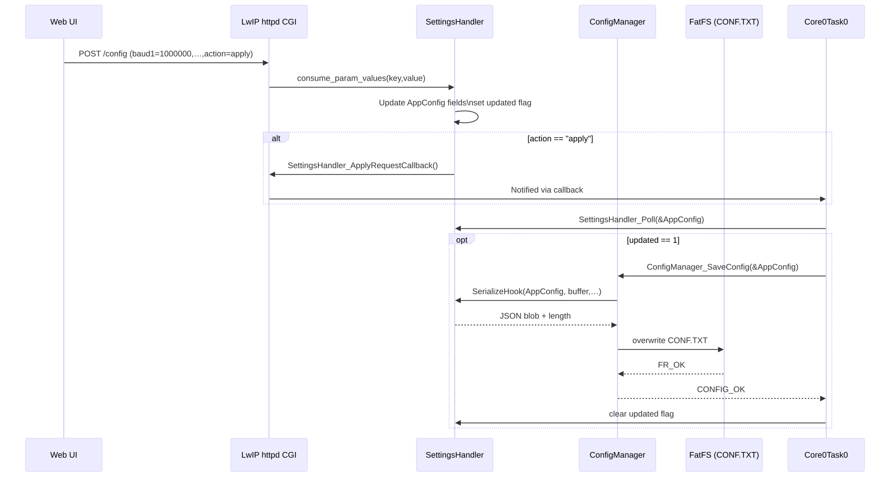

## Firmware update scenarios

**Upload and verification (success).** The update flow prepares the inactive slot, streams firmware bytes through the ingest path, and verifies the staged image. Apply is only enabled after successful verification and when logging is not active. Once apply is requested, the system performs a controlled reboot so the bootloader can process the uploaded image.

**Rejected or interrupted upload (failure).** If validation or storage checks fail, the upload is aborted and an error status is reported to the client. The running image stays unchanged and the client can retry.

## Ethernet requests processing

This section describes the runtime view of how an ethernet message is processed within the system. The following sequence diagram aims to answer following questions:
- What triggers the whole interaction?
- Which components run concurrently and in what order?
- Where does the interrupt end and the task take over?
- How does the frame reach the higher network stack?

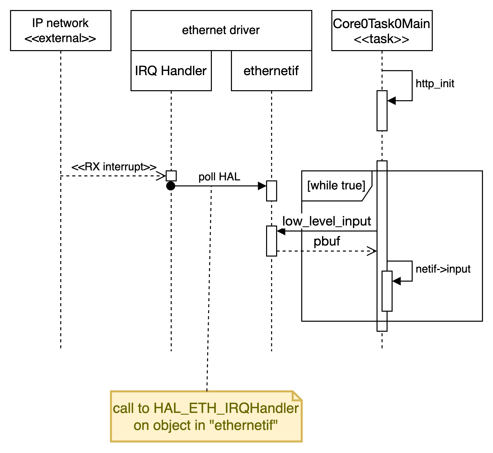

The interrupt populates the ethernet handle with the received data. The main task polls the input function of the LwIP stack to issue the message processing.

## Log file

The following sequence diagram visualizes how the CAN frames are written into actual log files on the SD card.

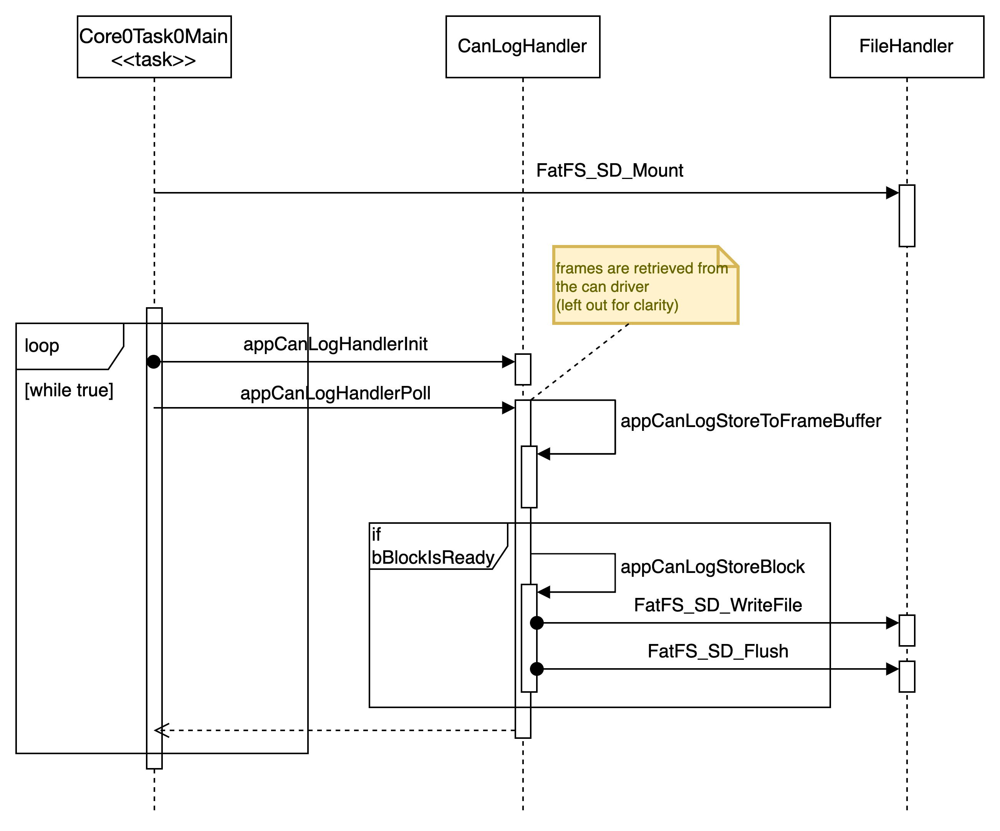

## CAN frame logging

The sequence diagram below shows the end-to-end flow from the FDCAN hardware interrupt through the buffering pipeline into the rotating SD files. It highlights the ISR/Deferred/Task staging, block formation, and file I/O split.

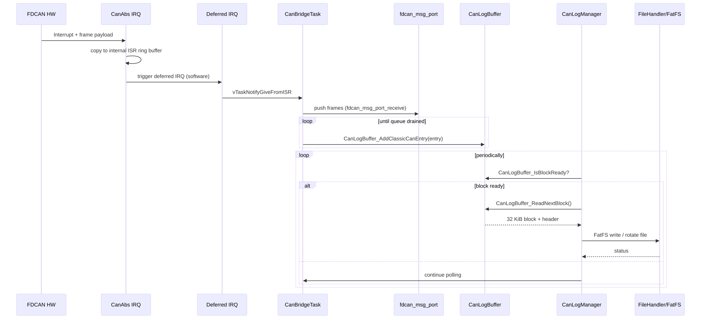

### Measurement instrumentation

To validate determinism, the firmware exposes GPIO toggles that align with Saleae/oscilloscope captures:

- **CAN ISR latency** – GPIO edges bracket the interrupt in *CanAbs*, allowing a scope capture of ISR duration.  
  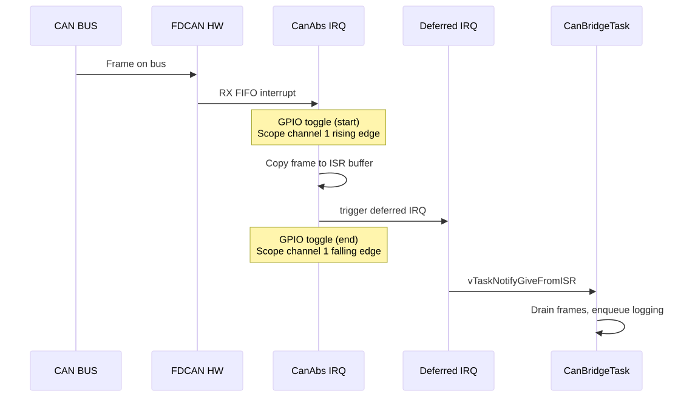
- **SD multi-block write timing** – GPIO toggles wrap the FatFS write call so scope channel 2 captures the write window while SPI signals provide context.  
  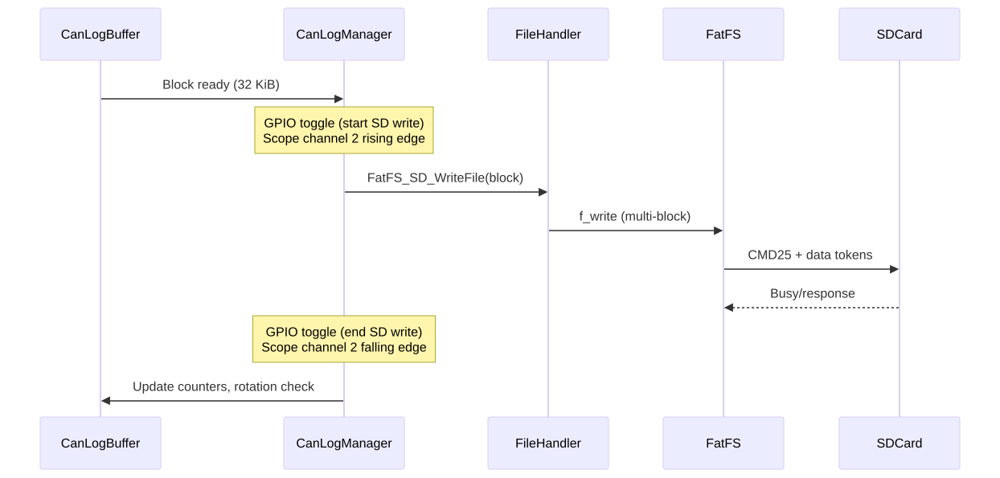
- **Block flush duration** – Saleae capture shows the flush window alongside SPI CLK/MOSI/MISO to correlate *CanLogBuffer* drain with actual SD traffic.  
  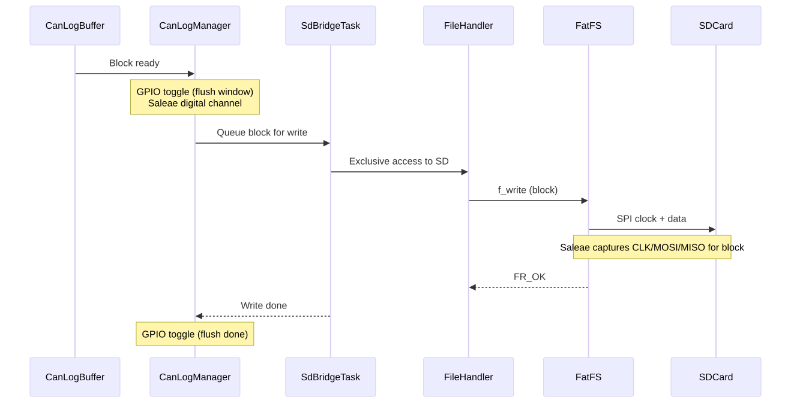
- **Lossless logging validation** – Logger starts first, then CANoe traffic; stopping happens in reverse. After each run, the firmware's drop counter and total received frame count are read, and the SD log is parsed to verify continuous CANoe sequence IDs. The total frame count is compared against the CANoe report to confirm zero loss.  
  

### Measurements

The input data used for the measurements in this section were generated using CANoe and an Interactive Generator node for precise control and analysis of the test data.

To test the reliability of the CAN logger representative test cases are defined. In practice, average bus loads are kept considerably below 100 % to reduce contention and keep the traffic deterministic. Therefore, the end-to-end CAN logger tests are run at a bus load of ~85 %.
The actual frame rate is determined by the baud rate and the payload of the frames. Stress tests have to show reliable operation at worst case frame rates as described further down in this section.

The following figure shows how the data rate depends on the payload length (DLC) assuming all frames have the same length.
For storing a log entry, each log entry adds a packed 14-byte header (excluding payload), so dynamic storage is 14 + DLC bytes per frame (22 bytes at DLC=8). At 1 Mbit/s and 100% bus load this yields ~0.35 MiB/s at DLC=8 and up to ~0.49 MiB/s at DLC=0; a fixed 8-byte payload in each log entry would push the worst case to ~0.76 MiB/s.
Worst case in this model (classic CAN, standard ID, 2 channels, DLC=0, 1 Mbit/s, 100% bus load) is therefore ~0.49 MiB/s for dynamic logging.

The following diagram shows that storage data rate to the SD card increases as DLC decreases because the frame rate rises; dynamic storage reduces the required bandwidth at low DLC. The SD throughput reference line (dashed green) is taken from the [SPI/SD timings section](#sd-multi-block-write-timing).

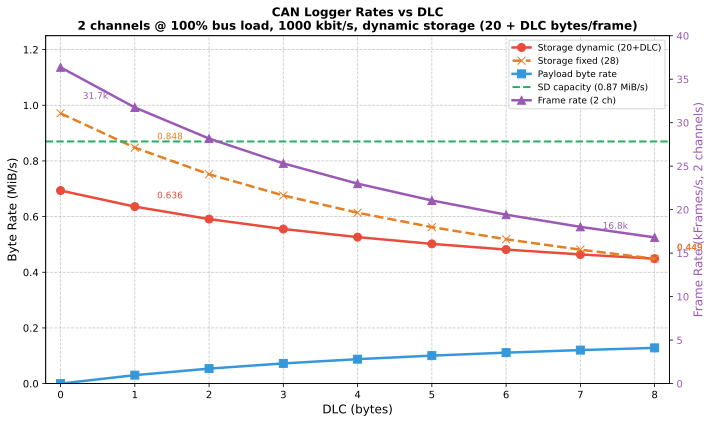
*Figure: Classic CAN byte and frame rates over the payload length (DLC) (see [script](images/graphs/datarates_anaylsis.py))*

In conclusion, at 1 Mbit/s and 85% bus load, lower-DLC classic CAN frames provide a realistic long-run test case (~6 h), complemented by short (~15 h) 100% bus load stress runs.

#### CAN ISR latency

The FDCAN interrupt service routine empties the hardware buffer and processes the timestamps of the received frames. The frames are then put into a lightweight first stage software buffer.
The measurements with an oscilloscope (1 GSs/s) shown in the following figure yield an eyeballed average of 4 us with a jitter of +-400 ns.

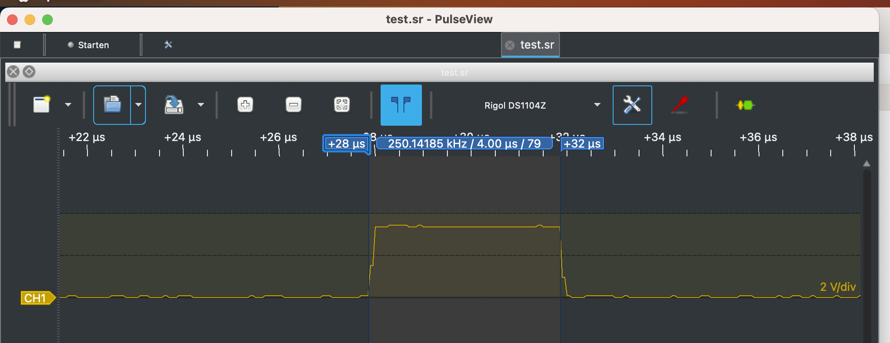
*Figure: FDCAN interrupt service routine duration with 1 Mbit/s on 2 channels at 85 % bus load.*

Notes:
- the measurement was taken for a per frame IRQ and not a watemark based policy
- jitter and ISR duration can be optimized by placing ISR code and data in ITCM/DTCM and
avoiding cache misses by keeping the buffer in tightly coupled RAM.

#### SPI/SD timings

This section describes the measured effective write speed and its statistical metrics.

##### SD multi-block write timing

*See instrumentation in [FileHandler.c](../app/services/storage/FileHandler.c).*

Data is written to the SD card from a staging buffer. The staging buffer is a rotating buffer offering multiple slots. When a slot is full it is written to the SD card in one go. The following image shows the time it takes to write one slot to the SD card on the y axis (including FatFS and SD SPI overhead) over the absolute time passed since the device was powered up (global timestamp).

The diagram can be re-generated using following commands:

```sh
cd doc/images/measurements/SD_card_write_duration \
&& python3 write_duration_block.py write_duration_2_channel_19920_fps_per_channel.csv
```

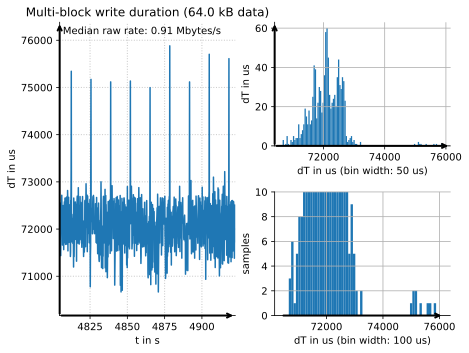

The diagram shows samples from 4001 consecutive written slots. These slots were filled by test frames sent to CAN 1 and CAN 2 with both in listen-only mode. Thus, the bus load on each channel was ~100 %.

Write duration is tightly clustered around ~69.5 ms (median ~69520 us), with 95 % of samples between ~69.1 ms and ~70.8 ms. Occasional spikes are visible: 6 samples exceed ~73.7 ms (0x12000 us), with spacing in the hundreds of writes.

The median throughput is accordingly: ~0.90 MiB/s for a single 64 KiB block with FAT32 overhead.
Logging 2 channels at 100 % bus load at 1 Mbit/s currently results in a needed data rate of 0.39 MiB/s to the SD card (28 byte per frame total; see [SD card bandwidth script](../dev/scripts/sd_card_bandwidth.py)). The end-to-end (E2E) throughput based on the measured write cadence and duration is ~0.53 MiB/s. This value is a little more than the theoretical one determined in [Measurements](#measurements). The delta is explained by the block header and sync frames that are added to each block of the log. 

Notes:

- High-latency spikes are sparse and spaced by hundreds of writes, consistent with periodic card-internal housekeeping (erase/program or cache flush).
- A separate 32 KiB write measurement shows spikes every 224 samples, consistent with card bookkeeping roughly every 224 * 32 KiB (~7 MiB).

##### Block flush window (logic analyzer)

The following screenshot taken with a 50 Msps logic analyzer shows the instrumented GPIO toggle at channel 0 and the SPI communication at the 4 remaining channels. 
These measurements are marked in the logic analyzer screenshot:

- M0 (PB1) shows the FDCAN ISR timing
- M1 (PB2) spans the 64 KiB multi-block write (~70.0 ms)
- M2 (PB4) spans each iteration of copying a frame from the message port to the SD card staging buffer and the flush management


#### Lossless logging validation

Lossless logging validation uses three checks after each run: 

1. the internal drop counters remains zero, 
2. the recorded CANoe-generated sequence IDs are continuous across all frames (indicating no E2E frame loss), 
3. and the total received frame count matches the CANoe report. 


The procedure is to start the logger, start CANoe traffic, stop CANoe, stop the logger, then read the metadata and parse the SD log.

The losslessness E2E tests are run at ~85 % bus load on both channels for 6 hours and the end-to-end captures from the SD card are stored here: [external link](https://my.hidrive.com/share/rc0mksyt9x).

Some metadata is read via the REST API using following scripts:

- error flags, drop counts and buffer utilizations: [poll_rb1_usage.sh](tools/poll_rb1_usage.sh) 
- log file status (using ` curl can-sniffer.local/logger/status >> tools/rb1_usage.log`)

##### Test results

The files resulting from the test are big (~10 Gb) and, therefore, compressed using

```sh
date=2026-01-30 \
&& tar -cvf - ./logs | zstd -T0 -19 -o logs_${date}.tar.zst \
&& zstd -t logs_${date}.tar.zst
``` 

and then uploaded to a private cloud storage.
A quick archive check:

```sh
zstd -t logs_${date}.tar.zst \
&& zstd -dc logs_${date}.tar.zst | tar -tvf - | head
``` 

The archive can be unpacked using following command:

```sh
mkdir -p ./logs \
&& zstd -dc logs_${date}.tar.zst | tar -xvf - -C ./logs --strip-components=2
```

Follwoing tests were conducted:

- 2026-01-30: The test results are stored in: [measurements/losslessnes/2026-01-30/README.md](measurements/losslessnes/2026-01-30/README.md).

#### Stress test

This section shows the results for a short stress test where both channels log frames at 1 Mbit/s @ 100 % bus load for 15 minutes to see the behavior under saturation.

##### Test results

- 2026-01-30: The test results are stored in: [doc/images/measurements/stress/results/2026-01-30/README.md](images/measurements/stress/results/2026-01-30/README.md).

> TODO

## Comm drivers (Runtime view)

Core runtime responsibilities:
- *SpiTask* multiplexes producer requests into the single SPI driver instance, tracking completion callbacks per client.
- *CanBridgeTask* drains *CanAbs* and writes frames into *fdcan_msg_port*, ensuring ISR -> task transfer is lossless.
- *SdBridgeTask* flushes log blocks to SD; config writes are handled in *Core0Task0*.
- *CommFactory* initializes driver instances via linker-based registration, keeping startup deterministic.
Each runtime component follows the same pattern: ISR copies data, deferred handler notifies a task, and the task interacts with drivers/middleware at safe priority levels.

## Comm driver factory

The factory is realized via linker sections: every driver exposes a *CommDriverDescriptor* placed in *.comm_factory*. At startup, *CommManager* walks that section, initializes the drivers, and hands out opaque handles to higher layers. This keeps the build scalable: new drivers register themselves without changing central code.

### SPI driver

This section describes the runtime behavior of the SPI driver, from initial transfer submission by producer tasks through hardware execution to completion handling. The flow illustrates how multiple producers with different priorities and completion requirements are handled concurrently.



### FDCAN driver

- **Trigger**: Hardware RX FIFO hits watermark or TX completes.
- **Flow**: IRQ copies frame meta/data into *CanAbs* ring buffer, posts deferred IRQ -> *CanBridgeTask* drains frames via *fdcan_msg_port_receive*, updates statistics, optionally notifies higher layers (logging, HTTP telemetry).
- **TX path**: Application queues messages via *CanAbs_Send_Can1/Can2* (e.g., in *CanCtrl*), which programs the HAL Tx mailbox and handles retries.
- **Error handling**: Bus-off or error-passive events are surfaced via callbacks so the UI can warn the user and logging can mark gaps.
- **Diagram**: reuse *images/can-logging_runtime.md.svg* (shows IRQ -> task flow).
## System Scenarios

### Scenario 1: End-to-end CAN message logging

- **Trigger**: Both CAN channels report traffic at up to 1 Mbit/s.
- **Flow**: FDCAN IRQ -> CanBridgeTask -> fdcan_msg_port -> CanLogManager adds entries to CanLogBuffer (64 KiB blocks) -> CanLogManager writes */logs/CAN.LOG<n>* via *SdBridgeTask*.
- **Outcome**: Frames are persisted without loss; rotation keeps a constant number of files.
- **Key risks**: SD stalls; mitigated through triple buffering and block-based writes.

### Scenario 2: Configuration load/apply flow

- **Trigger**: Device boot or user applies new settings via HTTP.
- **Flow**: ConfigManager loads *CONF.TXT* into RAM through FileHandler; SettingsHandler parses JSON -> UI updates fields; when *updated* flag is set and user presses “Apply”, ConfigManager serializes JSON and overwrites the file.
- **Outcome**: Configuration changes survive reboots; HTTP clients see immediate feedback.
- **Key risks**: SD removal or parse failure; exposed via *lastError* and UI diagnostics.

### Scenario 3: Firmware update upload/apply flow

- **Trigger**: User uploads a bootloader-compatible signed firmware image via the web UI.
- **Flow**: prepare update slot -> upload stream -> staged image verification -> explicit apply request -> controlled reboot.
- **Outcome**: Current application keeps running until reboot; bootloader activates the staged image in the next boot sequence.
- **Key risks**: Interrupted upload or invalid artifact; mitigated through strict ingest validation and explicit abort/retry behavior.

## CAN Logging Subsystem (System scenarios)

### Scenario 1: CAN frame capture to buffer

- **Trigger**: FDCAN RX interrupt fires.
- **Flow**: ISR copies frame into *CanAbs* ring buffer and wakes *CanBridgeTask*. The task pushes frames into *fdcan_msg_port*. *Core0Task1* then polls *CanLogManager*, which converts frames into *CanLogBuffer_AddEntry* calls, incrementing epoch/block counters.
- **Outcome**: Logging pipeline receives frames already timestamped and tagged with channel metadata, ready for batching.
- **Key constraint**: ISR stays under 6 µs to avoid CAN FIFO overflow; achieved by deferring all heavy work to the task.

### Scenario 2: Block-based flush to file

- **Trigger**: *CanLogBuffer_IsBlockReady* reports ≥64 KiB buffered.
- **Flow**: CanLogManager calls *ReadNextBlock*, stamps header (epoch, sequence), and writes the block via *FatFS_SD_WriteFile* through SdBridgeTask. If the current file size reaches configured *log_file_size*, rotation kicks in.
- **Outcome**: SD writes remain aligned and amortized, minimizing wear and ensuring deterministic latencies.
- **Key metrics**: Block counters per channel, write latency (exposed through telemetry hooks).

### Scenario 3: Log file rotation

- **Trigger**: Active file exceeds configured *log_file_size*.
- **Flow**: CanLogManager closes the current file, increments *fileHeadIndex*, optionally wraps and updates *fileTailIndex*, opens */logs/CAN.LOG<n>* (pre-allocates if enabled), and updates metadata presented via *FsCustom_GetCanLogHeadIndex/TailIndex*.
- **Outcome**: Circular buffer of log files; oldest data overwritten first when storage fills.
- **Key risks**: Power loss mid-rotation; mitigated via padding + block headers allowing recovery.

## Configuration Management (System scenarios)

### Scenario 1: Load settings on boot

- **Trigger**: CM7 boots and mounts the SD card.
- **Flow**: FileHandler mounts partition, ConfigManager opens *CONF.TXT*, reads into internal buffer, SettingsHandler deserializes JSON into *AppConfig*. *Core0Task0* also loads `log_config.json` (cluster_size, log_file_size, log_file_count) and applies it to *CanLogManager*; if a reformat was requested or the card has no usable filesystem, boot recreates the filesystem and rewrites `log_config.json`.
- **Outcome**: System starts with last persisted CAN baud rates, modes, and IP settings.
- **Failure handling**: Missing file->defaults applied; mount error->*CONFIG_ERROR_MOUNT_FAILED*.

### Scenario 2: HTTP POST updates settings

- **Trigger**: User submits the configuration form in the web UI.
- **Flow**: *httpd_post_cb* parses parameters, *SettingsHandler* updates *AppConfig* fields (baud, mode, IP) and sets *updated*. The “apply” action updates hardware immediately, and the main loop persists the new config.
- **Flow**: SD card management requests persist log sizing parameters in `formatting_requested.txt`; they are applied on the next boot and saved in `log_config.json`.
- **Outcome**: Running system reflects new settings instantly, and persistence occurs when requested.
- **Edge cases**: Invalid input rejected by parser; UI reports the error and *updated* stays unchanged.

### Scenario 3: Persist changes to file

- **Trigger**: Operator hits “Apply” in the web UI or a CLI command requests persistence.
- **Flow**: SettingsHandler detects *updated* flag -> ConfigManager serializes current *AppConfig* via hook -> writes using FileHandler. *needsSync* flag indicates pending flush if power removal is imminent.
- **Outcome**: New settings stored atomically; UI clears dirty flag.
- **Observability**: *ConfigManager_GetFileInfo* used to expose filename, size, last modified timestamp.

## Comm Drivers (System scenarios)

### Scenario 1: SPI transfer lifecycle

- **Trigger**: Application task enqueues SPI request (e.g., SD block write, SD block read).
- **Flow**: *SpiTask* assigns a slot via *SpiAbs*, prepares the transfer via HAL, and submits it using the appropriate backend for the request. Completion interrupt calls weak hook -> port layer signals requesting task (semaphore/notification). *SpiTask* dequeues next pending transfer.
- **Outcome**: Multiple producers share SPI bus without blocking in ISR context; latency predictable due to queueing.
- **Edge cases**: Timeout/backoff when peripheral not ready, priority inversion avoided by running *SpiTask* at higher priority than producers.
# Deployment View

- **Hardware**
  - NUCLEO-H745ZI-Q board with dual-core STM32H745
  - on-board Ethernet PHY, external SD-card adapter via SPI
  - two external TJA1050 CAN transceivers
  - and optional USB for power/debug.
  - internal flash partitioning includes bootloader and two image slots used for upgrade flow.
- **Core assignment**
  - CM7: runs FreeRTOS, networking, config/UI tasks, logging pipeline, SD bridge.
  - CM4: currently idle placeholder for future extensions (e.g., dedicated acquisition or diagnostics); kept in reset unless explicitly built.
- **Host tooling**
  - developers interact via STLink (CubeIDE/OpenOCD) for flashing/debugging and USB serial for logs
  - Network clients access the HTTP UI over LAN
  - SD card can be removed for offline log analysis.
- **External systems**
  - DHCP server for IP assignment
  - CAN buses under test
  - workstation running plotting/analysis scripts
  - optional dockerized doc toolchain for Mermaid rendering.

# Cross-cutting concerns

This section describes general structures and system-wide aspects.

## Architecture and design concepts

### CAN frame logging

Three buffering stages decouple hard-real-time work from lower-priority processing:

1. **First stage – ISR ring buffer**  
   The **CAN driver’s RX interrupt (IRQ)** immediately copies each frame from the hardware FIFO into an **internal ring buffer**. This keeps the ISR short and deterministic.

2. **Second stage – deferred IRQ callback**  
   The driver invokes an **integration-layer callback**. Because the CAN IRQ runs at very high priority, it cannot call *vTaskNotifyGiveFromISR* directly. Instead, the callback triggers a ***DEFERRED_IRQ*** with a lower priority suitable for RTOS primitives.

3. **Third stage – *CanLogManager* (Core0Task1)**  
   *CanBridgeTask* runs on a notification from the deferred IRQ and pushes frames into ***fdcan_msg_port***. *Core0Task1* then drains the port via *CanLogManager*, converts frames into log entries, and writes them to *CanLogBuffer* for SD flushing.

> **Note**  
> *fdcan_msg_port* exposes a classic producer/consumer buffer:  
> *Producer*->*fdcan_msg_port_receive()* | *Consumer*->*fdcan_msg_port_read()*

This three-layer approach ensures **minimal ISR latency**, isolates RTOS scheduling from high-priority hardware interrupts, and allows bulk transport of frames to subsequent processing stages or storage on SD-Card.


### SPI
The SPI driver design aims at decoupling the driver from the application and RTOS. Thus, an abstraction layer is used to handle all driver specific objects in a layered architecture. Using weak callback definitions lets the driver run either blocking in standalone mode or lets the caller inject their own functions (e. g. semaphore handling within the port layer):


### Firmware update path (IAP)

The IAP path uses one ingest path for upload data and keeps responsibilities separated:

- ingress source (currently HTTP) calls one ingest API
- update slot can be prepared before upload starts
- upload and verification status are exposed to the UI
- apply is allowed only after successful verification
- reboot is requested only after an explicit apply request; boot decision stays in bootloader.

### Concurrency & Interrupt Priorities

#### Interrupts
configLIBRARY_MAX_SYSCALL_INTERRUPT_PRIORITY is set to 5 per default.

Following NVIC setup is used (relative to the value of configLIBRARY_MAX_SYSCALL_INTERRUPT_PRIORITY):
| Module | Priority offset | Notes |
| - | - | - |
| FDCAN | -5 | ISR runs well above the FreeRTOS ceiling to keep capture deterministic. |
| TIM (profiling/timebase) | -4 | Provides a precise timestamp source without touching RTOS APIs. |
| Deferred software IRQ | +1 | Bridges FDCAN ISR to *CanBridgeTask* via notifications. |
| SPI1 DMA / IRQ | +2 | Shared by *SpiTask*; still allowed to call FreeRTOS APIs. |
| Ethernet | +3 | Lowest priority among comms so logging wins under load. |

#### Tasks

| Task | Relative priority | Notes |
| - | - | - |
| *CanBridgeTask* | Highest | Wakes on deferred IRQ notifications and drains CAN buffers first. |
| *SpiTask* | Very high | Owns the SPI bus and services storage traffic close behind CAN ingest. |
| *Core0Task1Main* | High | Runs the CanLogManager poll loop and fills the log buffer. |
| *SdBridgeTask* | Medium-high | Flushes completed log blocks to storage. |
| *CanSendTask* | Medium | Handles optional transmission without outranking the logging path. |
| *Core0Task0Main* | Lowest | Main control loop for HTTP polling, config, and general control. |

## Memory Overview

This firmware uses linker sections (defined in *CM7/Inc/memory_sections.h*) to place buffers in RAM regions that match their access and DMA needs. The table below consolidates current usage so it is not scattered across multiple sections.

| Section / macro | Placement intent | Current usage |
| - | - | - |
| *.ram_d1* / *RAM_D1_SECTION* | Large, CPU-friendly SRAM for bulk buffers. | *CanLogBuffer* ring buffer (3 x 64 KiB blocks). |
| *.dtcram* / *RAM_DTC_SECTION* | Core-coupled RAM for deterministic, low-latency access (not DMA). | *fdcan_msg_port* message buffer storage. |
| *.dma_buffer* / *DMA_BUFFER* | DMA-capable, 32-byte aligned buffers. | SPI DMA scratch buffers in *platform/drivers/spi/Spi_Cmds.c*. |
| *.RxDecripSection* / *ETH_RX_DESC* | Ethernet RX DMA descriptors. | RX descriptor table in *app/services/http/src/ethernetif.c*. |
| *.TxDecripSection* / *ETH_TX_DESC* | Ethernet TX DMA descriptors. | TX descriptor table in *app/services/http/src/ethernetif.c*. |
| *.Rx_PoolSection* / *ETH_RX_POOL* | Ethernet RX pool backing store. | LwIP RX pool in *app/services/http/src/ethernetif.c*. |

Notes:
- *RAM_D2_SECTION* and *RAM_D3_SECTION* are defined for future or retention use, but are not referenced by current CM7 allocations.
- Linker scripts map these sections to physical RAM regions; when adding new buffers, pick the section based on DMA and latency requirements.

# Architecture Decisions

This section enables you to understand core design decisions of the STM32H7 CAN sniffer.

## Using STM HAL

**Context.** The project targets STM32H745 dual-core MCUs; ST ships CubeMX projects, middleware (FatFS/LwIP), and HAL drivers that cover all peripherals used (FDCAN, SPI, ETH, SDMMC). Rolling custom register-level drivers would slow iteration and make it harder to reuse ST examples.

**Decision.** Build on STM32 HAL (CubeH7 v1.11.0) for peripheral access and middleware glue, but wrap it inside abstractions (*SpiAbs*, *CanAbs*, *FileHandler*, etc.) so higher layers stay portable.

**Consequences**

- Pros:
  - Faster bring-up (reuse ST examples); consistent CMSIS/LL definitions; leverages existing BSPs + CubeIDE startup code.
- Cons:
  - HAL is heavier than bare LL; upgrading Cube releases requires regression testing; some APIs still need thin wrappers to fit the project’s architecture.

## Frame logging

**Context.** Dual CAN channels must be recorded at 100 % bus load without dropping frames, while SD writes can block for milliseconds.

**Decision.** Introduce a three-stage pipeline:
1. **ISR ring buffer (CanAbs)** copies frames immediately from the hardware FIFO and triggers a deferred IRQ.
2. **Deferred IRQ + CanBridgeTask** moves frames into *fdcan_msg_port*, isolating RTOS primitives from the high-priority ISR.
3. **CanLogBuffer + CanLogManager** batch frames into 64 KiB blocks and persist them asynchronously through *SdBridgeTask*.

**Consequences.**

Pros:
- ISR latency stays bounded; SD jitter is absorbed by buffered blocks; rotation logic can run independently of CAN IRQs.

Cons:
- Higher RAM consumption (≈192 KiB for buffers); more moving pieces to test (queues, rotations).

## FreeRTOS tasks

Decision:
- a task sheduling system supporting task priorities shall be used
- due to the extensive ressources available FreeRTOS will be used

Reason:
- Using a super loop introduces latencies on peripheral access. Thus, accessing slow peripherals like SPI can stall the process and make the system less responsive and lead to loss of CAN frames.

## Active Object design pattern

Prefer event driven design over blocking and direct notification.
One task shall have authority about a ressources. 
If others need access, they can send messages to this task. 
Thus, no blocking contention on the SPI peripheral itself is possible.

## Prioritize logging determinism over UI responsiveness

**Context.** Lossless CAN capture is the primary goal; HTTP/config interactions are secondary and can tolerate latency. The STM32H7 provides enough CPU headroom, but SD bursts and ISR load can still preempt lower-priority work.

**Decision.** Assign the entire logging pipeline (FDCAN ISR + deferred IRQ + *CanBridgeTask* + *SpiTask* + *SdBridgeTask*) higher priorities than the main control loop (*Core0Task0*) where HTTP/config polling runs. User interaction remains in the background loop; log capture never waits on UI code. Details live in [Concurrency & Interrupt Priorities](#concurrency--interrupt-priorities).

**Consequences.**

Pros:
- Guarantees CAN frames leave the hardware FIFO and reach storage even under heavy SD/HTTP activity.
- Simplifies reasoning about worst-case latency—only the logging tasks can preempt each other.

Cons:
- Web UI/config actions may feel sluggish or bursty while logging at full load.
- Any future feature needing tight response time cannot run inside *Core0Task0* without revisiting priorities.

## Comm module driver factory pattern

Is used to realize dependency inversion and the open-closed principle so that extension with new drivers needs little changes to the existing code base.

Different approached for the driver registration are possible:
- linker section registry where drivers are added at linking time in the ".comm_factory" section
- static list in separate file
- array in RAM with dynamic registration at init runtime
- usage of weak-symbol switch (core needs to be patched for each new driver)

Decision:
- usage of linker section registry

Reason:
- The waek-symbol switch would be more safety/ reviewer friendly:
    - static analysing is possible (also no function pointers used to register a driver as with the static list approach)
    - almost not dependant on toolchain (like linker section approach)
    - explicit in which driver is supported and registered
    - deterministic (unlike runtime regisrtaion)

- Though, the linker-section registry is a good opportunity to apply and learn about the factory and opaque design patterns and a discovery mechanism similar to those used by OSs.

## Error-handling hooks for storage subsystems

**Problem.** SD-card failures need project-specific reactions (blink LEDs, stop logging, buffer in RAM, etc.). Hard-coding a single policy inside *CanLogManager*, *ConfigManager*, or *FileHandler* would reduce reuse.

**Decision.** Keep the modules policy-free and rely on overridable hooks + telemetry:
- weak *CanLogFileManager_ErrorHandler*.
- *FsCustom_** accessors for UI/telemetry.
- *lastError* fields surfaced via getter APIs.

**Consequences.**

Pro:
- Integrators can tailor UX without forking storage modules; easier to reuse components across demos and production builds.

Cons:
> **IMPORTANT** Each application must implement the hooks; otherwise failures are silent.

## Clock source selection

**Context.** The STM32H745 offers HSE (external crystal) and HSI/CSI (internal RC) oscillators. Lossless CAN logging needs accurate bit timing and stable PLL cascades for SD/SPI clocks.

**Decision.** Run exclusively from HSE (8 MHz crystal), disabling HSI/CSI. PLL1 provides 400 MHz SYSCLK + 40 MHz FDCAN, and PLL2 feeds SPI peripherals (see [`doc/clock_setup.md`](clock_setup.md)).

**Consequences.**
- Predictable timing and lower jitter for CAN, SPI, and timestamping.
- Requires a functioning external crystal/bypass; HSI cannot automatically rescue a bad board.

## SPI ring-buffer data management

**Context.** SPI DMA transactions outlive the caller’s buffer. Leaving the buffer lifetime to the caller would risk use-after-free when tasks unblock.

**Decision.** Copy payloads into the SPI ring buffer slots before DMA submission (*ring_buffer_put*). Reserve-based patterns were rejected.

**Consequences.**
- Memory-safe and thread-safe even for stack-local payloads.
- Introduces an extra memcpy and requires pre-allocated slot memory, but the cost is acceptable versus SD write latency.

## Chunked log files

**Context.** FatFS cannot keep a file open for read and write simultaneously, yet the UI must download logs while acquisition continues.

**Decision.** Emit logs as rotating chunk files (`/logs/CAN.LOG0`, `CAN.LOG1`, …) and let the client concatenate them.

**Consequences.**
- Downloading older chunks never blocks the active writer.
- Consumers need simple tooling to reconstruct a continuous log (documented in the logging sections).

## HTTP stack selection

**Context.** Implementing a TCP/IP + HTTP server from scratch would divert effort. ST already ships LwIP + `httpd` samples for this MCU.

**Decision.** Reuse LwIP (raw API) with ST’s `httpd` and build the configuration UI on CGI/SSI/POST hooks.

**Consequences.**
- Fast bring-up, DHCP support, and a proven networking stack.
- Need to adhere to LwIP’s threading model (callbacks in *Core0Task0*), and keep an eye on upstream fixes/security advisories.

## Firmware update artifact contract

**Context.** MCUboot update behavior depends on image metadata and trailer markers. Accepting arbitrary binaries in web upload leads to late and unclear failures.

**Decision.** The web update path accepts only signed MCUboot-compatible image artifacts, with optional encryption depending on build/release policy.

**Consequences.**
- Runtime validation in the app stays simple.
- Wrong or ad-hoc binaries are rejected early with clear client-facing error status.

## Firmware activation strategy

**Context.** The application receives and writes update data. Image selection and activation are bootloader responsibilities.

**Decision.** The application performs ingest and verification in the secondary slot, stores a persistent apply request, and then performs a controlled reboot. Image activation itself remains a bootloader responsibility.

**Consequences.**
- Clear split of responsibilities between app and bootloader.
- Activation happens only on reboot boundary.

## CAN timestamp reconstruction strategy

**Problem.** FDCAN hardware exposes only a 16-bit timestamp per frame, overflowing every ~65 ms. The logger requires a stable 64-bit microsecond-grade timeline to order frames across long captures and log files.

**Decision.**
- Run a dedicated TIMx at 1 µs resolution; its overflow interrupt accumulates the high bits into a 64-bit counter.
- *FDCAN_GetTimestampHook* double-reads the counter and TIM register to assemble an atomic 64-bit timestamp (*time_snapshot + cnt * TIMx_TIME_RESOLUTION*).
- The raw 16-bit timestamp from the CAN peripheral is still stored for debugging, but *CanLogManager*/*CanLogBuffer* use the extended value.

**Consequences.**
- Accurate timestamps across hours-long captures
- single time base keeps hardware/software metrics aligned.
- Timer prescaler and FDCAN timestamp configuration must stay consistent
- any change requires updating *TIMx_TIME_RESOLUTION* and documentation to avoid skew.

# Risks and Technical Debts

## Risks

| Description | Impact | Probability | Action |
| - | - | - | - |
| CAN bus on-chip FIFO overruns at 1 Mbit/s->messages dropped, traces corrupted. | High | Medium | Pre-allocate double-buffer in SRAM (DMA-friendly). Benchmark with 100 % bus load; configure overflow counters + watchdog LED. |
| SD-card wear due to continuous logging. | High | High | recommend SD cards that implement wear-leveling (e.g. industrial grade). |
| Mini-server blocks IRQs may increase CAN ISR latency > 6 µs. | Medium | Medium | set ethernet tasks to low-priority thread, use zero-copy lwIP, benchmark latency with logic analyzer. |
| Fragmentation from malloc in drivers; STM32H7 has no MMU. | Medium | Medium | static pools for frames, SPI messages. |
| Interrupted or invalid firmware upload causes update failure and user confusion. | Medium | Medium | Keep strict ingest checks, explicit abort/retry handling, and clear web UI status reporting. |
| intransparent/ inconsistent low-level driver layout. | Low | High | use well defined interface and driver pattern |
| No Power-Failure safe write on FAT32. Last trace may be corrupted. | Medium | Low | Add detection mechanism (e. g. transactional write with begin/ commit flags) |
| failures in complex third-party software | High | Low | use well tested and well documented third-party software only |

## Technical debts

| Origin / Decision | Consequence if left unpaid | Interest | Repayment Plan / Ticket |
| - | - | - | - |
| Current CAN driver supports Classical CAN only (no CAN-FD). | Limits usability for higher-bandwidth busses. | High | Abstract frame struct; plan extension of CAN driver; use self describing logs for allowing later extensions |
| Unit-test coverage is still incomplete for some runtime integration paths. | Refactors in cross-component flows can regress without early detection. | Medium | Extend tests for update workflow edges and long-running integration behavior. |
| Build/test workflows for app+bootloader variants remain complex for onboarding. | Setup mistakes can lead to inconsistent local vs CI results. | Medium | Keep simplifying presets and contributor docs for common build/test paths. |


# Glossary

| Term | Definition |
| - | - |
| *AppConfig* | Runtime structure holding CAN baud rates, modes, and network settings; persisted via ConfigManager. |
| *CanAbs* | CAN abstraction layer that hides STM32 HAL specifics and exposes RX/TX hooks plus callbacks. |
| *CanBridgeTask* | High-priority FreeRTOS task that drains CanAbs buffers and feeds fdcan_msg_port. |
| *CanLogBuffer* | RAM buffer pipeline that batches frames into 64 KiB blocks for SD flushes. |
| *CanLogManager* | Component that rotates log files, writes metadata, and orchestrates SdBridgeTask flushes. |
| *ConfigManager* | Persistence facade around FatFS; provides load/save hooks for AppConfig. |
| *Core0Task0* | Main application loop responsible for HTTP polling, config handling, and control flags. |
| *Deferred IRQ* | Software-generated interrupt used to hand off work from the high-priority FDCAN ISR to FreeRTOS. |
| *fdcan_msg_port* | Lock-free queue bridging CanBridgeTask and the logging pipeline. |
| *FileHandler* | FatFS helper that centralizes mount, read/write, and buffering logic. |
| *FreeRTOS* | Real-time operating system used to schedule application tasks with priorities. |
| *IAP* | In-application programming flow that uploads firmware while the current app is running. |
| *IapWriter* | Service that writes firmware to the inactive slot and verifies it by readback. |
| *LwIP/httpd* | Lightweight TCP/IP stack and embedded HTTP server providing the web UI. |
| *MCUboot* | Bootloader framework that validates/selects images during boot and performs upgrade actions. |
| *Primary slot* | Flash slot containing the currently active application image. |
| *Secondary slot* | Flash slot used as the firmware update target before reboot. |
| *SdBridgeTask* | Task that serializes SD-card access and executes block flushes. |
| *SpiTask* | Task that arbitrates SPI bus access and completes DMA transfers for SD/logging. |
| *UpdateIngestPipeline* | Source-independent ingest API (`begin/push/finish/abort`) used by firmware upload paths. |
