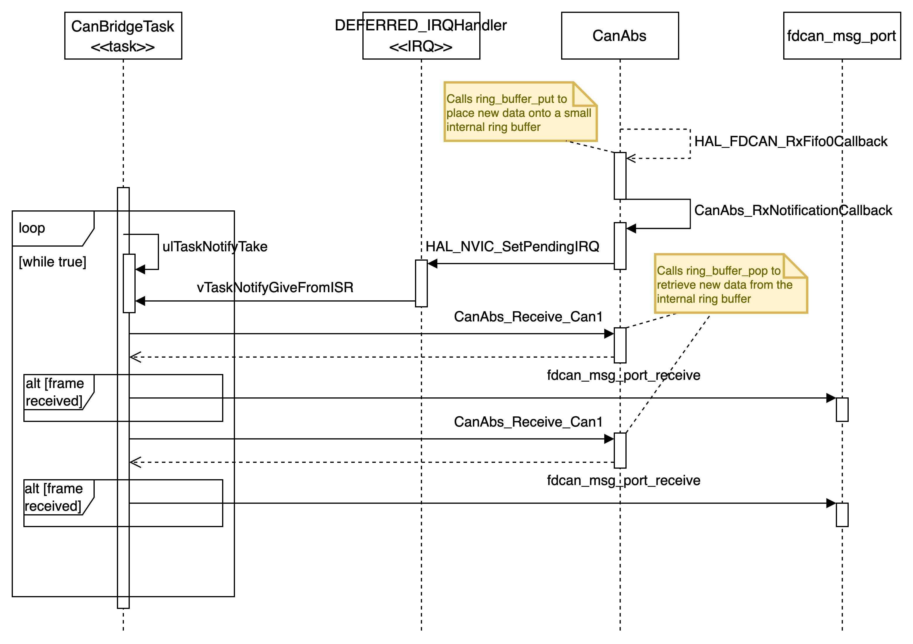
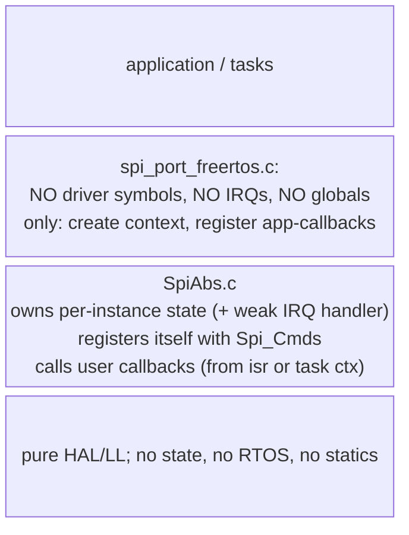

STM32H7 CAN-sniffer software architecture documentation
========================================


**About STM32H7 CAN-sniffer**

This document describes the software architecture of the 
STM32H7 CAN-sniffer. The STM32H7 CAM sniffer is a small CAN data logger.

<!-- TOC -->

- [STM32H7 CAN-sniffer software architecture documentation](#stm32h7-can-sniffer-software-architecture-documentation)
- [Introduction and Goals](#introduction-and-goals)
    - [Requirements Overview](#requirements-overview)
    - [Quality Goals](#quality-goals)
    - [Stakeholders](#stakeholders)
- [Architecture Constraints](#architecture-constraints)
- [Context and Scope](#context-and-scope)
    - [Business Context](#business-context)
    - [Technical Context](#technical-context)
- [Solution Strategy](#solution-strategy)
    - [Hardware](#hardware)
    - [Software](#software)
- [Building Block View](#building-block-view)
    - [System overview](#system-overview)
- [Runtime View](#runtime-view)
    - [Ethernet requets processing](#ethernet-requets-processing)
    - [Log file](#log-file)
    - [CAN frame logging](#can-frame-logging)
- [Deployment View](#deployment-view)
- [Cross-cutting concerns](#cross-cutting-concerns)
    - [Architecture and desing concepts](#architecture-and-desing-concepts)
        - [CAN frame logging](#can-frame-logging)
        - [SPI](#spi)
        - [Concurrency & Interrupt Priorities](#concurrency--interrupt-priorities)
            - [Interrupts](#interrupts)
            - [Tasks](#tasks)
- [Architecture Decisions](#architecture-decisions)
    - [Using STM HAL](#using-stm-hal)
    - [Frame logging](#frame-logging)
    - [FreeRTOS tasks](#freertos-tasks)
    - [Active Object design pattern](#active-object-design-pattern)
    - [Comm module driver factory pattern](#comm-module-driver-factory-pattern)
- [Risks and Technical Debts](#risks-and-technical-debts)
    - [Risks](#risks)
    - [Technical debts](#technical-debts)
- [Glossary](#glossary)

<!-- /TOC -->
<!-- /TOC -->

# Introduction and Goals

This section aims to provide an overview about the functions and the structure of the STM32H7 CAN-sniffer software.

This project is meant to be a learning opportunity for the author. Thus, the assessment of functional completeness and technical suitability of chosen solutions follow a compromise between offering a learning opportunity and what would be technically most suitable.

Therefore, following aspects will be provided with this documentation for future reference and possible adaptations and extensions:

-   essential features,

-   essential functional requirements,

-   quality goals for the architecture and

-   relevant stakeholders and their expectations

## Requirements Overview

The CAN-sniffer shall implement following functions:
- logging classic CAN frames on two channels
- Store all received CAN frames to a SD card for persistent storage
- implement a small server which allows to:
  - download and delete log files with CAN traces
  - configure the CAN-sniffer remotely via the network (e. g. CAN ID filters, baudrate, etc.)

The CAN-sniffer shall be able to capture all CAN frames at 100 % bus load reliably and store them persistently without losing any frames.

The detailed functional requirements are located [here](./requirements.md).

## Quality Goals

The following table shows the quality goals pursued in this project. They determine how the focus is set during the development.

| Goal | Motivation and description |
|-|-|
| Modifiability | The app shall be modularized and open to extension so that the code can be reused in other projects or changes and extensions will be localized. A clean interface between main app and HW abstraction is needed.|
| Reliability / Determinism | Data aquisition shall be reliable also at high throughput. Users must trust that samples are neither lost nor corrupted even under peak load.|
| Portability | The software shall be portable across the STM32H7 family that provide the according peripherals, it shall support operation on one and two core devices |


The STM32H7 CAN-sniffer is a learning project. The author chose these goals to push himself in following areas:

1. RTOS-level determinism: practice concurrency + priority tuning  
2. Architectural decoupling: enforce low coupling/high cohesion for reuse  
3. Firmware development: driver design and development

## Stakeholders

The following table illustrates the stakeholders of STM32H7 CAN-sniffer and their respective intentions.

| Role/Name   | Contact        | Expectations       |
|-------------|----------------|--------------------|
| Developer | author | well structured code, documented design decisions, clear specifications |
| Maintainer | author | quick overview over software structure, quick and localized changes for fixing bugs |
| User | author | ease of use, reliable operation and data aquisition |
| Open-source visitor | other GitHub users | understand quickly what the project provides and whether it solves their problem |

# Architecture Constraints

The following table states some constraints towards the system:

| Constraint | Explanation |
| - | - |
| The system shall use LwIP  | save time on making a http server available |
| The system shall use [ff15a]( http://elm-chan.org/fsw/ff/) FatFS | save time on making a file system available |
| Use STM32H7 | A NUCLEO-144 STM32H745 board is readily available for the author |
| Implementation in C | many third party code and examples are in C and it is the authors preference |

# Context and Scope

This section describes the environment of the STM32H7 CAN-sniffer, its users and other systems it interacts with.

## Business Context


| Neighbor | Description |
| - | - |
| User | accesses the system through a web GUI, connects the system physically to the CAN bus that is supposed to be monitored |
| local network/ DHCP server (external system)| to make the web GUI available, the system needs to be assigned an IP address by a DHCP server |
| CAN bus (external system) | The CAN bus is the physical communication channel between devices, it can be configured with different baudrates (e.g. 250 kbit/s, 500 kbit/s 1 Mbit/s) |

## Technical Context


*Figure: STM32H7 CAN-sniffer complete device* 

| # | Description |
| - | - |
| 1 | SD card adapter - SPI |
| 2 | RJ45 ethnerte adapter |
| 3 | 2x CAN transceiver |
| 4 | USB plug - connected to NUCLEO-144 board |
| 5 | USB plug - power only to CAN transceivers |
| 6 | DSUB 9 connector CAN 1 |
| 7 | DSUB 9 connector CAN 2 |


# Solution Strategy

## Hardware

The STM32H7 CAN-sniffer system uses the on board ethernet adapter of the NUCLEO-144 board. Other adapters are bought as-is and connected via jump-wires to the respective pins on the board (two CAN transceivers and SD card to SPI adapter).

## Software

The STM32H7 CAN-sniffer runs a custom software based on an embedded real-time operating system. Prioritized and preemptive task scheduling is used to perform the functions of the system.


The following table shows which measures are taken to reach the quality goals.

| Goal/Requirement | Architectural Approach | Details |
|-|-|-|
| Modifiability | separation of concerns (low coupling and high cohesion), opaque driver design, dependency inversion by letting drivers access data of the app layer through callback functions | |
| Reliability / Determinism | Use of NVIC for latency-critical drivers (e.g. CAN), prioritized task scheduling for critical code paths, error detection and correction for SD card access | |
| Portability | Use of STM32 HAL where applicable, conditional compilation for dual/single-core configs | | 

> **Note**: Portability in this context means portability across the STM32H7 family that support the needed peripherals and not portability accross toolchains. Thus, the code is allowed to use GCC specific commands (see function requirements)


# Building Block View

This section describes the decomposition of the STM32H7 CAN-sniffer into modules.

## System overview

The software follows a layer architecture. Following the dependency inversion principle (DIP), drivers expose callback declarations so the application layer can inject RTOS services (e.g., task-notification hooks) or shared data (e.g., timestamps).

The diagram below shows the level-1 (white-box) view:

 ```mermaid 
 %%{init: 
    { 'theme':'default', 
      'sequence': {
        'useMaxWidth':true
        } 
    } 
}%%

block-beta 
    columns 4

    Application["Application/ RTOS"]:4

    FILEHANDLER["CAN log file handler"]:2
    
    block:middlewarefs:1
        columns 1
        FatFS:1
        StorageDeviceControls["Storage Device Controls"]:1
    end
    
    HTTP["HTTP/TCP/IP Stack"]:1
    
    CANDRIVERABS["CAN driver abstraction"]:2
    SDCARDDRIVER["SD card driver"]
    NETIF["Network interface abstraction"]
    
    CANDRIVER["CAN driver"]:2
    SPIDRIVER["SPI driver"]:1
    ETHDRIVER["ETH driver"]:1

    STMHAL["STM HAL"]:4

```

The RTOS lives in the application layer to let the application integrator have the freedom to assign tasks to functions. For example a driver task can be created by combining its callback functions with a task living in the app layer. If no hooks are provided, the default callback functions are used and they then depend on the driver implementation.

The drivers itself call the functions from the STM32 HAL directly.

The multi-core deployment is detailed in the Runtime and Deployment views (sections 4 & 7).


# Runtime View

For better performance and higher availability the serving of requests via ethernet shall be executed on another core to not interfere with the CAN trace logging when large files are loaded for user downloads.

## Ethernet requets processing

This section describes the runtime view of how a ethernet message is processed within the system. The following sequence diagram aims to answer following questions:
- What triggers the whole interaction?
- Which components run concurrently and in what order?
- Where does the interrupt end and the task take over?
- How does the frame reach the higher network stack?


The interrupt populates the ethernet handle with the received data. The main task polls the input function of the LwIP stack to issue the message processing.

## Log file

The following sequence diagram visualizes how the CAN frames are written into actual log files on the SD card.


## CAN frame logging

The sequence diagram below illustrates how **incoming CAN frames** move through the system. Following components and interactions are the core mechanism to realize the logging:

1. `CanAbs::IRQ` copies the frame from the hardware FIFO into its internal ring buffer and triggers **DEFERRED_IRQ**.  
2. **DEFERRED_IRQ** (lower priority) issues `vTaskNotifyGiveFromISR`, waking **CanBridgeTask**.  
3. **CanBridgeTask** drains all queued frames from `CanAbs` and forwards them to `fdcan_msg_port`. 




# Deployment View

TO-DO

# Cross-cutting concerns

This section describes general structures and system-wide aspects.

## Architecture and desing concepts

### CAN frame logging

Three buffering stages decouple hard-real-time work from lower-priority processing:

1. **First stage – ISR ring buffer**  
   The **CAN driver’s RX interrupt (IRQ)** immediately copies each frame from the hardware FIFO into an **internal ring buffer**. This keeps the ISR short and deterministic.

2. **Second stage – deferred IRQ callback**  
   The driver invokes an **integration-layer callback**. Because the CAN IRQ runs at very high priority, it cannot call `vTaskNotifyGiveFromISR` directly. Instead, the callback triggers a **`DEFERRED_IRQ`** with a lower priority suitable for RTOS primitives.

3. **Third stage – `CanBridgeTask`**  
   `CanBridgeTask` runs till completion on a notification from the deferred IRQ. Once unblocked, it pulls all pending frames from **`CanAbs`** and writes them in bulk to the **`fdcan_msg_port` message buffer**.

> **Note**  
> `fdcan_msg_port` exposes a classic producer/consumer buffer:  
> *Producer* → `fdcan_msg_port_receive()` | *Consumer* → `fdcan_msg_port_read()`

This three-layer approach ensures **minimal ISR latency**, isolates RTOS scheduling from high-priority hardware interrupts, and allows bulk transport of frames to subsequent processing stages or storage on SD-Card.


### SPI
The SPI driver design aims at decoupling the driver from the application and RTOS. Thus, an abstraction layer is used to handle all driver specific objects in a layered architecture. Using weak callback definitions lets the driver run either blocking in standalone mode or lets the caller inject their own functions (e. g. semaphore handling within the port layer):


### Concurrency & Interrupt Priorities

#### Interrupts
configLIBRARY_MAX_SYSCALL_INTERRUPT_PRIORITY is set to 5 per default.

Following NVIC setup is used (relative to the value of configLIBRARY_MAX_SYSCALL_INTERRUPT_PRIORITY):
| Module | Priority |  |
| - | - | - |
| FDCAN | -5 |  |
| TIM | -4 |  |
|  | -3 |  |
|  | -2 |  |
|  | -1 |  |
|  | +0 |  |
| Deferred (SW) | +1 |  |
| SPI | +2 |  |
| ETH | +3 |  |
|  | +4 |  |
|  | +5 |  |

#### Tasks

# Architecture Decisions

This section enables you to understand core design decisions of the STM32H7 CAN-sniffer.

## Using STM HAL

TODO: explain why STM HAL is used

## Frame logging

TODO: explain why multistage buffering was necessary.

## FreeRTOS tasks

Decision:
- a task sheduling system supporting task priorities shall be used
- due to the extensive ressources available FreeRTOS will be used

Reason:
- Using a super loop introduces latencies on peripheral access. Thus, accessing slow peripherals like SPI can stall the process and make the system less responsive and lead to loss of CAN frames.

## Active Object design pattern

Prefer event driven design over blocking and direct notification.
One task shall have authority about a ressources. 
If others need access, they can send messages to this task. 
Thus, no blocking contention on the SPI peripheral itself is possible.

## Comm module driver factory pattern

Is used to realize dependency inversion and the open-closed principle so that extension with new drivers needs little changes to the existing code base.

Different approached for the driver registration are possible:
- linker section registry where drivers are added at linking time in the ".comm_factory" section
- static list in separate file
- array in RAM with dynamic registration at init runtime
- usage of weak-symbol switch (core needs to be patched for each new driver)

Decision:
- usage of linker section registry

Reason:
- The waek-symbol switch would be more safety/ reviewer friendly:
    - static analysing is possible (also no function pointers used to register a driver as with the static list approach)
    - almost not dependant on toolchain (like linker section approach)
    - explicit in which driver is supported and registered
    - deterministic (unlike runtime regisrtaion)

- Though, the linker-section registry is a good opportunity to apply and learn about the factory and opaque design patterns and a discovery mechanism similar to those used by OSs.

# Risks and Technical Debts

## Risks

| Description | Impact | Probability | Action |
| - | - | - | - |
| CAN bus on-chip FIFO overruns at 1 Mbit/s ➜ messages dropped, traces corrupted. | High | Medium | Pre-allocate double-buffer in SRAM (DMA-friendly). Benchmark with 100 % bus load; configure overflow counters + watchdog LED. |
| SD-card wear due to continuous logging. | High | High | recommend SD cards that implement wear-leveling (e.g. industrial grade). |
| Mini-server blocks IRQs may increase CAN ISR latency > 6 µs. | Medium | Medium | set ethernet tasks to low-priority thread, use zero-copy lwIP, benchmark latency with logic analyzer. |
| Fragmentation from malloc in drivers; STM32H7 has no MMU. | Medium | Medium | static pools for frames, SPI messages. |
| No firmware-update plan | High | Low | Add DFU over USB & Ethernet |
| intransparent/ inconsistent low-level driver layout. | Low | High | use well defined interface and driver pattern |
| No Power-Failure safe write on FAT32. Last trace may be corrupted. | Medium | Low | Add detection mechanism (e. g. transactional write with begin/ commit flags) |
| failures in complex third-party software | High | Low | use well tested and well documented third-party software only |

## Technical debts

| Origin / Decision | Consequence if left unpaid | Interest | Repayment Plan / Ticket |
| - | - | - | - |
| Current CAN driver supports Classical CAN only (no CAN-FD). | Limits usability for higher-bandwidth busses. | High | Abstract frame struct; plan extension of CAN driver; use self describing logs for allowing later extensions |
| No unit-tests; only on-target tests. | Harder refactor, risk of regression. | Medium | Set up unit-tests |
| Build system is a custom Makefile. | Onboard new devs slower, CI difficult to maintain. | Medium | Migrate to CMake + arm-none-eabi toolchain file; prepare GitHub Actions. |


# Glossary

| Term        | Definition        |
|-------------|-------------------|
| *\<Term-1>* | *\<definition-1>* |
| *\<Term-2>* | *\<definition-2>* |
