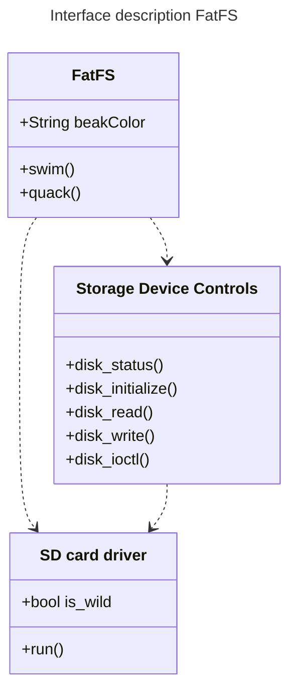

# Interface description

```mermaid
---
title: Interface description FatFS
---
classDiagram
 
    class FatFS{
        +String beakColor
        +swim()
        +quack()
    }

    class StorageDeviceControls["Storage Device Controls"]{
        +disk_status()
        +disk_initialize()
        +disk_read()
        +disk_write()
        +disk_ioctl()
    }
    
    class SDCardDriver["SD card driver"]{
        +bool is_wild
        +run()
    }

    FatFS ..> StorageDeviceControls
    FatFS ..> SDCardDriver
    StorageDeviceControls ..> SDCardDriver

```

## SPI framework
