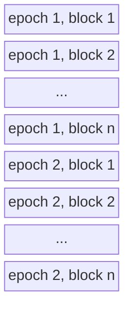
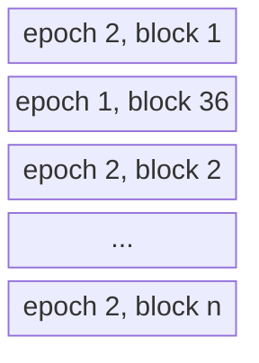

### Ideal block sequence

### Block interlieving between runs

It may happen, that a file cannot be opened and the logger skips to the next writable file. In this case block sequences of different epochs may interlieve.

