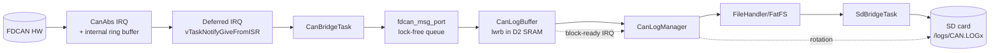

# can-logging_building-block

```mermaid
flowchart LR
    CANHW[(FDCAN HW)] --> IRQ[CanAbs IRQ<br/>+ internal ring buffer]
    IRQ --> Deferred[Deferred IRQ<br/>vTaskNotifyGiveFromISR]
    Deferred --> Bridge[CanBridgeTask]
    Bridge --> MsgPort[fdcan_msg_port<br/>lock-free queue]
    MsgPort --> Buffer[CanLogBuffer<br/>lwrb in D2 SRAM]
    Buffer --> Manager[CanLogManager]
    Manager --> FileIO[FileHandler/FatFS]
    FileIO --> SdBridge[SdBridgeTask]
    SdBridge --> SD[(SD card<br/>/logs/CAN.LOGx)]

    Manager -. rotation .-> SD
    Buffer -. block-ready IRQ .-> Manager
```
