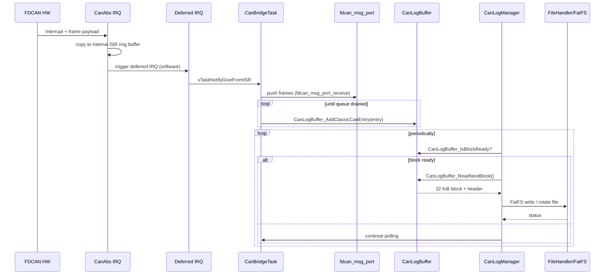

# can-logging_runtime

```mermaid
sequenceDiagram
    participant HW as FDCAN HW
    participant CanAbs as CanAbs IRQ
    participant Deferred as Deferred IRQ
    participant Bridge as CanBridgeTask
    participant MsgPort as fdcan_msg_port
    participant Buffer as CanLogBuffer
    participant Manager as CanLogManager
    participant FS as FileHandler/FatFS

    HW->>CanAbs: Interrupt + frame payload
    CanAbs->>CanAbs: copy to internal ISR ring buffer
    CanAbs->>Deferred: trigger deferred IRQ (software)
    Deferred->>Bridge: vTaskNotifyGiveFromISR
    Bridge->>MsgPort: push frames (fdcan_msg_port_receive)
    loop until queue drained
        Bridge->>Buffer: CanLogBuffer_AddClassicCanEntry(entry)
    end
    loop periodically
        Manager->>Buffer: CanLogBuffer_IsBlockReady?
        alt block ready
            Manager->>Buffer: CanLogBuffer_ReadNextBlock()
            Buffer-->>Manager: 32 KiB block + header
            Manager->>FS: FatFS write / rotate file
            FS-->>Manager: status
        else
            Manager->>Bridge: continue polling
        end
    end
```
