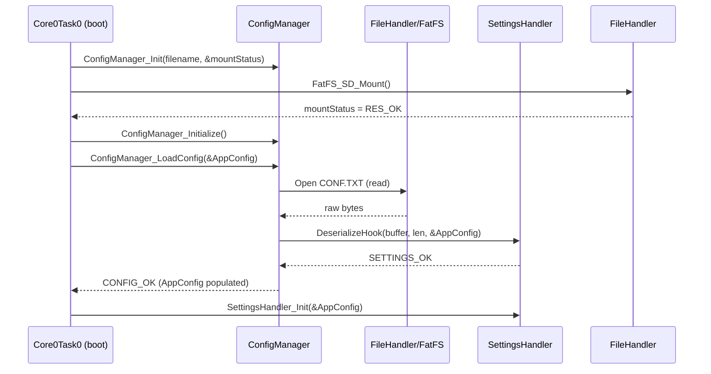

sequenceDiagram
    participant User as Web UI
    participant HTTP as LwIP httpd CGI
    participant Settings as SettingsHandler
    participant ConfigMgr as ConfigManager
    participant Storage as FatFS (CONF.TXT)

    User->>HTTP: POST /config (baud1=1000000,…,action=apply)
    HTTP->>Settings: consume_param_values(key,value)
    Settings->>Settings: Update AppConfig fields\nset updated flag
    alt action == "apply"
        Settings->>HTTP: SettingsHandler_ApplyRequestCallback()
        HTTP->>Core0Task0: Notified via callback
    end
    Core0Task0->>Settings: SettingsHandler_Poll(&AppConfig)
    opt updated == 1
    Core0Task0->>ConfigMgr: ConfigManager_SaveConfig(&AppConfig)
        ConfigMgr->>Settings: SerializeHook(AppConfig, buffer,…)
        Settings-->>ConfigMgr: JSON blob + length
        ConfigMgr->>Storage: overwrite CONF.TXT
        Storage-->>ConfigMgr: FR_OK
        ConfigMgr-->>Core0Task0: CONFIG_OK
        Core0Task0->>Settings: clear updated flag
    end
```

Key effects: HTTP never touches the filesystem, `SettingsHandler_Poll` acts as the dirty-bit gate, and `ConfigManager_SaveConfig` performs an overwrite + close so SD-card updates remain atomic.
