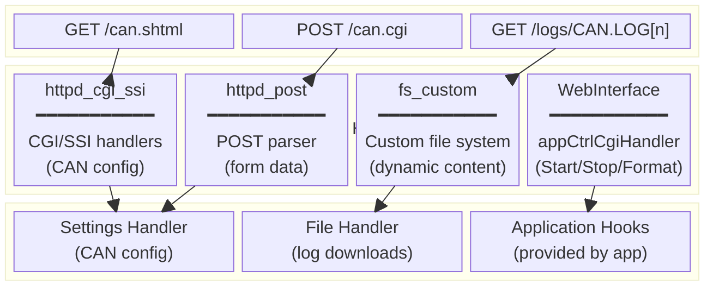

```mermaid
---
title: HTTP Application Layer - Level 2
---
block-beta
    columns 4
    
    block:REQUESTS["HTTP Requests"]:4
        GET["GET /can.shtml"]
        POST["POST /can.cgi"]
        DOWNLOAD["GET /logs/CAN.LOG[n]"]
    end
    
    block:HANDLERS["Request Handlers"]:4
        httpd_cgi_ssi["httpd_cgi_ssi<br/>━━━━━━━━━━━<br/>CGI/SSI handlers<br/>(CAN config)"]
        httpd_post["httpd_post<br/>━━━━━━━━━━━<br/>POST parser<br/>(form data)"]
        fs_custom["fs_custom<br/>━━━━━━━━━━━<br/>Custom file system<br/>(dynamic content)"]
        WebInterface["WebInterface<br/>━━━━━━━━━━━<br/>appCtrlCgiHandler<br/>(Start/Stop/Format)"]
    end
    
    block:INTEGRATION["Integration Points"]:4
        columns 3
        SettingsHandler["Settings Handler<br/>(CAN config)"]
        FileHandler["File Handler<br/>(log downloads)"]
        AppHooks["Application Hooks<br/>(provided by app)"]
    end
    
    GET --> httpd_cgi_ssi
    POST --> httpd_post
    DOWNLOAD --> fs_custom
    httpd_cgi_ssi --> SettingsHandler
    httpd_post --> SettingsHandler
    fs_custom --> FileHandler
    WebInterface --> AppHooks
```