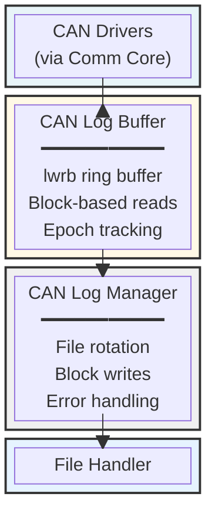

```mermaid
block-beta
    columns 3
    
    block:PRODUCER["Producers"]:3
        CANDRIVER["CAN Drivers<br/>(via Comm Core)"]
    end
    
    block:BUFFER["Buffering Layer"]:3
        CANLOGBUF["CAN Log Buffer<br/>━━━━━━━━━━━<br/>lwrb ring buffer<br/>Block-based reads<br/>Epoch tracking"]
    end
    
    block:CONSUMER["Consumer"]:3
        CANLOGMGR["CAN Log Manager<br/>━━━━━━━━━━━<br/>File rotation<br/>Block writes<br/>Error handling"]
    end
    
    block:STORAGE["Storage"]:3
        FILEHANDLER["File Handler"]
    end
    
    CANDRIVER --> CANLOGBUF
    CANLOGBUF --> CANLOGMGR
    CANLOGMGR --> FILEHANDLER
    
    style PRODUCER fill:#e8f4f8,stroke:#333,stroke-width:2px
    style BUFFER fill:#fff9e6,stroke:#333,stroke-width:2px
    style CONSUMER fill:#f0f0f0,stroke:#333,stroke-width:2px
    style STORAGE fill:#e6f3ff,stroke:#333,stroke-width:2px
```