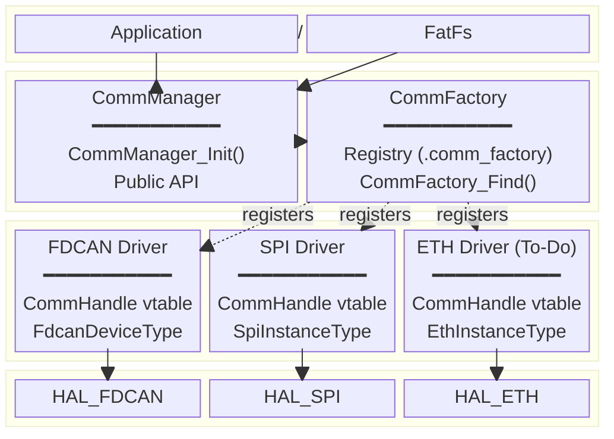

```mermaid
---
title: Level 1 - Comm Drivers Component
---
block-beta
    columns 3
    block:UPPER["Application / Middleware"]:3
        APP["Application"]
        FatFs["FatFs"]
    end
    block:COMMCORE:3
        columns 2
        CommManager["CommManager<br/>━━━━━━━━━━━<br/>CommManager_Init()<br/>Public API"]
        CommFactory["CommFactory<br/>━━━━━━━━━━━<br/>Registry (.comm_factory)<br/>CommFactory_Find()"]
    end
    block:DRIVERS:3
        columns 3
        FDCAN["FDCAN Driver<br/>━━━━━━━━━━━<br/>CommHandle vtable<br/>FdcanDeviceType"]
        SPI["SPI Driver<br/>━━━━━━━━━━━<br/>CommHandle vtable<br/>SpiInstanceType"]
        ETH["ETH Driver (To-Do)<br/>━━━━━━━━━━━<br/>CommHandle vtable<br/>EthInstanceType"]
    end
    block:HAL["STM HAL"]:3
        HALFDCAN["HAL_FDCAN"]
        HALSPI["HAL_SPI"]
        HALETH["HAL_ETH"]
    end
    APP --> CommManager
    FatFs --> CommManager
    CommManager --> CommFactory
    CommFactory -."registers".-> FDCAN
    CommFactory -."registers".-> SPI
    CommFactory -."registers".-> ETH
    FDCAN --> HALFDCAN
    SPI --> HALSPI
    ETH --> HALETH
```