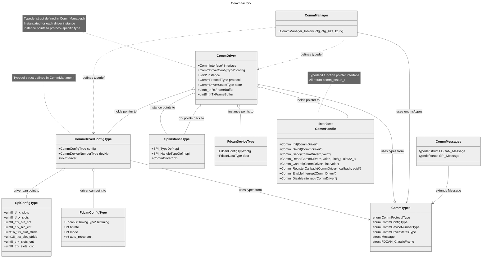

```mermaid
---
title: Comm factory
---
%%{
init: {
'theme': 'neutral' 
} 
}%%
classDiagram
    class CommDriver {
            +CommInterface* interface
            +CommDriverConfigType* config
            +void* instance
            +CommProtocolType protocol
            +CommDriverStatesType state
            +uint8_t* RxFrameBuffer
            +uint8_t* TxFrameBuffer
        }
    note for CommDriver "Typedef struct defined in CommManager.h<br/>Instantiated for each driver instance<br/>instance points to protocol-specific type"

    class CommDriverConfigType {
            +CommConfigType config
            +CommDeviceNumberType devNbr
            +void* driver
        }
    note for CommDriverConfigType "Typedef struct defined in CommManager.h"

    class SpiInstanceType {
            +SPI_TypeDef* spi
            +SPI_HandleTypeDef hspi
            +CommDriver* drv
        }

    class FdcanDeviceType {
            +FdcanConfigType* cfg
            +FdcanDataType data
        }

    class SpiConfigType {
            +uint8_t* rx_slots
            +uint8_t* tx_slots
            +uint8_t tx_bin_cnt
            +uint8_t rx_bin_cnt
            +uint16_t rx_slot_stride
            +uint16_t tx_slot_stride
            +uint8_t rx_slots_cnt
            +uint8_t tx_slots_cnt
        }

    class FdcanConfigType {
            +FdcanBitTimingType* bittiming
            +int bitrate
            +int mode
            +int auto_retransmit
        }

    class CommHandle {
            <<interface>>
            +Comm_Init(CommDriver*)
            +Comm_Deinit(CommDriver*)
            +Comm_Send(CommDriver*, void*)
            +Comm_Read(CommDriver*, void*, uint8_t, uint32_t)
            +Comm_Control(CommDriver*, int, void*)
            +Comm_RegisterCallback(CommDriver*, callback, void*)
            +Comm_EnableInterrupt(CommDriver*)
            +Comm_DisableInterrupt(CommDriver*)
        }
    note for CommHandle "Typedef'd function pointer interface<br/>All return comm_status_t"

    class CommManager {
            +CommManager_Init(drv, cfg, cfg_size, tx, rx)
        }

    class CommTypes {
            enum CommProtocolType
            enum CommConfigType
            enum CommDeviceNumberType
            enum CommDriverStatesType
            struct Message
            struct FDCAN_ClassicFrame
        }

    class CommMessages {
            typedef struct FDCAN_Message
            typedef struct SPI_Message
        }

    CommManager ..> CommDriver : defines typedef
    CommManager ..> CommDriverConfigType : defines typedef
    CommDriver o-- CommHandle : holds pointer to
    CommDriver o-- CommDriverConfigType : holds pointer to
    CommDriver o-- SpiInstanceType : instance points to
    CommDriver o-- FdcanDeviceType : instance points to
    SpiInstanceType --> CommDriver : drv points back to
    CommDriverConfigType o-- SpiConfigType : driver can point to
    CommDriverConfigType o-- FdcanConfigType : driver can point to
    CommDriverConfigType --> CommTypes : uses types from
    CommDriver --> CommTypes : uses types from
    CommManager --> CommTypes : uses enums/types
    CommMessages --> CommTypes : extends Message
```
