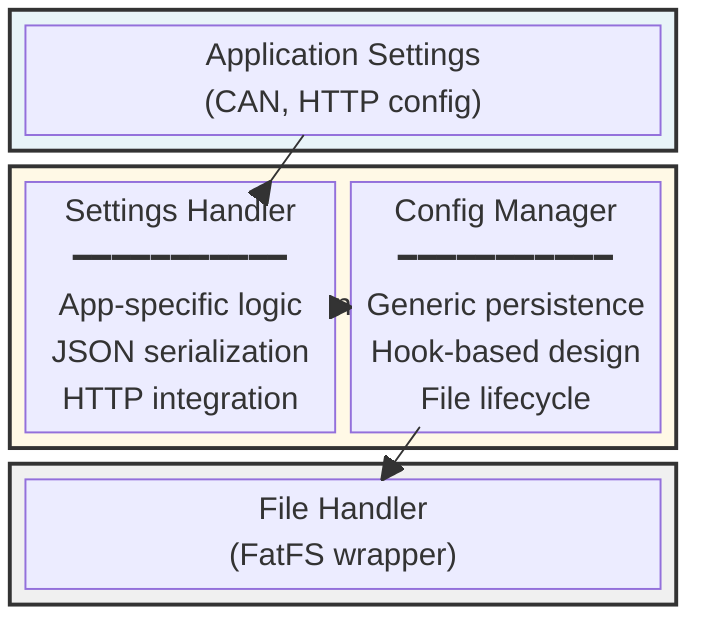

```mermaid
block-beta
    columns 3
    
    block:APP["Application Layer"]:3
        APPSETTINGS["Application Settings<br/>(CAN, HTTP config)"]
    end
    
    block:MIDDLEWARE["Configuration Middleware"]:3
        columns 2
        SETTINGSHNDL["Settings Handler<br/>━━━━━━━━━━━<br/>App-specific logic<br/>JSON serialization<br/>HTTP integration"]
        CONFIGMGR["Config Manager<br/>━━━━━━━━━━━<br/>Generic persistence<br/>Hook-based design<br/>File lifecycle"]
    end
    
    block:STORAGE["Storage Layer"]:3
        FILEHANDLER["File Handler<br/>(FatFS wrapper)"]
    end
    
    APPSETTINGS --> SETTINGSHNDL
    SETTINGSHNDL --> CONFIGMGR
    CONFIGMGR --> FILEHANDLER
    
    style APP fill:#e8f4f8,stroke:#333,stroke-width:2px
    style MIDDLEWARE fill:#fff9e6,stroke:#333,stroke-width:2px
    style STORAGE fill:#f0f0f0,stroke:#333,stroke-width:2px
```