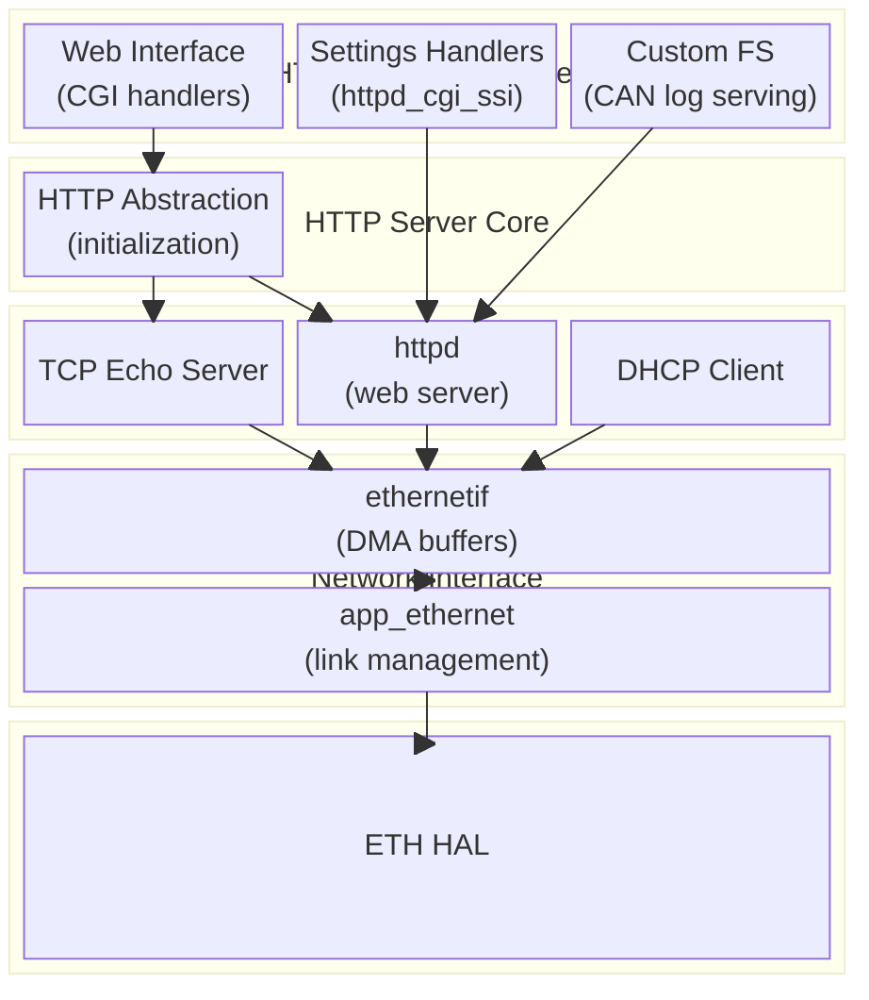

```mermaid
---
title: HTTP/TCP/IP Stack - Level 1
---
block-beta
    columns 3
    
    block:HTTPAPP["HTTP Application Layer"]:3
        columns 3
        WebInterface["Web Interface<br/>(CGI handlers)"]
        SettingsHandlers["Settings Handlers<br/>(httpd_cgi_ssi)"]
        CustomFS["Custom FS<br/>(CAN log serving)"]
    end
    
    block:HTTPCORE["HTTP Server Core"]:3
        HttpAbs["HTTP Abstraction<br/>(initialization)"]
        space:2
    end
    
    block:LWIP["LwIP Stack"]:3
        columns 3
        TCPEcho["TCP Echo Server"]
        HTTPd["httpd<br/>(web server)"]
        DHCP["DHCP Client"]
    end
    
    block:NETIF["Network Interface"]:3
        columns 1
        ethernetif["ethernetif<br/>(DMA buffers)"]
        AppEthernet["app_ethernet<br/>(link management)"]
    end
    
    block:HAL["Hardware"]:3
        ETHHAL["ETH HAL"]
    end
    
    WebInterface --> HttpAbs
    SettingsHandlers --> HTTPd
    CustomFS --> HTTPd
    HttpAbs --> HTTPd
    HttpAbs --> TCPEcho
    HTTPd --> ethernetif
    TCPEcho --> ethernetif
    DHCP --> ethernetif
    ethernetif --> AppEthernet
    AppEthernet --> ETHHAL
    
```