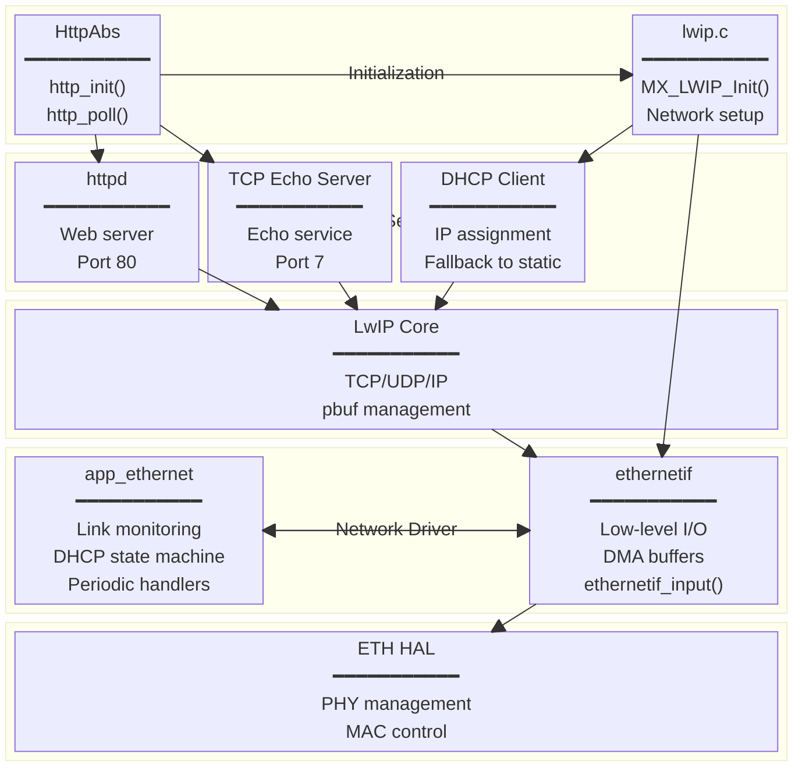

```mermaid
---
title: LwIP Integration - Level 3
---
block-beta
    columns 5
    
    block:INIT["Initialization"]:5
        columns 5
        HttpAbs["HttpAbs<br/>━━━━━━━━━━━<br/>http_init()<br/>http_poll()"]
        space:3
        lwip["lwip.c<br/>━━━━━━━━━━━<br/>MX_LWIP_Init()<br/>Network setup"]
    end
    
    block:SERVICES["LwIP Services"]:5
        columns 5
        HTTPd["httpd<br/>━━━━━━━━━━━<br/>Web server<br/>Port 80"]
        TCPEcho["TCP Echo Server<br/>━━━━━━━━━━━<br/>Echo service<br/>Port 7"]
        DHCP["DHCP Client<br/>━━━━━━━━━━━<br/>IP assignment<br/>Fallback to static"]
        space
    end
    
    block:STACK["LwIP stack"]:5
        columns 5
        LwIPCore["LwIP Core<br/>━━━━━━━━━━━<br/>TCP/UDP/IP<br/>pbuf management"]
    end

    block:DRIVER["Network Driver"]:5
        columns 5
        app_ethernet["app_ethernet<br/>━━━━━━━━━━━<br/>Link monitoring<br/>DHCP state machine<br/>Periodic handlers"]
        space
        ethernetif["ethernetif<br/>━━━━━━━━━━━<br/>Low-level I/O<br/>DMA buffers<br/>ethernetif_input()"]
    end
    
    block:HAL["Hardware"]:5
        ETHHAL["ETH HAL<br/>━━━━━━━━━━━<br/>PHY management<br/>MAC control"]
    end
    
    HttpAbs --> lwip
    HttpAbs --> HTTPd
    HttpAbs --> TCPEcho
    lwip --> DHCP
    lwip --> ethernetif
    HTTPd --> LwIPCore
    TCPEcho --> LwIPCore
    DHCP --> LwIPCore
    LwIPCore --> ethernetif
    ethernetif --> app_ethernet
    app_ethernet --> ethernetif
    ethernetif --> ETHHAL
```