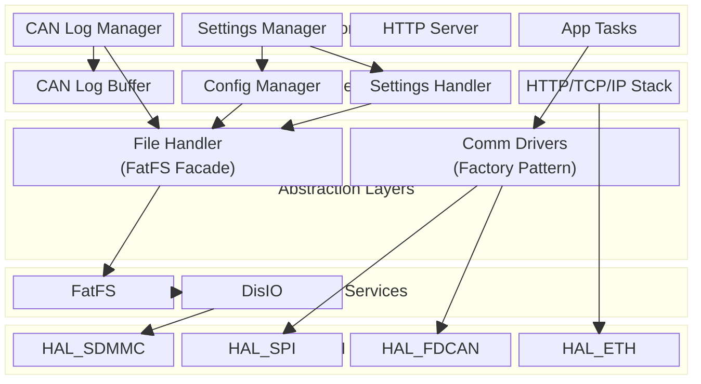

```mermaid
block-beta
    columns 4
    
    block:APP["Application / RTOS"]:4
        CANLOGMGR["CAN Log Manager"]
        SETTINGSMGR["Settings Manager"]
        HTTPSRV["HTTP Server"]
        APPTASKS["App Tasks"]
    end
    
    block:MIDDLEWARE["Middleware"]:4
        CANLOGBUF["CAN Log Buffer"]
        CONFIGMGR["Config Manager"]
        SETTINGSHNDL["Settings Handler"]
        TCPIP["HTTP/TCP/IP Stack"]
    end
    
    block:ABSTRACTION["Abstraction Layers"]:4
        FILEHANDLER["File Handler<br/>(FatFS Facade)"]:2
        COMMCORE["Comm Drivers<br/>(Factory Pattern)"]:2
    end
    
    block:SERVICES["System Services"]:4
        FATFS["FatFS"]
        DISIO["DisIO"]
        space
        space
    end
    
    block:HAL["STM HAL"]:4
        HALSDMMC["HAL_SDMMC"]
        HALSPI["HAL_SPI"]
        HALFDCAN["HAL_FDCAN"]
        HALETH["HAL_ETH"]
    end
    
    CANLOGMGR --> CANLOGBUF
    CANLOGMGR --> FILEHANDLER
    SETTINGSMGR --> CONFIGMGR
    SETTINGSMGR --> SETTINGSHNDL
    CONFIGMGR --> FILEHANDLER
    SETTINGSHNDL --> FILEHANDLER
    APPTASKS --> COMMCORE
    
    FILEHANDLER --> FATFS
    FATFS --> DISIO
    DISIO --> HALSDMMC
    
    COMMCORE --> HALFDCAN
    COMMCORE --> HALSPI
    TCPIP --> HALETH

```