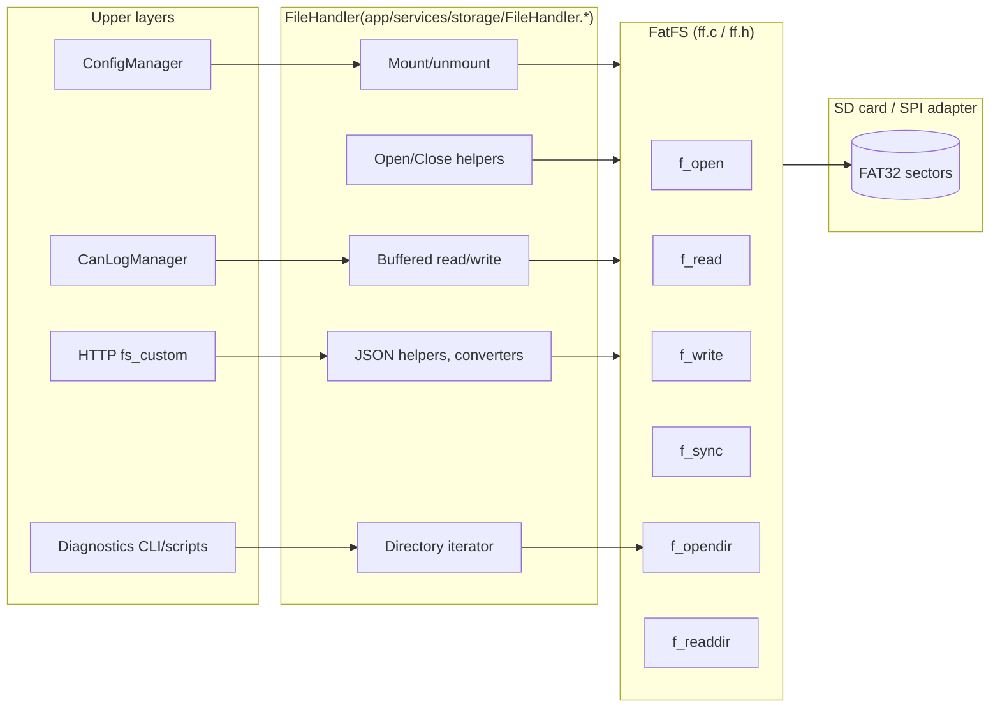

# filesystem_facade

```mermaid
flowchart LR
    subgraph AppLayer[Upper layers]
        Config[ConfigManager]
        LogMgr[CanLogManager]
        HttpFs[HTTP fs_custom]
        Diagnostics[Diagnostics CLI/scripts]
    end

    subgraph FileHandler["FileHandler(app/services/storage/FileHandler.*)"]
        Mount[Mount/unmount]
        OpenClose["Open/Close helpers"]
        RW["Buffered read/write"]
        Iterator["Directory iterator"]
        Helpers["JSON helpers, converters"]
    end

    subgraph FatFS["FatFS (ff.c / ff.h)"]
        f_open
        f_read
        f_write
        f_sync
        f_opendir
        f_readdir
    end

    subgraph Storage["SD card / SPI adapter"]
        Blocks[(FAT32 sectors)]
    end

    Config --> Mount
    LogMgr --> RW
    HttpFs --> Helpers
    Diagnostics --> Iterator

    Mount --> FatFS
    OpenClose --> FatFS
    RW --> FatFS
    Iterator --> f_opendir
    Helpers --> FatFS

    FatFS --> Blocks
```
