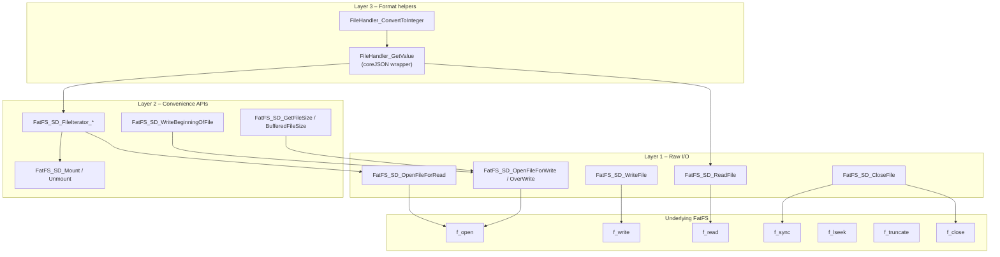

# filesystem_layers

```mermaid
flowchart TB

    subgraph Layer3["Layer 3 – Format helpers"]
        JSONHelper["FileHandler_GetValue<br/>(coreJSON wrapper)"]
        IntConv["FileHandler_ConvertToInteger"]
    end

    subgraph Layer2["Layer 2 – Convenience APIs"]
        Iterator["FatFS_SD_FileIterator_*"]
        BlockWrite["FatFS_SD_WriteBeginningOfFile"]
        SizeHelpers["FatFS_SD_GetFileSize / BufferedFileSize"]
        Mount["FatFS_SD_Mount / Unmount"]
    end

    subgraph Layer1["Layer 1 – Raw I/O"]
        OpenWrite["FatFS_SD_OpenFileForWrite / OverWrite"]
        OpenRead["FatFS_SD_OpenFileForRead"]
        Write["FatFS_SD_WriteFile"]
        Read["FatFS_SD_ReadFile"]
        Close["FatFS_SD_CloseFile"]
    end

    subgraph FatFS["Underlying FatFS"]
        f_open
        f_read
        f_write
        f_sync
        f_lseek
        f_truncate
        f_close
    end

    JSONHelper --> Iterator
    JSONHelper --> Read
    IntConv --> JSONHelper

    Iterator --> Mount
    Iterator --> OpenRead
    BlockWrite --> OpenWrite
    SizeHelpers --> OpenWrite

    OpenWrite --> f_open
    OpenRead --> f_open
    Write --> f_write
    Read --> f_read
    Close --> f_sync
    Close --> f_close
```
