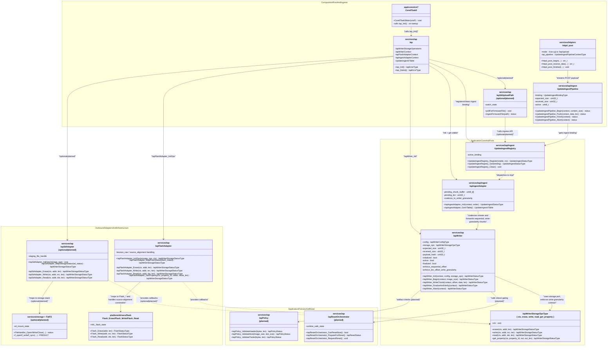

```mermaid
classDiagram
    namespace CompositionRootAndIngress {
        class CORE0["app/cores/cm7<br/>Core0Task0"] {
        +Core0Task0Main(void*) void
        -calls Iap_Init() on startup
        }

        class IAPSVC["services/iap<br/>Iap"] {
        +Iap_Init() IapErrorType
        +Iap_DeInit() IapErrorType
        -IapWriterStorageOperations
        -IapWriterContext
        -IapFlashAdapterContext
        -IapIngestAdapterContext
        -UpdateIngestVTable
        }

        class HTTP["services/http/src<br/>httpd_post"] {
        +httpd_post_begin(...) err_t
        +httpd_post_receive_data(...) err_t
        +httpd_post_finished(...) void
        -mode : /can.cgi or /iap/upload
        -iap_pipeline : UpdateIngestPipelineContextType
        }

        class INGESTPIPE["services/iap/ingest<br/>UpdateIngestPipeline"] {
        +UpdateIngestPipeline_Begin(context, content_size) status
        +UpdateIngestPipeline_Push(context, data, len) status
        +UpdateIngestPipeline_Finish(context) status
        +UpdateIngestPipeline_Abort(context) status
        -binding : UpdateIngestBindingType
        -expected_size : uint32_t
        -received_size : uint32_t
        -active : uint8_t
        }

        class SDINGRESS["services/iap<br/>IapSdUploadPath<br/>(optional/planned)"] {
        +pollForFirmwareFile() void
        +ingestFirmwareFile(path) status
        -watch_state
        }
    }

    namespace OutboundAdaptersAndInfrastructure {
        class ADAPTER["services/iap<br/>IapFlashAdapter"] {
        +IapFlashAdapter_InitOps(storage_ops, ctx) IapWriterStorageStatusType
        -IapFlashAdapter_MapFlashStatus(flash_status) IapWriterStorageStatusType
        -IapFlashAdapter_Erase(ctx, addr, len) IapWriterStorageStatusType
        -IapFlashAdapter_Write(ctx, addr, src, len) IapWriterStorageStatusType
        -IapFlashAdapter_Read(ctx, addr, dst, len) IapWriterStorageStatusType
        -IapFlashAdapter_GetProperty(ctx, property_id, value, value_len) IapWriterStorageStatusType
        -bounce_raw / source_alignment handling
        }

        class SDADAPTER["services/iap<br/>IapSdAdapter<br/>(optional/planned)"] {
        +IapSdAdapter_InitOps(storage_ops) void
        -IapSdAdapter_MapStorageStatus(sd_status) IapWriterStorageStatusType
        -IapSdAdapter_Erase(ctx, addr, len) IapWriterStorageStatusType
        -IapSdAdapter_Write(ctx, addr, src, len) IapWriterStorageStatusType
        -IapSdAdapter_Read(ctx, addr, dst, len) IapWriterStorageStatusType
        -staging_file_handle
        }

        class SDSTACK["services/storage + FatFS<br/>(optional/planned)"] {
        +FileHandler_Open/Write/Close(...) status
        +f_open/f_write/f_sync(...) FRESULT
        -sd_mount_state
        }

        class FLASH["platform/drivers/flash<br/>Flash_Erase/Flash_Write/Flash_Read"] {
        +Flash_Erase(addr, len) FlashStatusType
        +Flash_Write(addr, src, len) FlashStatusType
        +Flash_Read(addr, dst, len) FlashStatusType
        -HAL_flash_state
        }
    }

    namespace ApplicationCoreAndPorts {
        class REG["services/iap/ingest<br/>UpdateIngestRegistry"] {
        +UpdateIngestRegistry_Register(vtable, ctx) UpdateIngestStatusType
        +UpdateIngestRegistry_Get(binding) UpdateIngestStatusType
        +UpdateIngestRegistry_Clear() void
        -active_binding
        }
        class INGEST["services/iap/ingest<br/>IapIngestAdapter"] {
        +IapIngestAdapter_Init(context, writer) UpdateIngestStatusType
        +IapIngestAdapter_GetVTable() UpdateIngestVTable*
        -pending_chunk_buffer : uint8_t[]
        -pending_len : uint32_t
        -coalesce_to_writer_granularity
        }
        class WRITER["services/iap<br/>IapWriter"] {
        +IapWriter_Init(context, config, storage_ops) IapWriterStatusType
        +IapWriter_Begin(context, image_size) IapWriterStatusType
        +IapWriter_WriteChunk(context, offset, data, len) IapWriterStatusType
        +IapWriter_FinalizeAndVerify(context) IapWriterStatusType
        +IapWriter_Abort(context) IapWriterStatusType
        -config : IapWriterConfigType
        -storage_ops : IapWriterStorageOpsType
        -expected_size : uint32_t
        -received_size : uint32_t
        -payload_hash : uint32_t
        -initialized : bool
        -active : bool
        -finalized : bool
        -enforce_sequential_offset
        -enforce_len_offset_write_granularity
        }
    
        class OPS["IapWriterStorageOpsType<br/>{ ctx, erase, write, read, get_property }"] {
        +ctx : void*
        +erase(ctx, addr, len) IapWriterStorageStatusType
        +write(ctx, addr, src, len) IapWriterStorageStatusType
        +read(ctx, addr, dst, len) IapWriterStorageStatusType
        +get_property(ctx, property_id, out, out_len) IapWriterStorageStatusType
        }
    }

    namespace ApplicationPoliciesAndReset {
        class POLICY["services/iap<br/>IapPolicy<br/>(planned)"] {
        +IapPolicy_ValidateHeader(bytes, len) IapPolicyStatus
        +IapPolicy_ValidateSize(image_size, slot_size) IapPolicyStatus
        +IapPolicy_ValidateTrailer(bytes, len) IapPolicyStatus
        }
        class RESET["services/iap<br/>IapResetOrchestrator<br/>(planned)"] {
        +IapResetOrchestrator_CanResetNow() bool
        +IapResetOrchestrator_PrepareForReset() IapResetStatus
        +IapResetOrchestrator_RequestReset() void
        -runtime_safe_state
        }
    }

    HTTP --> INGESTPIPE : "streams POST payload"
    INGESTPIPE --> REG : "gets ingest binding"
    SDINGRESS --> REG : "calls ingress API (optional/planned)"
    REG --> INGEST : "dispatches to impl"
    INGEST --> WRITER : "coalesces stream and forwards sequential, write-granularity chunks"
    CORE0 --> IAPSVC : "calls Iap_Init()"
    IAPSVC --> REG : "registers/clears ingest binding"
    IAPSVC --> INGEST : "init + get vtable"
    IAPSVC --> ADAPTER : "IapFlashAdapter_InitOps"
    IAPSVC --> WRITER : "IapWriter_Init"
    IAPSVC --> SDINGRESS : "optional/planned"
    IAPSVC --> SDADAPTER : "optional/planned"
    ADAPTER ..> OPS : "provides callbacks"
    SDADAPTER ..> OPS : "provides callbacks (optional/planned)"
    SDADAPTER --> SDSTACK : "maps to storage stack (optional/planned)"
    ADAPTER --> FLASH : "maps to Flash_* and handles source-alignment constraints"
    WRITER --> OPS : "uses storage port, enforces write-granularity contract"
    WRITER --> POLICY : "artifact checks (planned)"
    WRITER --> RESET : "safe reboot gating (planned)"
```
