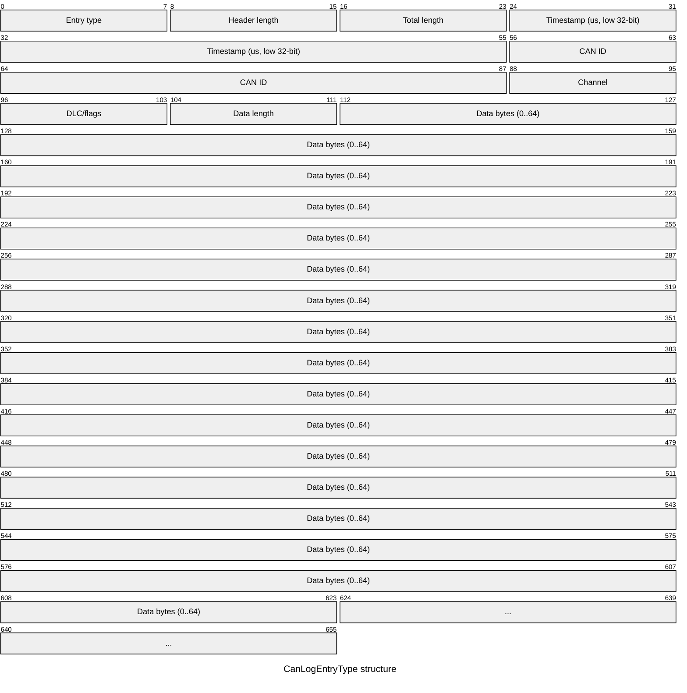

```mermaid
---
title: CanLogEntryType structure
---
packet-beta
    0-7: "Entry type"
    8-15: "Header length"
    16-23: "Total length"
    24-55: "Timestamp (us, low 32-bit)"
    56-87: "CAN ID"
    88-95: "Channel"
    96-103: "DLC/flags"
    104-111: "Data length"
    112-623: "Data bytes (0..64)"
    624-655: "..."
```
