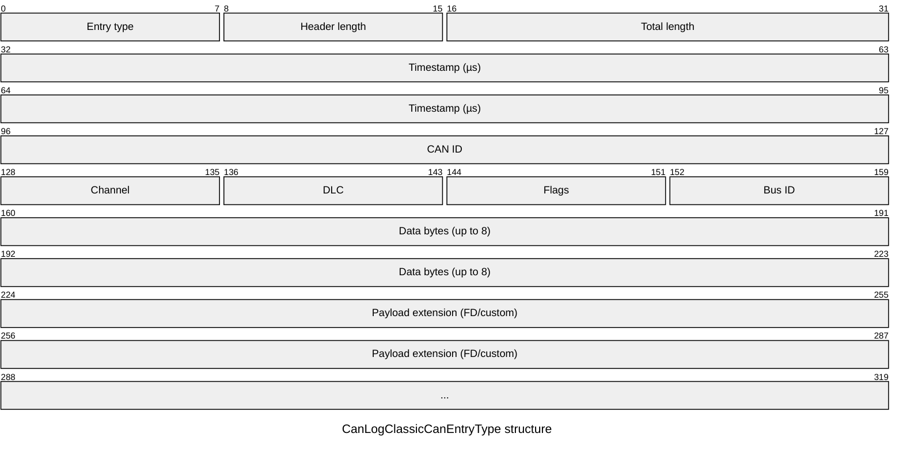

```mermaid
---
title: CanLogClassicCanEntryType structure
---
packet-beta
    0-7: "Entry type"
    8-15: "Header length"
    16-31: "Total length"
    32-95: "Timestamp (µs)"
    96-127: "CAN ID"
    128-135: "Channel"
    136-143: "DLC"
    144-151: "Flags"
    152-159: "Bus ID"
    160-223: "Data bytes (up to 8)"
    224-255: "Payload extension (FD/custom)"
    256-287: "Payload extension (FD/custom)"
    288-319: "..."
```
