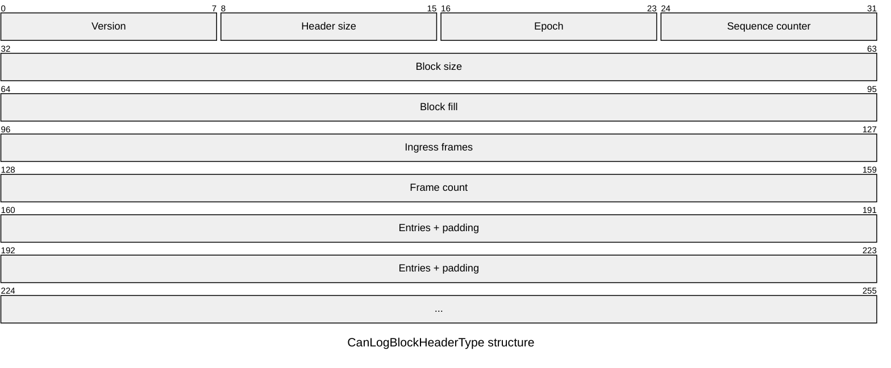

```mermaid
---
title: CanLogBlockHeaderType structure
---
packet-beta
    0-7: "Version"
    8-15: "Header size"
    16-23: "Epoch"
    24-31: "Sequence counter"
    32-63: "Block size"
    64-95: "Block fill"
    96-127: "Ingress frames"
    128-159: "Frame count"
    160-223: "Entries + padding"
    224-255: "..."
```
