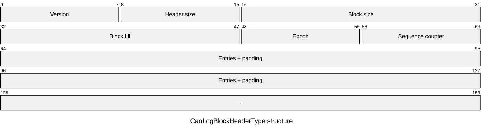

```mermaid
---
title: CanLogBlockHeaderType structure
---
packet-beta
    0-7: "Version"
    8-15: "Header size"
    16-31: "Block size"
    32-47: "Block fill"
    48-55: "Epoch"
    56-63: "Sequence counter"
    64-127: "Entries + padding"
    128-159: "..."
```
