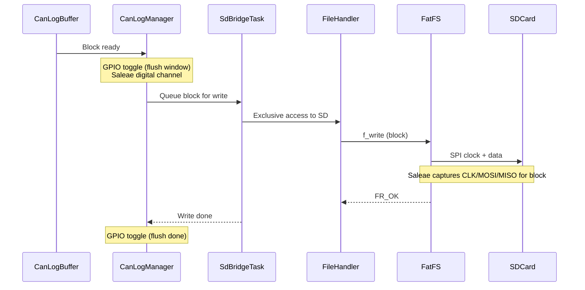

# measurement_block_flush

```mermaid
sequenceDiagram
    participant Buffer as CanLogBuffer
    participant LogMgr as CanLogManager
    participant SdTask as SdBridgeTask
    participant FileHandler
    participant FatFS
    participant SDCard

    Buffer->>LogMgr: Block ready
    Note over LogMgr: GPIO toggle (flush window)<br/>Saleae digital channel
    LogMgr->>SdTask: Queue block for write
    SdTask->>FileHandler: Exclusive access to SD
    FileHandler->>FatFS: f_write (block)
    FatFS->>SDCard: SPI clock + data
    Note over FatFS,SDCard: Saleae captures CLK/MOSI/MISO for block
    FatFS-->>FileHandler: FR_OK
    SdTask-->>LogMgr: Write done
    Note over LogMgr: GPIO toggle (flush done)
```
