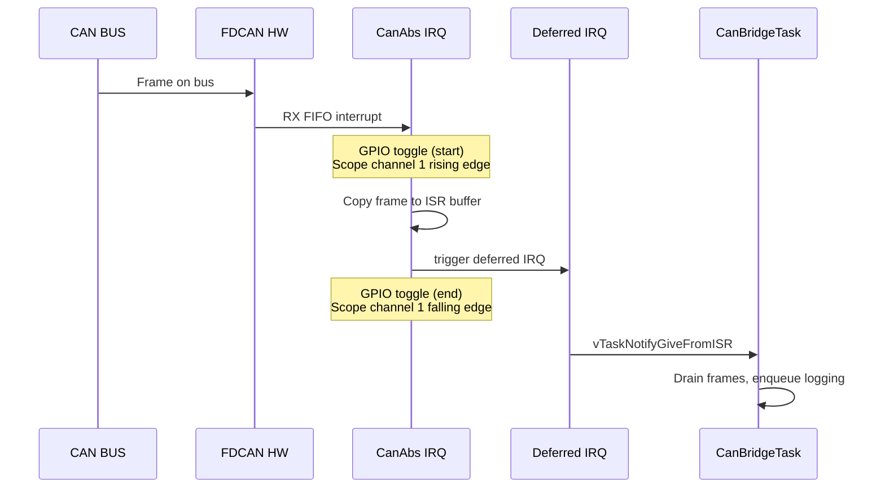

# measurement_can_isr

```mermaid
sequenceDiagram
    participant CANBUS as CAN BUS
    participant FDCAN as FDCAN HW
    participant IRQ as CanAbs IRQ
    participant Deferred as Deferred IRQ
    participant Bridge as CanBridgeTask

    CANBUS->>FDCAN: Frame on bus
    FDCAN->>IRQ: RX FIFO interrupt
    Note over IRQ: GPIO toggle (start)<br/>Scope channel 1 rising edge
    IRQ->>IRQ: Copy frame to ISR buffer
    IRQ->>Deferred: trigger deferred IRQ
    Note over IRQ: GPIO toggle (end)<br/>Scope channel 1 falling edge
    Deferred->>Bridge: vTaskNotifyGiveFromISR
    Bridge->>Bridge: Drain frames, enqueue logging
```
