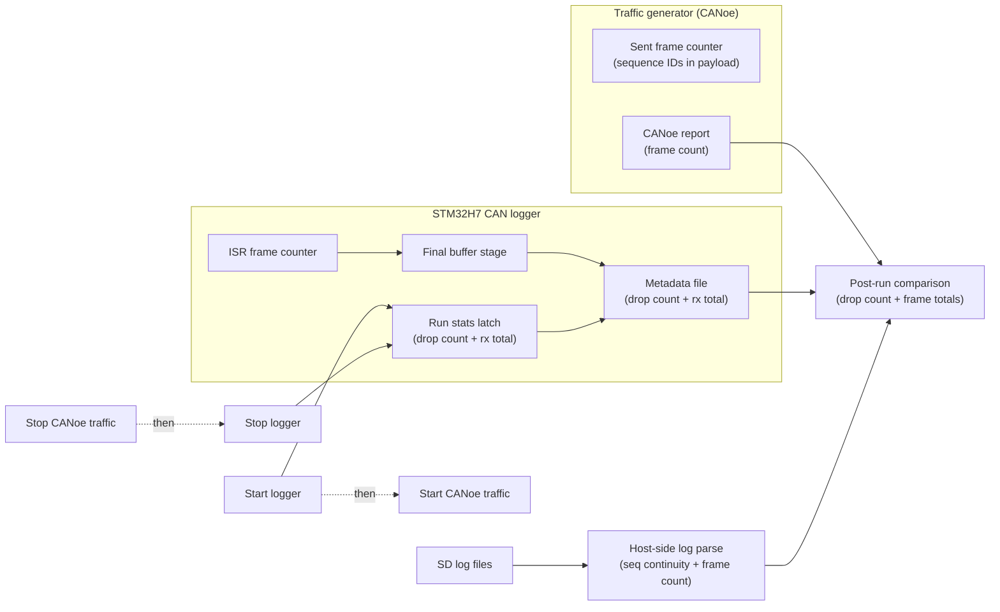

```mermaid
flowchart LR
    StartLogger["Start logger"] -.->|then| StartCANoe["Start CANoe traffic"]

    subgraph Device["STM32H7 CAN logger"]
        STATS["Run stats latch<br/>(drop count + rx total)"]
        ISR["ISR frame counter"]
        BUF["Final buffer stage"]
        META["Metadata file<br/>(drop count + rx total)"]
    end

    subgraph Generator["Traffic generator (CANoe)"]
        TX["Sent frame counter<br/>(sequence IDs in payload)"]
        CANOELOG["CANoe report<br/>(frame count)"]
    end

    StartLogger --> STATS
    ISR --> BUF
    BUF --> META
    STATS --> META

    StopCANoe["Stop CANoe traffic"] -.->|then| StopLogger["Stop logger"]
    StopLogger --> STATS

    CANOELOG --> Compare["Post-run comparison<br/>(drop count + frame totals)"]
    META --> Compare
    SD["SD log files"] --> HostParse["Host-side log parse<br/>(seq continuity + frame count)"]
    HostParse --> Compare
```
