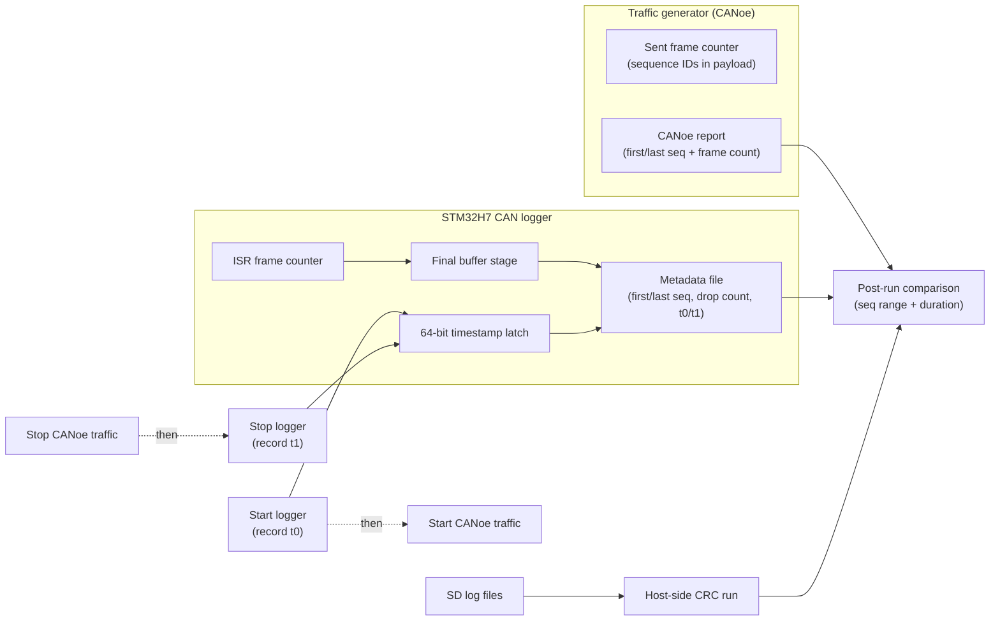

```mermaid
flowchart LR
    StartLogger["Start logger\n(record t0)"] -.->|then| StartCANoe["Start CANoe traffic"]

    subgraph Device["STM32H7 CAN logger"]
        TS64["64-bit timestamp latch"]
        ISR["ISR frame counter"]
        BUF["Final buffer stage"]
        META["Metadata file<br/>(first/last seq, drop count, t0/t1)"]
    end

    subgraph Generator["Traffic generator (CANoe)"]
        TX["Sent frame counter<br/>(sequence IDs in payload)"]
        CANOELOG["CANoe report<br/>(first/last seq + frame count)"]
    end

    StartLogger --> TS64
    ISR --> BUF
    BUF --> META
    TS64 --> META

    StopCANoe["Stop CANoe traffic"] -.->|then| StopLogger["Stop logger\n(record t1)"]
    StopLogger --> TS64

    CANOELOG --> Compare["Post-run comparison\n(seq range + duration)"]
    META --> Compare
    SD["SD log files"] --> HostCRC["Host-side CRC run"]
    HostCRC --> Compare
```
