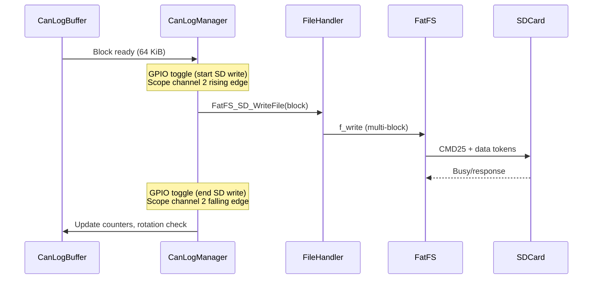

# measurement_sd_write

```mermaid
sequenceDiagram
    participant Buffer as CanLogBuffer
    participant LogMgr as CanLogManager
    participant FileHandler
    participant FatFS
    participant SDCard

    Buffer->>LogMgr: Block ready (64 KiB)
    Note over LogMgr: GPIO toggle (start SD write)<br/>Scope channel 2 rising edge
    LogMgr->>FileHandler: FatFS_SD_WriteFile(block)
    FileHandler->>FatFS: f_write (multi-block)
    FatFS->>SDCard: CMD25 + data tokens
    SDCard-->>FatFS: Busy/response
    Note over LogMgr: GPIO toggle (end SD write)<br/>Scope channel 2 falling edge
    LogMgr->>Buffer: Update counters, rotation check
```
