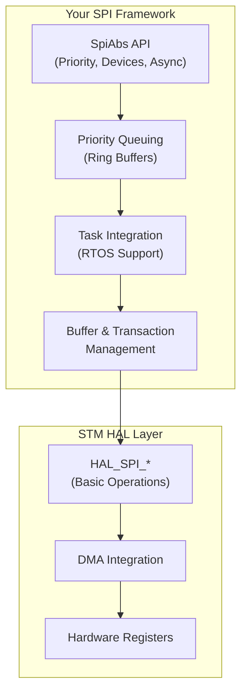

```mermaid
graph TB
    subgraph "Your SPI Framework"
        API["SpiAbs API<br/>(Priority, Devices, Async)"]
        Queue["Priority Queuing<br/>(Ring Buffers)"]
        Task["Task Integration<br/>(RTOS Support)"]
        Mgmt["Buffer & Transaction<br/>Management"]
    end
    
    subgraph "STM HAL Layer"
        HAL["HAL_SPI_*<br/>(Basic Operations)"]
        DMA["DMA Integration"]
        HW["Hardware Registers"]
    end
    
    API --> Queue
    Queue --> Task
    Task --> Mgmt
    Mgmt --> HAL
    HAL --> DMA
    DMA --> HW
```