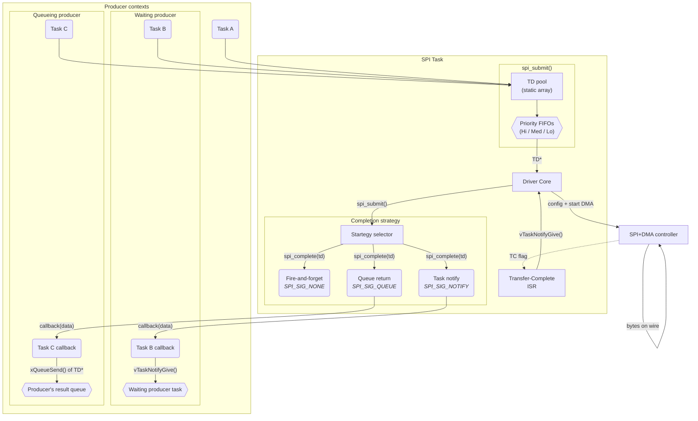

```mermaid
flowchart TB
    %% =============  PRODUCERS  ============= %%
    subgraph SPITASK["SPI Task"]
        %% =============  QUEUING INGEST  ============= %%
        subgraph ING["spi_submit()"]
            Alloc["TD pool<br/>(static array)"]
            PQ{{"Priority FIFOs<br/>(Hi / Med / Lo)"}}
        end

        %% =============  DRIVER SIDE  ============= %%
        Driver[Driver Core]
        IRQ[Transfer-Complete<br/>ISR]

        %% =============  COMPLETION STRATEGIES  ============= %%
        subgraph COMP["Completion strategy<br/>(per-transfer)"]
            Selector["Startegy selector"]
            NONE(Fire-and-forget<br/><i>SPI_SIG_NONE</i>)
            NOTE(Task notify<br/><i>SPI_SIG_NOTIFY</i>)
            RQ(Queue return<br/><i>SPI_SIG_QUEUE</i>)
        end
    end

    subgraph P["Producer contexts"]
        TA(Task A)
        subgraph B["Waiting producer"]
            TB(Task B)
            TaskBCallback("Task B callback")
            WaitTask{{Waiting producer task}}
        end

        subgraph C["Queueing producer"]
            TC(Task C)
            TaskCCallback("Task C callback")
            RespQ{{Producer's result queue}}
        end
    end

    DMA[SPI+DMA controller]

    %% =============  DATA FLOW  ============= %%
    TA -->|" "| Alloc
    TB -->|" "| Alloc
    TC -->|" "| Alloc

    %% ----- return to waiting task (if any) -----
    NOTE -->|"callback(data)"| TaskBCallback
    TaskBCallback -->|"vTaskNotifyGive()"| WaitTask
    RQ -->|"callback(data)"| TaskCCallback
    TaskCCallback -->|"xQueueSend() of TD*"| RespQ

    Alloc --> PQ
    PQ -->|TD*| Driver
    Driver -->|config + start DMA| DMA
    DMA -->|bytes on wire| DMA
    DMA -.TC flag .-> IRQ
    IRQ -->|"vTaskNotifyGive()"| Driver
    Driver -->|"spi_submit()"| Selector
    Selector -->|"spi_complete(td)"| NOTE
    Selector -->|"spi_complete(td)"| RQ
    Selector -->|"spi_complete(td)"| NONE

    %% styling (optional, keeps colours gentle) %%
    %% classDef pool fill:#d8e6ff,stroke:#2e6bf5,stroke-width:1px;
    %% classDef driver fill:#ffe0cc,stroke:#ff6b00,stroke-width:1px;
    %% class Alloc pool;
    %% class Driver driver;
```