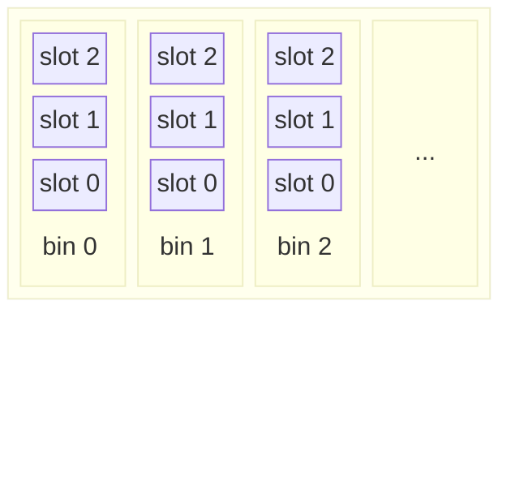

```mermaid
block-beta
    columns 3
    block:spibins:3
        block:bin0
            columns 1
            bin0slot2["slot 2 "]
            bin0slot1["slot 1"]
            bin0slot0["slot 0"]
            bin0label["bin 0"]
        end
        block:bin1
            columns 1
            bin1slot2["slot 2"]
            bin1slot1["slot 1"]
            bin1slot0["slot 0"]
            bin1label["bin 1"]
        end
        block:bin2
            columns 1
            bin2slot2["slot 2"]
            bin2slot1["slot 1"]
            bin2slot0["slot 0"]
            bin2label["bin 2"]
        end
        block:bin3["..."]
            columns 1
        end
    end

    style bin0label fill:transparent,stroke:transparent
    style bin1label fill:transparent,stroke:transparent
    style bin2label fill:transparent,stroke:transparent

```