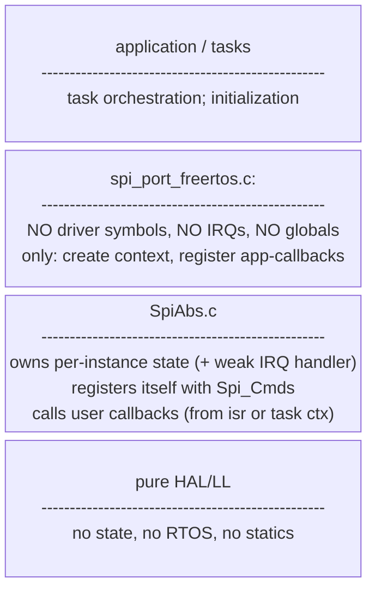

```mermaid 
 %%{init: 
    { 'theme':'default', 
      'sequence': {
        'useMaxWidth':true
        } 
    } 
}%%

block-beta 
    columns 1

    Application["application / tasks
        --------------------------------------------------
        task orchestration; initialization"]
    port["spi_port_freertos.c:
        --------------------------------------------------
        NO driver symbols, NO IRQs, NO globals
        only: create context, register app-callbacks"]
    abs["SpiAbs.c
        --------------------------------------------------
        owns per-instance state (+ weak IRQ handler)
        registers itself with Spi_Cmds
        calls user callbacks (from isr or task ctx)"]
    drv["pure HAL/LL
        --------------------------------------------------
        no state, no RTOS, no statics"]
```